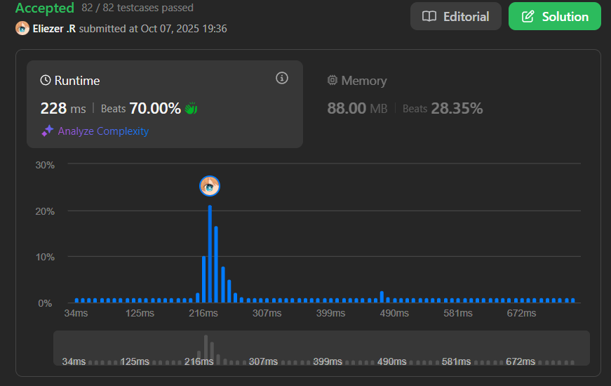

# 1488. Avoid Flood in The City

Tu país tiene un número infinito de lagos. Inicialmente, todos los lagos están vacíos, pero cuando llueve sobre el lago `n`, el lago `n` se llena de agua. Si llueve sobre un lago que ya está lleno, habrá una **inundación**. Tu objetivo es **evitar inundaciones** en cualquier lago.

Se te da un array de enteros `rains` donde:
- `rains[i] > 0` significa que lloverá sobre el lago `rains[i]` en el día `i`.
- `rains[i] == 0` significa que no hay lluvia en el día `i`, y puedes elegir **un** lago para secar.

Retorna un array `ans` donde:
- `ans.length == rains.length`
- `ans[i] == -1` si `rains[i] > 0`
- `ans[i]` es el lago que eliges secar en el día `i` si `rains[i] == 0`

Si hay **múltiples soluciones válidas**, retorna **cualquiera** de ellas. Si es **imposible** evitar la inundación, retorna un **array vacío**.

**Dificultad:** Medium

---

## 📋 Ejemplos

**Ejemplo 1:**

- Entrada: `rains = [1,2,3,4]`
- Salida: `[-1,-1,-1,-1]`
- Explicación: Después del día 4, todos los lagos están llenos. No hay días secos para secar lagos.

**Ejemplo 2:**

- Entrada: `rains = [1,2,0,0,2,1]`
- Salida: `[-1,-1,2,1,-1,-1]`
- Explicación:
```
Día 1: llueve en lago 1 → lleno
Día 2: llueve en lago 2 → lleno
Día 3: día seco → secar lago 2
Día 4: día seco → secar lago 1
Día 5: llueve en lago 2 → OK (fue secado)
Día 6: llueve en lago 1 → OK (fue secado)
```

**Ejemplo 3:**

- Entrada: `rains = [1,2,0,1,2]`
- Salida: `[]`
- Explicación: Día 3 debemos secar lago 1 o 2. Pero el que sea que elijamos, habrá inundación en el día 4 o 5.

---

## 💭 Enfoque y Estrategia

- **Problema de scheduling**: Decidir qué lago secar en cada día seco para prevenir inundaciones futuras.
- **Greedy approach**: Cuando hay un día seco, secar el lago que se llenará más pronto.
- **Estructuras de datos**:
  - `lastRain`: Map que rastrea el último día que llovió en cada lago
  - `dryDays`: Array de días secos disponibles
- **Binary Search**: Encontrar el día seco más cercano después del último día de lluvia.

---

## 🔧 Implementación

```js
var avoidFlood = function(rains) {
    const n = rains.length
    const ans = new Array(n).fill(1)
    const lastRain = new Map() // lago → último día que llovió
    const dryDays = [] // días secos disponibles

    for (let i = 0; i < n; i++) {
        const lake = rains[i]

        if (lake === 0) {
            // Día seco: guardar para uso posterior
            dryDays.push(i)
            ans[i] = 1 // Placeholder, se actualizará si es necesario
        } else {
            // Día lluvioso
            ans[i] = -1

            // Verificar si el lago ya estaba lleno
            if (lastRain.has(lake)) {
                const prevDay = lastRain.get(lake)

                // Buscar un día seco después de prevDay
                let idx = binarySearch(dryDays, prevDay)
                if (idx === -1) return [] // No hay día seco disponible

                const dryDay = dryDays[idx]
                ans[dryDay] = lake // Secar este lago en ese día
                dryDays.splice(idx, 1) // Remover día usado
            }

            lastRain.set(lake, i) // Actualizar último día de lluvia
        }
    }

    return ans

    function binarySearch(arr, target) {
        let left = 0, right = arr.length - 1
        let res = -1
        while (left <= right) {
            const mid = Math.floor((left + right) / 2)
            if (arr[mid] > target) {
                res = mid
                right = mid - 1
            } else {
                left = mid + 1
            }
        }
        return res
    }
}

console.log(avoidFlood([1,2,3,4])) // [-1,-1,-1,-1]
console.log(avoidFlood([1,2,0,0,2,1])) // [-1,-1,2,1,-1,-1]
console.log(avoidFlood([1,2,0,1,2])) // []

/**
 * Ejemplo paso a paso con rains = [1,2,0,0,2,1]:
 * 
 * i=0: lake=1, ans[0]=-1, lastRain={1→0}
 * i=1: lake=2, ans[1]=-1, lastRain={1→0, 2→1}
 * i=2: lake=0, dryDays=[2], ans[2]=1
 * i=3: lake=0, dryDays=[2,3], ans[3]=1
 * 
 * i=4: lake=2
 *   prevDay = lastRain.get(2) = 1
 *   Buscar día seco > 1 en [2,3]
 *   binarySearch([2,3], 1) → índice 0 (día 2)
 *   ans[2] = 2 (secar lago 2 en día 2)
 *   dryDays = [3]
 *   ans[4] = -1
 *   lastRain={1→0, 2→4}
 * 
 * i=5: lake=1
 *   prevDay = lastRain.get(1) = 0
 *   Buscar día seco > 0 en [3]
 *   binarySearch([3], 0) → índice 0 (día 3)
 *   ans[3] = 1 (secar lago 1 en día 3)
 *   dryDays = []
 *   ans[5] = -1
 *   lastRain={1→5, 2→4}
 * 
 * Resultado: [-1, -1, 2, 1, -1, -1]
 */
```

---

## 📊 Análisis de Rendimiento

- **Complejidad temporal**: O(n log n), donde n es la longitud de rains.
  - Por cada día lluvioso, hacemos binary search: O(log n)
  - Splice en array: O(n) en peor caso
  - Total: O(n²) en peor caso, pero O(n log n) en promedio
- **Complejidad espacial**: O(n), para almacenar lastRain, dryDays y ans.

---

## 🎯 Visualización del Proceso

```
rains = [1, 2, 0, 0, 2, 1]

Día 0: Llueve en lago 1
  Lagos llenos: {1}
  Días secos: []

Día 1: Llueve en lago 2
  Lagos llenos: {1, 2}
  Días secos: []

Día 2: Día seco
  Lagos llenos: {1, 2}
  Días secos: [2]

Día 3: Día seco
  Lagos llenos: {1, 2}
  Días secos: [2, 3]

Día 4: Llueve en lago 2 (¡ya lleno!)
  Necesitamos haberlo secado antes
  Buscar día seco después del día 1
  → Encontrar día 2
  → ans[2] = 2 (secar lago 2)
  Lagos llenos: {1, 2}
  Días secos: [3]

Día 5: Llueve en lago 1 (¡ya lleno!)
  Necesitamos haberlo secado antes
  Buscar día seco después del día 0
  → Encontrar día 3
  → ans[3] = 1 (secar lago 1)
  Lagos llenos: {1, 2}
  Días secos: []

Resultado: [-1, -1, 2, 1, -1, -1]
```

---

## 🔄 Optimización con TreeSet

En JavaScript no tenemos TreeSet nativo, pero podríamos optimizar con una estructura similar:

```js
// Usando un array ordenado manualmente es más simple en JS
// Para mejor rendimiento en otros lenguajes, usar TreeSet/SortedSet

// Alternativa con Set (sin binary search):
var avoidFloodAlt = function(rains) {
    const n = rains.length
    const ans = new Array(n).fill(1)
    const lastRain = new Map()
    const dryDays = new Set()

    for (let i = 0; i < n; i++) {
        if (rains[i] === 0) {
            dryDays.add(i)
        } else {
            ans[i] = -1
            if (lastRain.has(rains[i])) {
                const prevDay = lastRain.get(rains[i])
                let found = false
                // Buscar linealmente (menos eficiente)
                for (const day of dryDays) {
                    if (day > prevDay) {
                        ans[day] = rains[i]
                        dryDays.delete(day)
                        found = true
                        break
                    }
                }
                if (!found) return []
            }
            lastRain.set(rains[i], i)
        }
    }
    return ans
}
```

---

## 🔍 Casos Edge

- **Sin días secos**: `[1,2,3,4]` → `[-1,-1,-1,-1]`
- **Solo días secos**: `[0,0,0,0]` → `[1,1,1,1]` (cualquier lago)
- **Imposible evitar**: `[1,2,0,1,2]` → `[]`
- **Un solo lago**: `[1,0,1,0,1]` → `[-1,1,-1,1,-1]`

---

## 🎯 Aprendizajes Clave

- **Greedy with lookahead**: Necesitamos mirar hacia adelante para tomar decisiones óptimas.
- **Binary search on sorted array**: Encontrar el próximo elemento mayor eficientemente.
- **Hash map tracking**: Rastrear el último estado de cada elemento.
- **Impossibility detection**: Identificar cuándo no hay solución válida.
- **Lazy assignment**: Guardar días secos y asignarlos cuando sea necesario.

---

## 💡 Intuición del Problema

El problema se reduce a:
1. **Para cada lago que llueve por segunda vez**: Debemos haberlo secado entre la primera y segunda lluvia
2. **Encontrar el día seco óptimo**: El más cercano después de la primera lluvia
3. **Si no existe tal día**: Es imposible evitar la inundación

La clave es usar **binary search** para encontrar eficientemente el día seco más temprano que está después de la última lluvia en ese lago.

---

## 🧮 Comparación de Enfoques

| Enfoque | Búsqueda | Complejidad | Mejor para |
|---------|----------|-------------|------------|
| Array + Binary Search | O(log n) | O(n log n) | Implementación simple |
| Set + Linear Search | O(n) | O(n²) | Código corto |
| TreeSet/Heap | O(log n) | O(n log n) | Lenguajes con TreeSet |

---

## 🏷️ Tags

`Array` `Hash Table` `Binary Search` `Greedy` `Heap (Priority Queue)` `Medium`

---

**Complejidad Final:**
- ⏱️ Tiempo: O(n log n)
- 💾 Espacio: O(n)