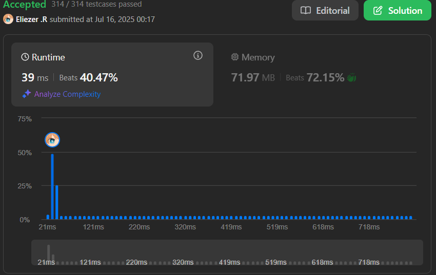

# 15. 3Sum

## 🧠 Descripción

Dado un array de enteros `nums`, devuelve todos los tripletes `[nums[i], nums[j], nums[k]]` tales que:

* `i != j`, `i != k` y `j != k`.
* `nums[i] + nums[j] + nums[k] == 0`

**Importante**: El conjunto de soluciones no debe contener tripletes duplicados.

---

## 📋 Ejemplos

### Ejemplo 1:

* **Entrada**: `nums = [-1,0,1,2,-1,-4]`
* **Salida**: `[[-1,-1,2],[-1,0,1]]`

### Ejemplo 2:

* **Entrada**: `nums = [0,1,1]`
* **Salida**: `[]`

### Ejemplo 3:

* **Entrada**: `nums = [0,0,0]`
* **Salida**: `[[0,0,0]]`

---

## 💭 Estrategia y Enfoque

Después de muchas horas intentando resolver este problema sin éxito, fui a la caja de comentarios de la comunidad en LeetCode y encontré una explicación paso a paso que me ayudó a entender y resolverlo:

### 🧩 Pasos del Algoritmo:

1. Ordena el array de forma no decreciente.
2. Recorre el array desde el índice 0 hasta n-1.
3. Para cada iteración, establece el objetivo como `-nums[i]`.
4. Crea dos punteros: `j = i + 1` y `k = n - 1`.
5. Mientras `j < k`, verifica:

   * Si `nums[j] + nums[k] === target`, entonces guarda el triplete `[nums[i], nums[j], nums[k]]` y mueve `j` a la derecha y `k` a la izquierda.
   * Si la suma es menor que el objetivo, mueve `j++`.
   * Si la suma es mayor, mueve `k--`.
6. Para evitar duplicados, omite iteraciones donde `nums[i] === nums[i - 1]` y también donde `nums[j] === nums[j - 1]` o `nums[k] === nums[k + 1]`.

---

## 💻 Implementación en JavaScript

```js
const threeSum = function (nums) {
  const arr = [] // Inicializamos un array donde guardaremos las combinaciones
  nums.sort((a, b) => a - b) // Ordenamos el array de menor a mayor para poder obtener mejores resultados y evitar repetidos

  for (let i = 0; i < nums.length; i++) {
    if (i > 0 && nums[i] === nums[i - 1]) continue // Aquí lo que decimos es que si el número actual es igual al anterior, es repetido y no lo necesitamos

    let k = nums.length - 1 // Inicializamos el primer puntero
    let j = i + 1 // Inicializamos el segundo puntero

    while (j < k) {
      // Mientras j sea menor que k, seguimos buscando combinaciones
      const sum = nums[j] + nums[k] // Aquí está el truco: ahora el ejercicio se convierte en un 2Sum, no un 3Sum

      if (sum === -nums[i]) {
        // Si la suma es igual al negativo del número actual, entonces en total suman 0
        // Ejemplo: -1 + 0 + 1 = 0 → aquí nums[i] es -1 y sum sería 1 (0+1)
        arr.push([nums[i], nums[j], nums[k]]) // Guardamos los tres números
        j++
        k--

        // Esto es clave: sirve para lo mismo que el primer if de arriba y evita combinaciones repetidas
        while (nums[j] === nums[j - 1]) j++
        while (nums[k] === nums[k + 1]) k--
      } else if (sum < -nums[i]) {
        // Si la suma es menor al objetivo (-nums[i]), significa que debemos mover j a la derecha
        j++
      } else {
        // Si la suma es mayor al objetivo, movemos k a la izquierda
        k--
      }
    }
  }

  return arr // Retornamos el array con los resultados
}

console.log(threeSum([-1,0,1,2,-1,-4]))
```

---

## 📊 Análisis de Rendimiento

* Muy eficiente incluso para cadenas largas (hasta 10⁵ caracteres).
* No requiere estructuras adicionales.



---

## 🎯 Aprendizajes Clave

* Convertir un problema 3Sum a múltiples 2Sum es una estrategia poderosa.
* Ordenar el array simplifica mucho el manejo de duplicados.
* El uso de punteros (`two pointers`) reduce la complejidad de O(n³) a O(n²).

---

## 🏷️ Etiquetas

`Array` `Two Pointers` `Sorting` `Medium`

---

**Tiempo invertido**: 3h
**Intentos**: 10
**Dificultad percibida**: Media
