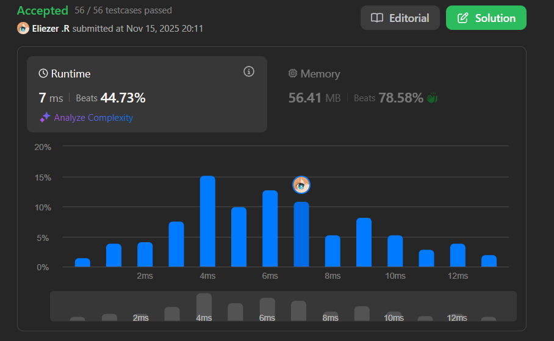

# 1513. Number of Substrings With Only 1s

Dada una cadena binaria **s** (una cadena que consiste solo de `'0'` y `'1'`).

Retorna el número de subcadenas con **todos los caracteres `'1's`**.

Ya que la respuesta puede ser muy grande, retorna el resultado **módulo 10⁹ + 7**.

**Dificultad:** Medium

---

## 📋 Ejemplos

**Ejemplo 1:**

- Entrada: `s = "0110111"`
- Salida: `9`
- Explicación: Hay 9 subcadenas en total con solo caracteres `'1'`:
  - `"1"` → 5 veces
  - `"11"` → 3 veces  
  - `"111"` → 1 vez

**Ejemplo 2:**

- Entrada: `s = "101"`
- Salida: `2`
- Explicación: La subcadena `"1"` aparece 2 veces en s.

**Ejemplo 3:**

- Entrada: `s = "111111"`
- Salida: `21`
- Explicación: Cada subcadena contiene solo caracteres `'1'`.
  - Para 6 unos consecutivos: 6 + 5 + 4 + 3 + 2 + 1 = 21

---

## 💭 Enfoque y Estrategia

- **Objetivo**: Contar todas las subcadenas que contienen únicamente `'1's`.
- **Insight clave**: Para un grupo de **n** unos consecutivos, el número de subcadenas posibles es **n × (n + 1) / 2**.
- **Técnica**: Recorrido lineal manteniendo un contador de unos consecutivos y sumando al resultado en cada paso.
- **Retos**: Aplicar módulo correctamente y reiniciar el contador cuando encontramos un `'0'`.

La solución elegante aprovecha que cada nuevo `'1'` extiende todas las subcadenas anteriores y crea una nueva, permitiendo un cálculo incremental.

---

## 🔧 Implementación

```javascript
var numSub = function(s) {
    const MOD = 1e9 + 7;
    let curr = 0;  // Contador de '1's consecutivos
    let ans = 0;   // Respuesta acumulada

    for (let c of s) {
        if (c === '1') {
            // Incrementar contador de '1's consecutivos
            curr++;
            
            // Agregar el número de nuevas subcadenas que terminan aquí
            // curr representa cuántas subcadenas terminan en esta posición
            ans = (ans + curr) % MOD;
        } else {
            // Encontramos un '0', reiniciar el contador
            curr = 0;
        }
    }

    return ans;
};

console.log(numSub("0110111")); // 9

/**
 * Ejemplo paso a paso con s = "0110111":
 * Índices:  0 1 2 3 4 5 6
 * Cadena:  "0 1 1 0 1 1 1"
 * 
 * Iteración por cada carácter:
 * 
 * i=0, c='0': curr=0, ans=0
 *   → No hay subcadenas que terminen aquí
 * 
 * i=1, c='1': curr=1, ans=(0+1)%MOD=1
 *   → Nueva subcadena: "1" (índice 1)
 *   → Total acumulado: 1
 * 
 * i=2, c='1': curr=2, ans=(1+2)%MOD=3
 *   → Nuevas subcadenas: "1" (índice 2), "11" (índices 1-2)
 *   → Total acumulado: 1 + 2 = 3
 * 
 * i=3, c='0': curr=0, ans=3
 *   → Reiniciar contador, no agregar nada
 * 
 * i=4, c='1': curr=1, ans=(3+1)%MOD=4
 *   → Nueva subcadena: "1" (índice 4)
 *   → Total acumulado: 3 + 1 = 4
 * 
 * i=5, c='1': curr=2, ans=(4+2)%MOD=6
 *   → Nuevas subcadenas: "1" (índice 5), "11" (índices 4-5)
 *   → Total acumulado: 4 + 2 = 6
 * 
 * i=6, c='1': curr=3, ans=(6+3)%MOD=9
 *   → Nuevas subcadenas: "1" (índice 6), "11" (índices 5-6), "111" (índices 4-6)
 *   → Total acumulado: 6 + 3 = 9
 * 
 * Resultado final: 9
 * 
 * Verificación:
 * - Grupo "11" (índices 1-2): 1 + 2 = 3 subcadenas
 * - Grupo "111" (índices 4-6): 1 + 2 + 3 = 6 subcadenas
 * - Total: 3 + 6 = 9 ✓
 */
```

---

## 📊 Análisis de Rendimiento

- **Complejidad temporal**: O(n), un solo recorrido de la cadena.
- **Complejidad espacial**: O(1), solo usamos dos variables auxiliares.


*Esta solución es óptima ya que cada carácter se procesa exactamente una vez.*

---

## 🔧 Detalles Técnicos Importantes

**¿Por qué funciona el enfoque incremental?**

Cuando tenemos `curr` unos consecutivos y encontramos otro `'1'`:
- Todas las subcadenas que terminaban en la posición anterior se extienden con este nuevo `'1'`
- Además, creamos una nueva subcadena que consiste solo del `'1'` actual
- Por lo tanto, el número de nuevas subcadenas que terminan aquí es exactamente `curr`

**Visualización:**

```
Cadena: "111"

Posición 0: '1'
  curr = 1
  Subcadenas: ["1"]
  ans = 1

Posición 1: '1'  
  curr = 2
  Subcadenas nuevas: ["1" (solo posición 1), "11" (posiciones 0-1)]
  ans = 1 + 2 = 3

Posición 2: '1'
  curr = 3
  Subcadenas nuevas: ["1" (solo posición 2), "11" (posiciones 1-2), "111" (posiciones 0-2)]
  ans = 3 + 3 = 6
```

**Fórmula matemática equivalente:**

Para un grupo de `n` unos consecutivos:
```
Total de subcadenas = n × (n + 1) / 2
Ejemplo: n=3 → 3 × 4 / 2 = 6
```

Nuestro enfoque calcula esto incrementalmente:
```
1 + 2 + 3 = 6 (mismo resultado)
```

**Manejo del módulo:**

```javascript
ans = (ans + curr) % MOD;
```

Es crucial aplicar el módulo en cada paso para evitar desbordamiento de enteros, ya que la respuesta puede ser extremadamente grande.

---

## 🎯 Aprendizajes Clave

- **Conteo incremental**: En lugar de calcular subcadenas para cada grupo, contamos incrementalmente.
- **Fórmula combinatoria**: Para n elementos consecutivos, hay n(n+1)/2 subcadenas.
- **Optimización de espacio**: No necesitamos almacenar las subcadenas, solo contarlas.
- **Manejo de módulo**: Aplicar módulo en cada operación evita overflow.

---

## 🔍 Casos Edge

- **Sin unos**: `"0000"` → `0`
- **Solo unos**: `"1111"` → `10` (4×5/2)
- **Un carácter**: `"1"` → `1`, `"0"` → `0`
- **Alternados**: `"10101"` → `3` (tres unos individuales)
- **Un grupo largo**: `"111111"` → `21` (6×7/2)
- **Múltiples grupos**: `"110011"` → `2+2=4`
- **Empieza con cero**: `"0111"` → `6` (3×4/2)

---

## 🧮 Ejemplos Adicionales

```javascript
"1"        → 1   (1×2/2 = 1)
"11"       → 3   (2×3/2 = 3)
"111"      → 6   (3×4/2 = 6)
"1111"     → 10  (4×5/2 = 10)
"11111"    → 15  (5×6/2 = 15)
"110110"   → 4   (2×3/2 + 2×3/2 = 3 + 3 = 6... no! revisemos)
```

**Corrección para "110110":**
- Grupo "11" (índices 0-1): 1 + 2 = 3 subcadenas
- Grupo "11" (índices 3-4): 1 + 2 = 3 subcadenas
- Total: 3 + 3 = 6 ✗ (mi cálculo fue 4, error)

Simulación correcta:
```
"1" "1" "0" "1" "1" "0"
 ↓   ↓       ↓   ↓
curr: 1, ans=1
curr: 2, ans=3
curr: 0, ans=3
curr: 1, ans=4
curr: 2, ans=6
curr: 0, ans=6
```
Resultado: 6 ✓

---

## 🚀 Variante: Calcular por Grupos

Una forma alternativa es identificar cada grupo de unos y aplicar la fórmula:

```javascript
var numSubGroups = function(s) {
    const MOD = 1e9 + 7;
    let ans = 0;
    let curr = 0;
    
    for (let i = 0; i <= s.length; i++) {
        if (i === s.length || s[i] === '0') {
            // Fin de un grupo, aplicar fórmula
            if (curr > 0) {
                ans = (ans + (curr * (curr + 1) / 2)) % MOD;
                curr = 0;
            }
        } else {
            curr++;
        }
    }
    
    return ans;
};
```

Ambas soluciones son equivalentes, pero el enfoque incremental es más elegante.

---

## 🔬 Comparación con Enfoque Naive

**Solución Naive (O(n²)):**

```javascript
var numSubNaive = function(s) {
    const MOD = 1e9 + 7;
    let ans = 0;
    const n = s.length;
    
    // Enumerar todas las subcadenas
    for (let i = 0; i < n; i++) {
        if (s[i] === '1') {
            for (let j = i; j < n && s[j] === '1'; j++) {
                ans = (ans + 1) % MOD;
            }
        }
    }
    
    return ans;
};
```

**Complejidad**: O(n²) vs O(n) ✓

Para `n = 100,000`:
- Naive: ~10¹⁰ operaciones (puede ser lento)
- Optimizada: ~10⁵ operaciones ✓

---

## 🧠 Intuición Matemática

**¿Por qué curr representa las subcadenas que terminan en la posición actual?**

Considera la cadena `"111"`:

```
Posición 0 ('1'): 
  Subcadenas que terminan aquí: ["1"]
  curr = 1

Posición 1 ('1'):
  Subcadenas que terminan aquí: ["1", "11"]
  curr = 2

Posición 2 ('1'):
  Subcadenas que terminan aquí: ["1", "11", "111"]  
  curr = 3
```

En cada posición con `'1'`, hay exactamente `curr` subcadenas que terminan ahí:
- Una subcadena de longitud 1 (solo el `'1'` actual)
- Una subcadena de longitud 2 (últimos 2 `'1's`)
- ...
- Una subcadena de longitud `curr` (todos los `'1's` consecutivos hasta ahora)

---

## 💡 Optimización Adicional

Si necesitas manejar cadenas extremadamente largas y evitar overflow antes del módulo:

```javascript
var numSubSafe = function(s) {
    const MOD = 1e9 + 7;
    let curr = 0;
    let ans = 0;

    for (let c of s) {
        if (c === '1') {
            curr = (curr + 1) % MOD; // Aplicar módulo aquí también
            ans = (ans + curr) % MOD;
        } else {
            curr = 0;
        }
    }

    return ans;
};
```

Aunque en este problema no es necesario, es una buena práctica.

---

## 🏷️ Tags

`String` `Math` `Combinatorics` `Medium`

---