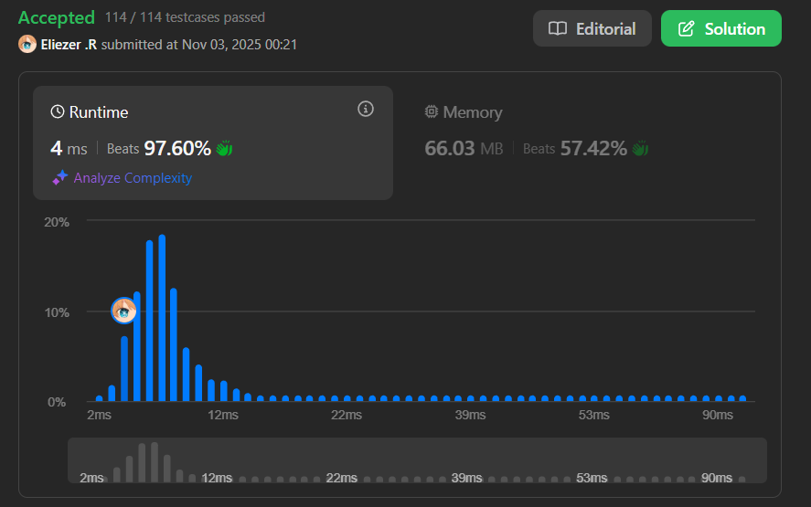

# 1578. Minimum Time to Make Rope Colorful

## 🧠 Descripción

Alice tiene `n` globos dispuestos en una cuerda. Se te da un string `colors` indexado en 0 donde `colors[i]` es el color del globo i-ésimo.

Alice quiere que la cuerda sea **colorida**. Ella no quiere **dos globos consecutivos** que sean del mismo color, así que puede remover algunos globos de la cuerda.

Se te da un array de enteros indexado en 0 `neededTime` donde `neededTime[i]` es el tiempo (en segundos) que Alice necesita para remover el globo i-ésimo de la cuerda.

Retorna el **tiempo mínimo** que Alice necesita para hacer la cuerda colorida.

**Dificultad:** Medium

---

## 📋 Ejemplos

### Ejemplo 1:

* **Entrada**: `colors = "abaac", neededTime = [1,2,3,4,5]`
* **Salida**: `3`
* **Explicación**: 
  - Remover globo 2 (tiempo 3) para evitar "aa".
  - Total: 3 segundos.

### Ejemplo 2:

* **Entrada**: `colors = "abc", neededTime = [1,2,3]`
* **Salida**: `0`
* **Explicación**: No hay globos consecutivos del mismo color.

### Ejemplo 3:

* **Entrada**: `colors = "aabaa", neededTime = [1,2,3,4,1]`
* **Salida**: `2`
* **Explicación**: 
  - Remover globos 0 y 4 (tiempos 1+1=2).
  - Dejar [2,3] en las posiciones "aa".

---

## 💭 Estrategia y Enfoque

Cuando encontramos globos consecutivos del mismo color, debemos remover todos excepto uno. La estrategia greedy es **remover siempre el de menor costo** y **mantener el de mayor costo**.

### 🧩 Observación clave:

Para un grupo de globos consecutivos del mismo color:
- **Eliminar**: Todos menos el más costoso
- **Mantener**: El más costoso (porque es más eficiente mantenerlo)

### 🎯 Algoritmo:

1. Iterar por el array comparando colores consecutivos.
2. Si `colors[i] == colors[i-1]`:
   - Sumar el tiempo del globo **más barato** entre ambos.
   - Actualizar el valor de referencia al tiempo del **más caro**.
3. Si son diferentes, actualizar el valor de referencia.

---

## 💻 Implementación en JavaScript

```js
var minCost = function (colors, neededTime) {
    // count acumula el tiempo total necesario para remover globos
    let count = 0
    
    // value guarda el tiempo del globo actual que estamos considerando mantener
    // Inicialmente es el tiempo del primer globo
    let value = neededTime[0]

    // Empezamos desde el índice 1 para comparar con el anterior
    for (let i = 1; i < colors.length; i++) {
        // Verificar si el color actual es igual al color anterior
        if (colors[i] === colors[i - 1]) {
            // CONFLICTO: Dos globos consecutivos del mismo color
            
            // Estrategia: Remover el más barato, mantener el más caro
            // Math.min(value, neededTime[i]) obtiene el tiempo del más barato
            count += Math.min(value, neededTime[i])
            
            // Actualizar value al tiempo del más caro
            // Math.max(value, neededTime[i]) nos da el tiempo del que mantenemos
            // Este será el nuevo valor de referencia para la próxima comparación
            value = Math.max(value, neededTime[i])
        } else {
            // NO HAY CONFLICTO: Colores diferentes
            // Actualizar value al tiempo del globo actual
            // Este se convierte en el nuevo globo de referencia
            value = neededTime[i]
        }
    }
    
    return count
};

console.log(minCost("abaac", [1,2,3,4,5]))  // 3
console.log(minCost("abc", [1,2,3]))        // 0
console.log(minCost("aabaa", [1,2,3,4,1])) // 2
```

### 📝 Ejemplo paso a paso con `colors = "abaac", neededTime = [1,2,3,4,5]`:

```
colors:     a  b  a  a  c
            0  1  2  3  4
neededTime: 1  2  3  4  5

Inicio: count = 0, value = neededTime[0] = 1

i=1: colors[1]='b', colors[0]='a'
  'b' !== 'a' → diferentes colores
  Acción: value = neededTime[1] = 2
  count = 0

i=2: colors[2]='a', colors[1]='b'
  'a' !== 'b' → diferentes colores
  Acción: value = neededTime[2] = 3
  count = 0

i=3: colors[3]='a', colors[2]='a'
  'a' === 'a' → ¡MISMO COLOR! ✓
  Tenemos dos globos 'a' consecutivos con tiempos 3 y 4
  
  Decisión: Remover el más barato (3), mantener el más caro (4)
  count += min(3, 4) = 3
  count = 0 + 3 = 3
  
  value = max(3, 4) = 4
  (Actualizamos value al más caro porque ese lo mantenemos)

i=4: colors[4]='c', colors[3]='a'
  'c' !== 'a' → diferentes colores
  Acción: value = neededTime[4] = 5
  count = 3

Resultado final: count = 3

String resultante: "abac" (removimos el globo en posición 2)
```

### 📝 Ejemplo con grupo de 3 consecutivos `colors = "aaab", neededTime = [3,5,10,7]`:

```
colors:     a  a  a  b
            0  1  2  3
neededTime: 3  5  10 7

Inicio: count = 0, value = 3

i=1: 'a' === 'a' ✓
  count += min(3, 5) = 3
  count = 3
  value = max(3, 5) = 5

i=2: 'a' === 'a' ✓
  count += min(5, 10) = 5
  count = 3 + 5 = 8
  value = max(5, 10) = 10

i=3: 'b' !== 'a'
  value = 7
  count = 8

Resultado: 8
Explicación: De los tres globos 'a' con tiempos [3,5,10],
             removemos los de tiempo 3 y 5, mantenemos el de 10.
```

---

## 📊 Análisis de Rendimiento

* **Complejidad temporal**: O(n), un solo recorrido del array.
* **Complejidad espacial**: O(1), solo variables auxiliares.



---

## 🎯 Aprendizajes Clave

* **Greedy approach**: En cada decisión local, elegir mantener el más caro.
* **Running maximum**: Mantener track del valor más alto en el grupo actual.
* **Sequential processing**: Comparar solo con el elemento anterior.
* **Accumulation**: Sumar costos de elementos eliminados.
* **State transition**: value cambia según haya o no conflicto.

---

## 💡 Intuición del Greedy

**¿Por qué funciona mantener el más caro?**

Si tenemos globos consecutivos [tiempo1, tiempo2, tiempo3] del mismo color:
- Debemos eliminar todos excepto uno
- Costo total = suma_total - tiempo_del_que_mantenemos
- Para minimizar el costo, maximizamos el tiempo del que mantenemos
- Por lo tanto, mantenemos el de mayor tiempo

**Ejemplo:**
```
Globos 'a' con tiempos [3, 5, 10]
Opción 1: Mantener 3, eliminar 5+10 = costo 15
Opción 2: Mantener 5, eliminar 3+10 = costo 13
Opción 3: Mantener 10, eliminar 3+5 = costo 8 ✓ (óptimo)
```

---

## 🏷️ Etiquetas

`Array` `String` `Greedy` `Dynamic Programming` `Medium`