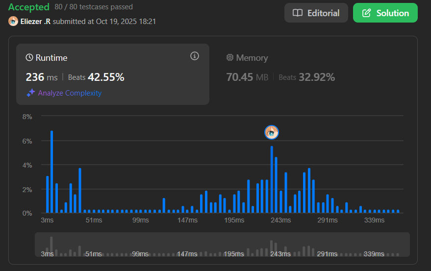

# 1625. Lexicographically Smallest String After Applying Operations

Se te da un string `s` de longitud par que consiste de dígitos del 0 al 9, y dos enteros `a` y `b`.

Puedes aplicar cualquiera de las siguientes operaciones cualquier número de veces y en cualquier orden:

1. **Sumar** `a` a todos los índices impares de `s` (indexado en 0). Los dígitos después de 9 vuelven a 0. Por ejemplo, si `s = "3456"` y `a = 5`, `s` se convierte en `"3951"`.
2. **Rotar** `s` a la derecha `b` posiciones. Por ejemplo, si `s = "3456"` y `b = 1`, `s` se convierte en `"6345"`.

Retorna el string lexicográficamente más pequeño que puedes obtener aplicando las operaciones anteriores cualquier número de veces.

**Dificultad:** Medium

---

## 📋 Ejemplos

**Ejemplo 1:**

- Entrada: `s = "5525", a = 9, b = 2`
- Salida: `"2050"`
- Explicación:
```
Start: "5525"
Rotate: "2555"
Add: "2454"
Add: "2353"
Rotate: "5323"
Add: "5222"
Add: "5121"
Rotate: "2151"
Add: "2050"
```

**Ejemplo 2:**

- Entrada: `s = "74", a = 5, b = 1`
- Salida: `"24"`

**Ejemplo 3:**

- Entrada: `s = "0011", a = 4, b = 2`
- Salida: `"0011"`

---

## 💭 Enfoque y Estrategia

- **Objetivo**: Explorar todos los estados posibles del string y encontrar el mínimo lexicográfico.
- **Problema de búsqueda**: BFS/DFS para explorar el espacio de estados.
- **Estado**: Cada configuración única del string.
- **Técnica**: BFS con Set para evitar visitar estados repetidos.
- **Optimización**: Usar un Set para tracking de strings visitados.

---

## 🔧 Implementación

```js
var findLexSmallestString = function(s, a, b) {
    const visited = new Set()
    const queue = [s]
    visited.add(s)
    let smallest = s
    
    // Pre-calcular índices impares para eficiencia
    const oddIndices = []
    for (let i = 1; i < s.length; i += 2) {
        oddIndices.push(i)
    }
    
    while (queue.length > 0) {
        const current = queue.shift()
        
        // Actualizar el mínimo
        if (current < smallest) {
            smallest = current
        }
        
        // Operación 1: Sumar 'a' a índices impares
        const chars = current.split('')
        for (const idx of oddIndices) {
            chars[idx] = String((Number(chars[idx]) + a) % 10)
        }
        const afterAdd = chars.join('')
        
        if (!visited.has(afterAdd)) {
            visited.add(afterAdd)
            queue.push(afterAdd)
        }
        
        // Operación 2: Rotar 'b' posiciones a la derecha
        const n = current.length
        const afterRotate = current.slice(n - b) + current.slice(0, n - b)
        
        if (!visited.has(afterRotate)) {
            visited.add(afterRotate)
            queue.push(afterRotate)
        }
    }
    
    return smallest
}

console.log(findLexSmallestString("5525", 9, 2)) // "2050"
console.log(findLexSmallestString("74", 5, 1)) // "24"
console.log(findLexSmallestString("0011", 4, 2)) // "0011"
```

---

## 📊 Análisis de Rendimiento

- **Complejidad temporal**: O(n × 10 × n), donde n es la longitud del string.
  - Máximo 10 × n estados únicos posibles
  - Cada operación toma O(n) tiempo
- **Complejidad espacial**: O(n²), para almacenar todos los estados visitados.


---

## 🎯 Visualización del BFS

```
Estado inicial: "5525"
         ↓
    ┌────┴────┐
   Add       Rotate
    ↓          ↓
  "5424"    "2555"
    ↓          ↓
   ...       ...
    ↓          ↓
Encontrar "2050" (mínimo)
```

---

## 🔍 Casos Edge

- **Ya es el mínimo**: `s = "0011", a = 4, b = 2` → `"0011"`
- **String corto**: `s = "74"` → Pocos estados posibles
- **Rotación completa**: Si `b = n`, vuelve al estado original

---

## 🎯 Aprendizajes Clave

- **BFS para exploración**: Útil cuando hay múltiples transformaciones posibles.
- **State tracking**: Usar Set para evitar ciclos infinitos.
- **String comparison**: Comparación lexicográfica directa en JavaScript.
- **Modular arithmetic**: Operaciones cíclicas con módulo 10.

---

## 🏷️ Tags

`String` `BFS` `Hash Table` `Medium`

---
---

**Tiempo invertido**: 40m  
**Intentos**: 2
**Dificultad percibida**: Media
---