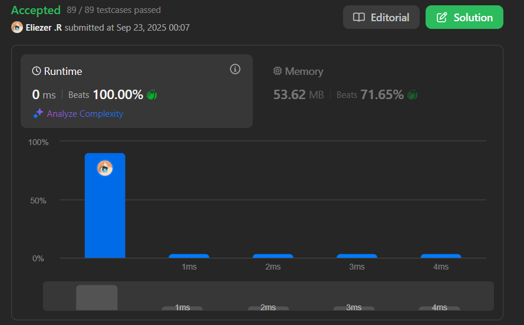

# 165. Compare Version Numbers

Dadas dos cadenas de versión, `version1` y `version2`, compáralas.

Una cadena de versión consiste en **revisiones** separadas por puntos `'.'`. El valor de la revisión es su conversión a entero ignorando ceros a la izquierda.

Para comparar cadenas de versión, compara sus valores de revisión en orden de izquierda a derecha. Si una de las cadenas de versión tiene menos revisiones, trata los valores de revisión faltantes como `0`.

Retorna:
- Si `version1 < version2`, retorna `-1`
- Si `version1 > version2`, retorna `1`  
- De lo contrario, retorna `0`

**Dificultad:** Medium

---

## 📋 Ejemplos

**Ejemplo 1:**

- Entrada: `version1 = "1.2", version2 = "1.10"`
- Salida: `-1`
- Explicación: `version1` tiene revisiones `[1, 2]` y `version2` tiene `[1, 10]`. Como `1 == 1` y `2 < 10`, entonces `version1 < version2`.

**Ejemplo 2:**

- Entrada: `version1 = "1.01", version2 = "1.001"`
- Salida: `0`
- Explicación: Ignorando ceros a la izquierda, ambos `"01"` y `"001"` representan el mismo entero `1`.

**Ejemplo 3:**

- Entrada: `version1 = "1.0", version2 = "1.0.0.0"`
- Salida: `0`
- Explicación: `version1` no especifica revisiones en los índices 2 y 3, por lo que se tratan como `0`.

---

## 💭 Enfoque y Estrategia

- **Objetivo**: Comparar versiones nivel por nivel, tratando ausencias como `0`.
- **Insight clave**: Split por `'.'` y comparar enteros, no strings.
- **Reto**: Manejar longitudes diferentes y ceros a la izquierda.
- **Optimización**: Comparar sobre la marcha sin necesidad de almacenar todo.

La estrategia divide ambas versiones en arrays, luego compara cada nivel como enteros, usando `0` para niveles faltantes.

---

## 🔧 Implementación

```js
const compareVersion = function (version1, version2) {
    const spli1 = version1.split('.')  // Dividir version1 en revisiones
    const spli2 = version2.split('.')  // Dividir version2 en revisiones
    const n = Math.max(spli1.length, spli2.length)  // Longitud máxima
    let num1 = 0  // Revisión actual de version1
    let num2 = 0  // Revisión actual de version2

    // Comparar cada nivel de revisión
    for (let i = 0; i < n; i++) {
        // Convertir a número, usar 0 si no existe la revisión
        num1 = Number(spli1[i]) || 0
        num2 = Number(spli2[i]) || 0

        // Comparar revisiones actuales
        if (num1 < num2) {
            return -1  // version1 < version2
        } else if (num1 > num2) {
            return 1   // version1 > version2
        }
        // Si son iguales, continúa al siguiente nivel
    }
    
    return 0  // Todas las revisiones son iguales
}

console.log(compareVersion("1.2", "1.10")) // -1

/**
 * Ejemplo paso a paso con version1 = "1.2", version2 = "1.10":
 * 
 * 1. Split:
 *    spli1 = ["1", "2"]
 *    spli2 = ["1", "10"]
 *    n = Math.max(2, 2) = 2
 * 
 * 2. Comparación por niveles:
 *    i=0: num1 = Number("1") = 1, num2 = Number("1") = 1
 *         1 == 1 → continúa
 *    
 *    i=1: num1 = Number("2") = 2, num2 = Number("10") = 10  
 *         2 < 10 → return -1
 * 
 * Resultado: -1 (version1 < version2)
 */
```

---

## 📊 Análisis de Rendimiento

- **Complejidad temporal**: O(max(n, m)), donde n y m son el número de revisiones en cada versión.
- **Complejidad espacial**: O(n + m), para almacenar los arrays después del split.


*Solución eficiente que compara solo los niveles necesarios.*

---

## ⚠️ Problema en la Implementación Actual

Tu implementación tiene un **error sutil**. Estás **acumulando** los números en lugar de compararlos individualmente:

```js
// ❌ INCORRECTO - acumula valores
num1 += Number(spli1[i]) || 0
num2 += Number(spli2[i]) || 0

// ✅ CORRECTO - compara cada nivel
num1 = Number(spli1[i]) || 0
num2 = Number(spli2[i]) || 0
```

**Ejemplo del error:**
- `"1.0.1"` vs `"1.1"` 
- Tu código: `num1 = 1+0+1 = 2`, `num2 = 1+1 = 2` → retorna `0`
- Correcto: Debe comparar `[1,0,1]` vs `[1,1,0]` → retorna `-1`

---

## 🔧 Versión Corregida

```js
const compareVersionFixed = function (version1, version2) {
    const spli1 = version1.split('.')
    const spli2 = version2.split('.')
    const n = Math.max(spli1.length, spli2.length)

    for (let i = 0; i < n; i++) {
        const num1 = Number(spli1[i]) || 0  // No acumular, solo asignar
        const num2 = Number(spli2[i]) || 0

        if (num1 < num2) return -1
        if (num1 > num2) return 1
    }
    
    return 0
}
```

---

## 🎯 Aprendizajes Clave

- **Comparación nivel por nivel**: No acumular, comparar cada revisión independientemente.
- **Manejo de ausencias**: Usar `|| 0` para tratar revisiones faltantes como cero.
- **Conversión de tipos**: `Number()` maneja automáticamente ceros a la izquierda.
- **Early return**: Retornar tan pronto como se encuentra una diferencia.
- **Cuidado con operadores**: `+=` vs `=` pueden cambiar completamente la lógica.

---

## 🔍 Casos Edge

- Longitudes diferentes: `"1.0"` vs `"1.0.0"` → `0`
- Ceros a la izquierda: `"01"` vs `"1"` → `0`  
- Versiones largas: `"1.2.3.4.5"` vs `"1.2.3.4.6"` → `-1`
- Una versión vacía: Edge case no común, pero importante considerar

---

## 🏷️ Tags

`String` `Two Pointers` `Medium`

---

**Tiempo invertido**: 20 minutos  
**Intentos**: 2  
**Dificultad percibida**: Medium