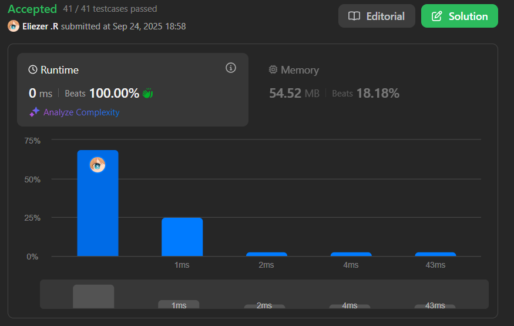

# 166. Fraction to Recurring Decimal

Dados dos enteros que representan el **numerador** y **denominador** de una fracción, retorna la fracción en formato de cadena.

Si la parte fraccionaria es **repetitiva**, encierra la parte repetitiva entre paréntesis.

Si múltiples respuestas son posibles, retorna cualquiera de ellas.

Se garantiza que la longitud de la respuesta es menor que 10⁴ para todos los casos de prueba dados.

**Dificultad:** Medium

---

## 📋 Ejemplos

**Ejemplo 1:**

- Entrada: `numerator = 1, denominator = 2`
- Salida: `"0.5"`

**Ejemplo 2:**

- Entrada: `numerator = 2, denominator = 1`
- Salida: `"2"`

**Ejemplo 3:**

- Entrada: `numerator = 4, denominator = 333`
- Salida: `"0.(012)"`
- Explicación: La división da `0.012012012...` donde `012` se repite infinitamente.

**Ejemplo 4:**

- Entrada: `numerator = 1, denominator = 3`
- Salida: `"0.(3)"`

---

## 💭 Enfoque y Estrategia

- **Objetivo**: Simular división larga para detectar patrones repetitivos.
- **Insight clave**: Cuando el residuo se repite, el ciclo decimal comienza.
- **Técnica**: Hash Map para rastrear posiciones de residuos + BigInt para manejar overflow.
- **Retos**: Manejo de signos, detección de ciclos, y números grandes.

La estrategia simula la división larga manual, usando un Map para detectar cuándo un residuo se repite, indicando el inicio de un patrón cíclico.

---

## 🔧 Implementación

```js
const fractionToDecimal = function(numerator, denominator) {
    // Caso especial: numerador es 0
    if (numerator === 0) return "0"

    // Usar BigInt para evitar overflow con números grandes
    let n = BigInt(numerator)
    let d = BigInt(denominator)

    let res = ""
    
    // Determinar signo: negativo solo si uno es negativo (XOR lógico)
    if ((n < 0n) !== (d < 0n)) res += "-"

    // Trabajar con valores absolutos
    if (n < 0n) n = -n
    if (d < 0n) d = -d

    // Parte entera de la división
    res += (n / d).toString()
    let rem = n % d  // Residuo inicial
    
    // Si no hay residuo, es un entero
    if (rem === 0n) return res

    // Agregar punto decimal
    res += "."
    const seen = new Map()  // Rastrear residuos y sus posiciones

    // Simular división larga
    while (rem !== 0n) {
        // Si ya vimos este residuo, encontramos un ciclo
        if (seen.has(rem)) {
            const pos = seen.get(rem)
            // Insertar paréntesis en la posición donde comenzó el ciclo
            res = res.slice(0, pos) + "(" + res.slice(pos) + ")"
            break
        }
        
        // Recordar posición actual del residuo
        seen.set(rem, res.length)
        
        // Continuar división larga
        rem *= 10n              // Bajar el siguiente dígito
        res += (rem / d).toString()  // Agregar dígito del cociente
        rem = rem % d           // Nuevo residuo
    }
    
    return res
}

console.log(fractionToDecimal(4, 333)) // "0.(012)"

/**
 * Ejemplo paso a paso con numerator = 4, denominator = 333:
 * 
 * 1. Configuración inicial:
 *    n = 4n, d = 333n
 *    Signo: ambos positivos → sin signo negativo
 *    Parte entera: 4n / 333n = 0n → res = "0"
 *    rem = 4n % 333n = 4n
 *    res += "." → res = "0."
 * 
 * 2. División larga (simulando):
 *    rem = 4n, seen = {}, res.length = 2
 *    seen.set(4n, 2), rem = 40n
 *    40n / 333n = 0n → res = "0.0"
 *    rem = 40n % 333n = 40n
 *    
 *    rem = 40n, seen = {4n: 2}, res.length = 3  
 *    seen.set(40n, 3), rem = 400n
 *    400n / 333n = 1n → res = "0.01"
 *    rem = 400n % 333n = 67n
 *    
 *    rem = 67n, seen = {4n: 2, 40n: 3}, res.length = 4
 *    seen.set(67n, 4), rem = 670n  
 *    670n / 333n = 2n → res = "0.012"
 *    rem = 670n % 333n = 4n
 *    
 *    rem = 4n → seen.has(4n) = true!
 *    pos = seen.get(4n) = 2
 *    res = "0." + "(" + "012" + ")" = "0.(012)"
 * 
 * Resultado: "0.(012)"
 */
```

---

## 📊 Análisis de Rendimiento

- **Complejidad temporal**: O(denominador), en el peor caso antes de encontrar un ciclo.
- **Complejidad espacial**: O(denominador), para el Map que rastrea residuos.


*El uso de BigInt previene overflow pero puede ser más lento que int regular.*

---

## 🔧 Detalles Técnicos Importantes

**Manejo de BigInt:**
```js
// BigInt previene overflow con números como -2147483648
let n = BigInt(numerator)  // Conversión explícita
n < 0n                     // Comparación con BigInt literal
(n / d).toString()         // Conversión de vuelta a string
```

**Detección de signos (XOR lógico):**
```js
// Solo negativo si exactamente uno es negativo
(n < 0n) !== (d < 0n)
// Ejemplos:
// 1, 2   → false !== false = false (positivo)
// -1, 2  → true !== false = true (negativo)  
// 1, -2  → false !== true = true (negativo)
// -1, -2 → true !== true = false (positivo)
```

---

## 🎯 Aprendizajes Clave

- **Simulación de división larga**: Multiplicar residuo por 10 y dividir iterativamente.
- **Detección de ciclos**: Un Map para rastrear cuándo se repite un residuo.
- **BigInt para overflow**: Evitar problemas con números extremos como -2³¹.
- **Manipulación de strings**: Insertar paréntesis usando slice().
- **XOR para signos**: Elegante forma de determinar el signo del resultado.

---

## 🔍 Casos Edge

- **Numerador 0**: `0/5` → `"0"`
- **División exacta**: `1/2` → `"0.5"`  
- **Entero**: `4/2` → `"2"`
- **Ciclo inmediato**: `1/3` → `"0.(3)"`
- **Números negativos**: `-1/2` → `"-0.5"`
- **Ambos negativos**: `-1/-2` → `"0.5"`
- **Overflow potencial**: `-2147483648/-1` → usar BigInt

---

## 🧮 Ejemplos Adicionales

```
1/6 → "0.1(6)"
22/7 → "3.(142857)" 
1/7 → "0.(142857)"
-1/4 → "-0.25"
5/1 → "5"
```

---

## 🚀 Optimización Sin BigInt

Para casos donde no hay riesgo de overflow:
```js
// Versión más rápida sin BigInt (cuidado con overflow)
const fractionToDecimalFast = function(numerator, denominator) {
    if (numerator === 0) return "0"
    
    let res = ""
    if ((numerator < 0) !== (denominator < 0)) res += "-"
    
    let n = Math.abs(numerator)
    let d = Math.abs(denominator)
    
    res += Math.floor(n / d)
    let rem = n % d
    if (rem === 0) return res
    
    res += "."
    const seen = new Map()
    
    while (rem !== 0) {
        if (seen.has(rem)) {
            const pos = seen.get(rem)
            return res.slice(0, pos) + "(" + res.slice(pos) + ")"
        }
        seen.set(rem, res.length)
        rem *= 10
        res += Math.floor(rem / d)
        rem %= d
    }
    
    return res
}
```

---

## 🏷️ Tags

`Hash Table` `Math` `String` `Medium`

---

**Tiempo invertido**: 2h  
**Intentos**: 4  
**Dificultad percibida**: Medium-Hard