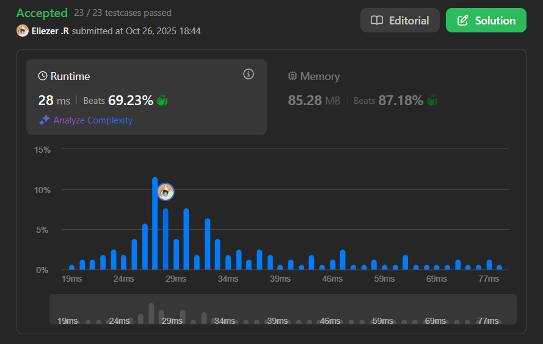

# 2043. Simple Bank System

## 🧠 Descripción

Te han encargado escribir un programa para un banco popular que automatizará todas sus transacciones entrantes (transferencia, depósito y retiro). El banco tiene `n` cuentas numeradas del `1` al `n`. El saldo inicial de cada cuenta se almacena en un array de enteros indexado en 0 llamado `balance`, donde la cuenta `(i + 1)` tiene un saldo inicial de `balance[i]`.

Ejecuta todas las transacciones válidas. Una transacción es válida si:

* El número de cuenta dado está entre `1` y `n`, y
* La cantidad de dinero retirada o transferida es menor o igual al saldo de la cuenta.

Implementa la clase `Bank`:

* `Bank(long[] balance)` - Inicializa el objeto con el array de enteros indexado en 0 `balance`.
* `boolean transfer(int account1, int account2, long money)` - Transfiere `money` dólares de la cuenta `account1` a la cuenta `account2`. Retorna `true` si la transacción fue exitosa, `false` en caso contrario.
* `boolean deposit(int account, long money)` - Deposita `money` dólares en la cuenta `account`. Retorna `true` si la transacción fue exitosa, `false` en caso contrario.
* `boolean withdraw(int account, long money)` - Retira `money` dólares de la cuenta `account`. Retorna `true` si la transacción fue exitosa, `false` en caso contrario.

---

## 📋 Ejemplos

### Ejemplo 1:

* **Entrada**:
```
["Bank", "withdraw", "transfer", "deposit", "transfer", "withdraw"]
[[[10, 100, 20, 50, 30]], [3, 10], [5, 1, 20], [5, 20], [3, 4, 15], [10, 50]]
```

* **Salida**: `[null, true, true, true, false, false]`

* **Explicación**:
```javascript
Bank bank = new Bank([10, 100, 20, 50, 30]);
bank.withdraw(3, 10);    // true, cuenta 3 tiene $20, válido retirar $10.
                         // Cuenta 3 ahora tiene $20 - $10 = $10.
bank.transfer(5, 1, 20); // true, cuenta 5 tiene $30, válido transferir $20.
                         // Cuenta 5 tiene $30 - $20 = $10, cuenta 1 tiene $10 + $20 = $30.
bank.deposit(5, 20);     // true, válido depositar $20 en cuenta 5.
                         // Cuenta 5 tiene $10 + $20 = $30.
bank.transfer(3, 4, 15); // false, el saldo actual de cuenta 3 es $10,
                         // así que es inválido transferir $15 de ella.
bank.withdraw(10, 50);   // false, es inválido porque la cuenta 10 no existe.
```

---

## 💭 Estrategia y Enfoque

Este problema requiere implementar un **sistema de banco simple** con operaciones básicas. La clave está en:

1. **Validar siempre** que las cuentas existan (entre 1 y n).
2. **Validar fondos suficientes** antes de retirar o transferir.
3. **Convertir índices**: Las cuentas se numeran desde 1, pero el array es indexado en 0.

### 🧩 Pasos del Algoritmo:

Para cada operación:
1. Ajustar el número de cuenta restando 1 (convertir de 1-indexed a 0-indexed).
2. Validar que la cuenta existe (índice válido en el array).
3. Para retiros y transferencias, validar fondos suficientes.
4. Realizar la operación si todas las validaciones pasan.
5. Retornar `true` si fue exitosa, `false` en caso contrario.

---

## 💻 Implementación en JavaScript

```js
// Constructor: Inicializa el banco con los saldos iniciales
var Bank = function (balance) {
    // Guardamos el array de saldos como propiedad del objeto
    this.balance = balance
};

/** 
 * Transfiere dinero de account1 a account2
 * @param {number} account1 - Cuenta origen
 * @param {number} account2 - Cuenta destino
 * @param {number} money - Cantidad a transferir
 * @return {boolean} - true si la transacción fue exitosa
 */
Bank.prototype.transfer = function (account1, account2, money) {
    // Convertir de 1-indexed a 0-indexed
    account1--;
    account2--;

    // Validar que ambas cuentas existan (índices válidos)
    if (account1 < 0 || account1 >= this.balance.length ||
        account2 < 0 || account2 >= this.balance.length) {
        return false;  // Cuenta inválida
    }

    // Validar que la cuenta origen tenga fondos suficientes
    if (this.balance[account1] < money) return false;

    // Realizar la transferencia
    this.balance[account1] -= money;  // Retirar de cuenta origen
    this.balance[account2] += money;  // Depositar en cuenta destino

    return true;  // Transacción exitosa
};

/** 
 * Deposita dinero en una cuenta
 * @param {number} account - Número de cuenta
 * @param {number} money - Cantidad a depositar
 * @return {boolean} - true si la transacción fue exitosa
 */
Bank.prototype.deposit = function (account, money) {
    // Convertir de 1-indexed a 0-indexed
    account--;

    // Validar que la cuenta exista
    if (account < 0 || account >= this.balance.length) return false;

    // Realizar el depósito (siempre es válido si la cuenta existe)
    this.balance[account] += money;
    return true;
};

/** 
 * Retira dinero de una cuenta
 * @param {number} account - Número de cuenta
 * @param {number} money - Cantidad a retirar
 * @return {boolean} - true si la transacción fue exitosa
 */
Bank.prototype.withdraw = function (account, money) {
    // Convertir de 1-indexed a 0-indexed
    account--;

    // Validar que la cuenta exista
    if (account < 0 || account >= this.balance.length) return false;

    // Validar fondos suficientes
    if (this.balance[account] < money) return false;

    // Realizar el retiro
    this.balance[account] -= money;
    return true;
};

// Ejemplo de uso:
const bank = new Bank([10, 100, 20, 50, 30]);
console.log(bank.withdraw(3, 10));     // true
console.log(bank.transfer(5, 1, 20));  // true
console.log(bank.deposit(5, 20));      // true
console.log(bank.transfer(3, 4, 15));  // false
console.log(bank.withdraw(10, 50));    // false
```

### 📝 Ejemplo paso a paso:

```
Estado inicial: balance = [10, 100, 20, 50, 30]
                Cuentas:    1    2    3   4   5

1. withdraw(3, 10):
   - account = 3 - 1 = 2 (índice)
   - balance[2] = 20 >= 10 ✓
   - balance[2] = 20 - 10 = 10
   - return true
   Estado: [10, 100, 10, 50, 30]

2. transfer(5, 1, 20):
   - account1 = 5 - 1 = 4, account2 = 1 - 1 = 0
   - balance[4] = 30 >= 20 ✓
   - balance[4] = 30 - 20 = 10
   - balance[0] = 10 + 20 = 30
   - return true
   Estado: [30, 100, 10, 50, 10]

3. deposit(5, 20):
   - account = 5 - 1 = 4
   - balance[4] = 10 + 20 = 30
   - return true
   Estado: [30, 100, 10, 50, 30]

4. transfer(3, 4, 15):
   - account1 = 3 - 1 = 2
   - balance[2] = 10 < 15 ✗
   - return false
   Estado: [30, 100, 10, 50, 30] (sin cambios)

5. withdraw(10, 50):
   - account = 10 - 1 = 9
   - 9 >= 5 (length) ✗
   - return false (cuenta no existe)
```

---

## 📊 Análisis de Rendimiento

* **Complejidad temporal**: O(1) para cada operación.
* **Complejidad espacial**: O(n), donde n es el número de cuentas.



---

## 🎯 Aprendizajes Clave

* **Conversión de índices**: Siempre restar 1 cuando las cuentas se numeran desde 1.
* **Validaciones múltiples**: Verificar existencia de cuenta Y fondos suficientes.
* **Prototype methods**: En JavaScript, agregar métodos a una clase usando `prototype`.
* **Early return**: Retornar `false` inmediatamente cuando una validación falla.
* **State management**: Mantener el estado del banco en `this.balance`.

---

## 🏷️ Etiquetas

`Array` `Design` `Simulation` `Hash Table` `Medium`