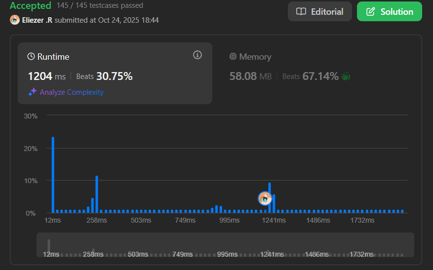

# 2048. Next Greater Numerically Balanced Number

## 🧠 Descripción

Un entero `x` es **numéricamente balanceado** si para cada dígito `d` en el número `x`, hay exactamente `d` ocurrencias de ese dígito en `x`.

Dado un entero `n`, retorna el número numéricamente balanceado más pequeño **estrictamente mayor** que `n`.

---

## 📋 Ejemplos

### Ejemplo 1:

* **Entrada**: `n = 1`
* **Salida**: `22`
* **Explicación**: 
  * 22 es numéricamente balanceado ya que:
    - El dígito 2 ocurre 2 veces.
  * Es también el número numéricamente balanceado más pequeño estrictamente mayor que 1.

### Ejemplo 2:

* **Entrada**: `n = 1000`
* **Salida**: `1333`
* **Explicación**: 
  * 1333 es numéricamente balanceado ya que:
    - El dígito 1 ocurre 1 vez.
    - El dígito 3 ocurre 3 veces.
  * Es también el número numéricamente balanceado más pequeño estrictamente mayor que 1000.
  * Nota que 1022 no puede ser la respuesta porque 0 apareció más de 0 veces.

### Ejemplo 3:

* **Entrada**: `n = 3000`
* **Salida**: `3133`
* **Explicación**: 
  * 3133 es numéricamente balanceado ya que:
    - El dígito 1 ocurre 1 vez.
    - El dígito 3 ocurre 3 veces.

---

## 💭 Estrategia y Enfoque

Este problema requiere **generar todos los números balanceados posibles** y encontrar el siguiente mayor que `n`.

### 🧩 Características de números balanceados:

* Un dígito `d` debe aparecer exactamente `d` veces.
* El dígito 0 **no puede aparecer** (porque 0 apariciones de 0 es ambiguo).
* Los dígitos válidos son 1-7 (porque un número con 8 dígitos 8 tendría 8×8=64 dígitos, excesivo).
* El número balanceado más grande práctico es `1224444` (7 dígitos).

### 🔄 Enfoque: Backtracking + Generación

1. **Generar todos los números balanceados** usando backtracking.
2. **Validar** si un número es balanceado (cada dígito `d` aparece `d` veces).
3. **Ordenar** la lista de números generados.
4. **Buscar** el primer número mayor que `n`.

---

## 💻 Implementación en JavaScript

```js
var nextBeautifulNumber = function (n) {
    // Array para guardar todos los números balanceados generados
    const list = [];

    // Función que verifica si un conteo de dígitos es balanceado
    function isBeautiful(count) {
        // Recorremos cada dígito del 1 al 7
        for (let d = 1; d <= 7; d++) {
            // Si el dígito aparece pero NO exactamente d veces, no es balanceado
            // count[d] = cuántas veces hemos usado el dígito d
            if (count[d] !== 0 && count[d] !== d) return false;
        }
        return true;
    }

    // Función recursiva que genera números balanceados
    // num: número actual que estamos construyendo
    // count: array que cuenta cuántas veces usamos cada dígito
    function generate(num, count) {
        // Si el número es válido (> 0) y es balanceado, lo agregamos
        if (num > 0 && isBeautiful(count)) list.push(num);
        
        // Poda: si excedemos el número balanceado más grande posible, paramos
        if (num > 1224444) return;

        // Probamos agregar cada dígito del 1 al 7
        for (let d = 1; d <= 7; d++) {
            // Solo agregamos el dígito si aún no hemos alcanzado su límite
            // Por ejemplo, si d=3, solo podemos usar el dígito 3 hasta 3 veces
            if (count[d] < d) {
                // ELEGIR: incrementamos el contador del dígito d
                count[d]++;
                
                // EXPLORAR: construimos el nuevo número agregando d al final
                // num * 10 + d agrega el dígito d al final del número
                generate(num * 10 + d, count);
                
                // BACKTRACK: deshacemos el cambio para probar otras opciones
                count[d]--;
            }
        }
    }

    // Iniciar la generación con número 0 y contadores en 0
    generate(0, Array(10).fill(0));
    
    // Ordenar todos los números generados de menor a mayor
    list.sort((a, b) => a - b);
    
    // Buscar el primer número mayor que n
    for (let num of list) {
        if (num > n) return num;
    }
    
    // Si no encontramos ninguno (no debería pasar), retornar -1
    return -1;
};

console.log(nextBeautifulNumber(1))     // 22
console.log(nextBeautifulNumber(1000))  // 1333
console.log(nextBeautifulNumber(3000))  // 3133
```

### 📝 Ejemplo paso a paso - Generación de números balanceados:

```
Árbol de backtracking (primeros niveles):

                    0
        /     /     |     \     \
       1     2      3      4     5 ...
      / \   /|\   / | \
    1,1 1,2 ...  

Números generados:
- 1 → count[1]=1 → ✓ balanceado → list.push(1)
- 22 → count[2]=2 → ✓ balanceado → list.push(22)
- 122 → count[1]=1, count[2]=2 → ✓ balanceado → list.push(122)
- 333 → count[3]=3 → ✓ balanceado → list.push(333)
- 1333 → count[1]=1, count[3]=3 → ✓ balanceado → list.push(1333)
- ...

Después de ordenar: [1, 22, 122, 212, 221, 333, 1333, 3133, ...]
```

### 📝 Ejemplo con `n = 1000`:

```
n = 1000

Lista generada y ordenada:
[1, 22, 122, 212, 221, 333, 1333, 3133, 3313, 3331, ...]

Buscamos el primer número > 1000:
- 1 > 1000? No
- 22 > 1000? No
- 122 > 1000? No
- 212 > 1000? No
- 221 > 1000? No
- 333 > 1000? No
- 1333 > 1000? ✓ Sí!

Resultado: 1333

Verificación de 1333:
- Dígito 1: aparece 1 vez ✓
- Dígito 3: aparece 3 veces ✓
- Es balanceado ✓
```

### 🔍 ¿Por qué funciona?

**Validación de balance:**
```js
isBeautiful([0, 1, 0, 3, 0, 0, 0, 0]) 
// Para el número 1333
// count[1] = 1 (el dígito 1 aparece 1 vez) ✓
// count[3] = 3 (el dígito 3 aparece 3 veces) ✓
// Todos los demás: count[d] = 0 (no aparecen) ✓
```

**Generación recursiva:**
```
generate(0, [0,0,0,0,0,0,0,0,0,0])
  ↓
generate(1, [0,1,0,0,0,0,0,0,0,0])  // agregamos dígito 1
  ↓
generate(13, [0,1,1,0,0,0,0,0,0,0])  // agregamos dígito 3
  ↓
generate(133, [0,1,2,0,0,0,0,0,0,0])  // agregamos dígito 3
  ↓
generate(1333, [0,1,3,0,0,0,0,0,0,0])  // agregamos dígito 3
  ↓
isBeautiful? ✓ → list.push(1333)
```

---

## 📊 Análisis de Rendimiento

* **Complejidad temporal**: O(7^7 × log(7^7)), dominada por la generación y ordenamiento.
  - Generación: O(7^7) en el peor caso
  - Ordenamiento: O(n log n) donde n es el número de elementos generados
  - Búsqueda: O(n)
* **Complejidad espacial**: O(7^7), para almacenar todos los números generados.

En práctica, el número de números balanceados es limitado (~1000 números), así que es muy eficiente.




---

## 🎯 Aprendizajes Clave

* **Backtracking con restricciones**: Generar solo combinaciones válidas.
* **Poda efectiva**: Limitar la recursión a números prácticos (≤ 1224444).
* **Pre-generación**: Generar todos los candidatos primero, luego buscar.
* **Validación de balance**: Verificar que cada dígito `d` aparece `d` veces.
* **Sorting para búsqueda**: Ordenar facilita encontrar el siguiente mayor.

---

## 🔍 Casos Edge

* **n = 1**: Primer número balanceado → `1`
* **n = 22**: Siguiente después de 22 → `122`
* **n mayor que todos**: No existe en rango práctico
* **Números con 0**: El 0 nunca aparece en números balanceados

---

## 💡 Números Balanceados Pequeños

```
1        → 1 aparece 1 vez ✓
22       → 2 aparece 2 veces ✓
122      → 1 aparece 1 vez, 2 aparece 2 veces ✓
212      → 1 aparece 1 vez, 2 aparece 2 veces ✓
221      → 1 aparece 1 vez, 2 aparece 2 veces ✓
333      → 3 aparece 3 veces ✓
1333     → 1 aparece 1 vez, 3 aparece 3 veces ✓
3133     → 1 aparece 1 vez, 3 aparece 3 veces ✓
3313     → 1 aparece 1 vez, 3 aparece 3 veces ✓
3331     → 1 aparece 1 vez, 3 aparece 3 veces ✓
4444     → 4 aparece 4 veces ✓
5555     → 5 aparece 5 veces ✓
...
```

---

## 🔄 Optimización Alternativa

En lugar de generar todos y ordenar, podríamos usar BFS para generar en orden creciente:

```js
var nextBeautifulNumberBFS = function(n) {
    const queue = [0]
    
    while (queue.length > 0) {
        const num = queue.shift()
        
        if (num > n && isBeautiful(num)) return num
        if (num > 1224444) continue
        
        for (let d = 1; d <= 7; d++) {
            queue.push(num * 10 + d)
        }
    }
    
    return -1
}
// Menos eficiente pero más directo
```

---

## 🏷️ Etiquetas

`Math` `Backtracking` `Enumeration` `Medium`