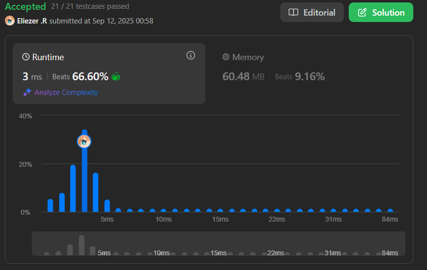

# 209. Minimum Size Subarray Sum

Dado un array de enteros positivos `nums` y un entero positivo `target`, devuelve la **longitud mínima** de un subarray cuya suma sea mayor o igual a `target`. Si no existe tal subarray, devuelve `0`.

---

## 📋 Ejemplos

**Ejemplo 1:**

- Entrada: `target = 7, nums = [2,3,1,2,4,3]`
- Salida: `2`
- Explicación: El subarray `[4,3]` tiene la longitud mínima bajo la restricción del problema.

**Ejemplo 2:**

- Entrada: `target = 4, nums = [1,4,4]`
- Salida: `1`
- Explicación: El elemento `4` por sí solo cumple la condición.

**Ejemplo 3:**

- Entrada: `target = 11, nums = [1,1,1,1,1,1,1,1]`
- Salida: `0`
- Explicación: No existe subarray cuya suma sea mayor o igual a 11.

---

## 💭 Enfoque y Estrategia

- **Objetivo**: Encontrar el subarray contiguo más corto cuya suma sea ≥ target.
- **Técnica**: Sliding Window (Ventana deslizante) con dos punteros.
- **Optimización**: Expandir la ventana hasta alcanzar el target, luego contraerla para minimizar longitud.

La estrategia utiliza el patrón de **ventana deslizante** donde expandimos la ventana hacia la derecha sumando elementos hasta que la suma sea ≥ target, luego contraemos desde la izquierda para encontrar la longitud mínima posible.

---

## 🔧 Implementación

```js
const minSubArrayLen = function (target, nums) {
    const subArr = [] // Array para almacenar longitudes válidas
    let left = 0      // Puntero izquierdo de la ventana
    let right = 0     // Puntero derecho de la ventana  
    let prefix = 0    // Suma acumulada de la ventana actual

    // Expandir la ventana con el puntero derecho
    while (right < nums.length) {
        prefix += nums[right] // Agregar elemento actual a la suma
        
        // Contraer la ventana mientras la suma sea >= target
        while (prefix >= target) {
            subArr.push(right - left + 1) // Guardar longitud actual
            prefix -= nums[left]          // Quitar elemento izquierdo
            left++                        // Mover puntero izquierdo
        }

        right++ // Mover puntero derecho para siguiente iteración
    }

    // Retornar la longitud mínima o 0 si no hay subarrays válidos
    return subArr.length === 0 ? 0 : Math.min(...subArr)
}

console.log(minSubArrayLen(7, [2,3,1,2,4,3])) // 2

/**
 * Ejemplo paso a paso con target = 7, nums = [2,3,1,2,4,3]:
 * 
 * right=0: prefix=2, suma < 7
 * right=1: prefix=5, suma < 7  
 * right=2: prefix=6, suma < 7
 * right=3: prefix=8, suma >= 7
 *   → subArr=[4], prefix=6, left=1
 *   → subArr=[4,3], prefix=4, left=2
 * right=4: prefix=8, suma >= 7
 *   → subArr=[4,3,2], prefix=6, left=3  
 * right=5: prefix=9, suma >= 7
 *   → subArr=[4,3,2,2], prefix=7, left=4
 *   → subArr=[4,3,2,2,2], prefix=3, left=5
 * 
 * Math.min(4,3,2,2,2) = 2
 */
```

---

## 📊 Análisis de Rendimiento

- **Complejidad temporal**: O(n), donde n es la longitud del array nums.
- **Complejidad espacial**: O(k), donde k es el número de subarrays válidos encontrados.



*Nota: En el peor caso, cada elemento podría generar un subarray válido, resultando en O(n) espacio.*

---

## 🔄 Optimización Alternativa

```js
// Versión optimizada O(1) espacio
const minSubArrayLenOptimized = function (target, nums) {
    let left = 0, right = 0, prefix = 0
    let minLength = Infinity
    
    while (right < nums.length) {
        prefix += nums[right]
        
        while (prefix >= target) {
            minLength = Math.min(minLength, right - left + 1)
            prefix -= nums[left]
            left++
        }
        
        right++
    }
    
    return minLength === Infinity ? 0 : minLength
}
```

---

## 🎯 Aprendizajes Clave

- **Sliding Window**: Técnica eficiente para problemas de subarrays contiguos.
- **Dos punteros**: Permite explorar el espacio de soluciones en tiempo lineal.
- **Optimización de espacio**: Se puede reducir de O(k) a O(1) calculando el mínimo sobre la marcha.
- **Condición de parada**: El while interno se ejecuta solo cuando es necesario contraer la ventana.

---

## 🏷️ Tags

`Array` `Binary Search` `Sliding Window` `Prefix Sum` `Medium`

---

**Tiempo invertido**: 40 minutos  
**Intentos**: 3  
**Dificultad percibida**: Medium