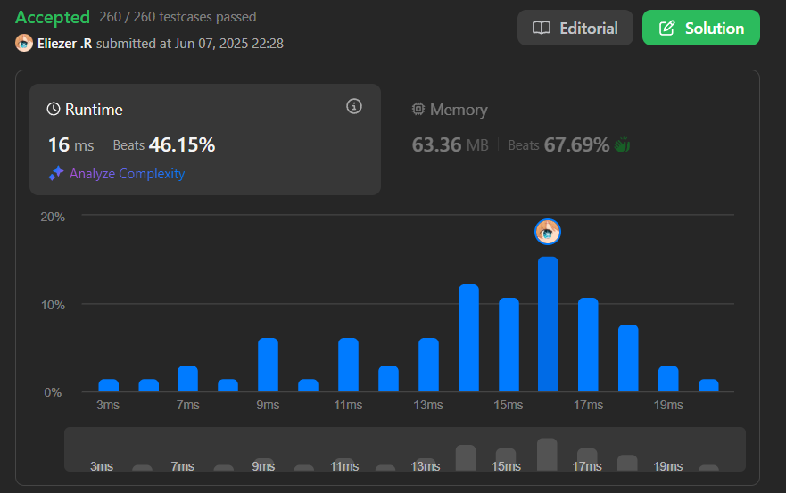

# 2116. Check if a Parentheses String Can Be Valid

Dada una cadena de paréntesis `s` y una cadena binaria `locked`, determina si es posible convertir `s` en una cadena de paréntesis válida siguiendo estas reglas:

- Si `locked[i]` es `'1'`, no puedes cambiar `s[i]`.
- Si `locked[i]` es `'0'`, puedes cambiar `s[i]` a `'('` o `')'`.

Una cadena de paréntesis es válida si:
- Es `"()"`.
- Puede escribirse como AB (A concatenado con B), donde A y B son válidas.
- Puede escribirse como (A), donde A es válida.

---

## 📋 Ejemplos

**Ejemplo 1:**

- Entrada: `s = "))()))"`, `locked = "010100"`
- Salida: `true`
- Explicación: Cambiando los caracteres desbloqueados se puede obtener una cadena válida.

**Ejemplo 2:**

- Entrada: `s = "()()"`, `locked = "0000"`
- Salida: `true`
- Explicación: Ya es válida, no se requieren cambios.

**Ejemplo 3:**

- Entrada: `s = ")"`, `locked = "0"`
- Salida: `false`
- Explicación: No es posible formar una cadena válida.

**Ejemplo 4:**

- Entrada: `s = "(((())(((())"`, `locked = "111111010111"`
- Salida: `true`
- Explicación: Cambiando los caracteres desbloqueados se puede obtener una cadena válida.

---

## 💭 Enfoque y Estrategia

### Análisis del problema

- **Objetivo**: Verificar si se puede transformar `s` en una cadena de paréntesis válida, cambiando solo los caracteres desbloqueados.
- **Restricción**: Solo se pueden cambiar los caracteres donde `locked[i] == '0'`.
- **Salida**: `true` si es posible, `false` en caso contrario.

---

### Estrategia implementada (`main.js`)

1. Si la longitud de `s` es impar, no puede ser válida.
2. Recorrer de izquierda a derecha:
   - Si el carácter es `'('` o está desbloqueado (`locked[i] == '0'`), incrementar el contador de abiertos.
   - Si es `')'` bloqueado, decrementar el contador.
   - Si en algún momento hay más cerrados que abiertos, retornar `false`.
3. Recorrer de derecha a izquierda (para verificar el caso inverso):
   - Si el carácter es `')'` o está desbloqueado, incrementar el contador de cerrados.
   - Si es `'('` bloqueado, decrementar el contador.
   - Si en algún momento hay más abiertos que cerrados, retornar `false`.
4. Si pasa ambas validaciones, retornar `true`.

#### Implementación

```js
const canBeValid = function (s, locked) {
  if (s.length % 2 === 1) return false // Si encontramos que la longitud no es divisible por 2 quiere decir que no estan completo los paréntesis
  let openString = 0 // Creamos una variable para verificar los parentesis que estan abiertos
  let closeString = 0 // Creamos una variable para verificar los parentesis que estan cerrados

  for (let i = 0; i < s.length; i++) { // Iteramos primero de orden acendente para verificar los parentesis abiertos
    if (s[i] === '(' || locked[i] === '0') { // Verificamos que si s[i] === ( || 0, entonces:
      openString++ // Le sumamos
    } else {
      openString-- // Si no quiere decir que no es ni 0 ni (, asi que restamos
    }

    if (openString < 0) { // En cada pasada tambien comprobamos que openString se mayor que 0, esto nos quiere decir que no hay mas cerrados que abiertos
      return false
    }
  }

  // Hacemos lo mismo con el siquiente for, pero de manera decendente
  for (let i = s.length - 1; i >= 0; i--) {
    if (s[i] === ')' || locked[i] === '0') {
      closeString++
    } else {
      closeString--
    }

    if (closeString < 0) {
      return false
    }
  }

  return true // Retornamos si Open o closeString son mayores o 0
}
console.log(canBeValid('(((())(((())', '111111010111'))

```

**Características:**

- **Algoritmo**: Dos recorridos lineales para validar desde ambos extremos.
- **Complejidad temporal**: O(n).
- **Complejidad espacial**: O(1).
- **Ventaja**: Eficiente y directo.
- **Desventaja**: Puede ser difícil de entender a primera vista.

---

## 📊 Análisis de Rendimiento

- Muy eficiente incluso para cadenas largas (hasta 10⁵ caracteres).
- No requiere estructuras adicionales.



---

## 🎯 Aprendizajes Clave

- Validar cadenas de paréntesis puede requerir recorrer desde ambos extremos.
- El uso de caracteres desbloqueados permite flexibilidad para balancear la cadena.
- Siempre verificar la longitud par antes de intentar validar.
- Un ejercicio que odio mucho pero bueno... 
---

## 🏷️ Tags

`String` `Parentheses` `Greedy` `Stack` `Medium`

---

**Tiempo invertido**: 2h  
**Intentos**: 10  
**Dificultad percibida**: Media