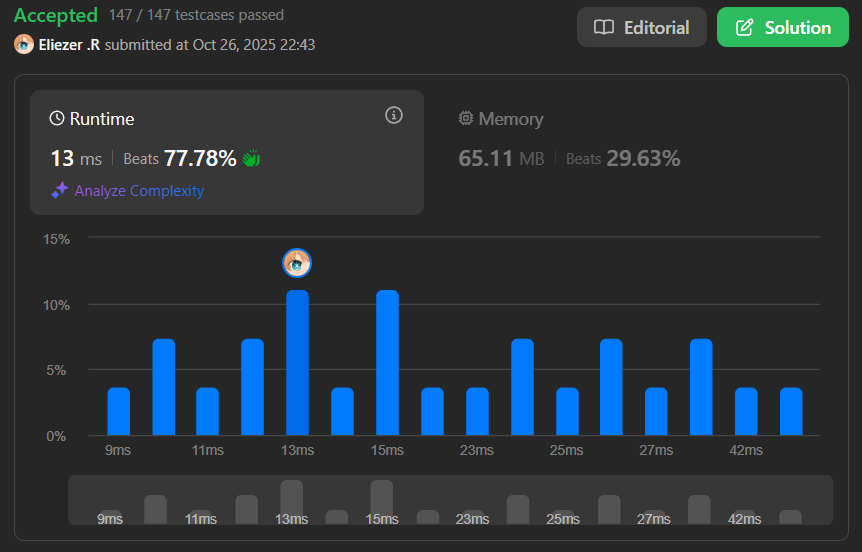

# 2125. Number of Laser Beams in a Bank

## 🧠 Descripción

Se activan dispositivos de seguridad antirrobo dentro de un banco. Se te da un array de strings binarios `bank` indexado en 0 que representa el plano del banco, el cual es una matriz 2D de `m x n`. `bank[i]` representa la fila `i`, que consiste en `'0'`s y `'1'`s. `'0'` significa que la celda está vacía, mientras que `'1'` significa que la celda tiene un dispositivo de seguridad.

Hay un rayo láser entre dos dispositivos de seguridad si se cumplen ambas condiciones:

* Los dos dispositivos están ubicados en dos filas diferentes: `r1` y `r2`, donde `r1 < r2`.
* Para cada fila `i` donde `r1 < i < r2`, no hay dispositivos de seguridad en la fila `i`.

Los rayos láser son independientes, es decir, un rayo no interfiere ni se une con otro.

Retorna el número total de rayos láser en el banco.

---

## 📋 Ejemplos

### Ejemplo 1:

* **Entrada**: `bank = ["011001","000000","010100","001000"]`
* **Salida**: `8`
* **Explicación**: Entre cada uno de los siguientes pares de dispositivos, hay un rayo. En total, hay 8 rayos:
  * bank[0][1] -- bank[2][1]
  * bank[0][1] -- bank[2][3]
  * bank[0][2] -- bank[2][1]
  * bank[0][2] -- bank[2][3]
  * bank[0][5] -- bank[2][1]
  * bank[0][5] -- bank[2][3]
  * bank[2][1] -- bank[3][2]
  * bank[2][3] -- bank[3][2]

### Ejemplo 2:

* **Entrada**: `bank = ["000","111","000"]`
* **Salida**: `0`
* **Explicación**: No existen dos dispositivos ubicados en dos filas diferentes.

---

## 💭 Estrategia y Enfoque

La clave para resolver este problema es entender que:

1. **Los rayos láser solo se forman entre filas consecutivas que tengan dispositivos** (ignorando filas vacías entre ellas).
2. **El número de rayos entre dos filas** = dispositivos en fila 1 × dispositivos en fila 2.
3. Debemos **acumular el conteo de dispositivos** de la fila anterior y multiplicarlo por el conteo de la fila actual.

### 🧩 Pasos del Algoritmo:

1. Recorrer cada fila del banco.
2. Contar cuántos dispositivos (`'1'`) hay en cada fila.
3. Si la fila tiene dispositivos y la fila anterior también tenía, multiplicar ambos conteos y sumar al resultado.
4. Actualizar el conteo anterior con el de la fila actual.
5. Ignorar filas sin dispositivos (no rompen el patrón, simplemente no contribuyen).

---

## 💻 Implementación en JavaScript

```js
var numberOfBeams = function (bank) {
    let count = 0       // Contador de dispositivos en la fila anterior con dispositivos
    let resul2 = 0      // Resultado total de rayos láser
    
    // Recorremos cada fila del banco
    for (let i = 0; i < bank.length; i++) {
        // Contamos cuántos '1' (dispositivos) hay en la fila actual
        // split('') convierte el string en array de caracteres
        // reduce suma 1 por cada '1' encontrado, 0 por cada '0'
        const resul = bank[i].split('').reduce((sum, value) => value === '1' ? sum + 1 : sum, 0)
        
        // Si la fila actual tiene dispositivos Y la anterior también tenía
        if (resul !== 0 && count !== 0) {
            // Calculamos los rayos: dispositivos fila anterior × dispositivos fila actual
            resul2 += resul * count
            // Actualizamos count con el número de dispositivos de la fila actual
            count = resul
        }
        
        // Si es la primera fila con dispositivos (count aún es 0)
        if (count === 0) {
            // Simplemente guardamos el conteo para la próxima fila
            count = resul
        }
    }

    return resul2
}

console.log(numberOfBeams(["011001","000000","010100","001000"])) // 8
console.log(numberOfBeams(["000","111","000"])) // 0
```

### 📝 Ejemplo paso a paso con `bank = ["011001","000000","010100","001000"]`:

```
Fila 0: "011001" → resul = 3 dispositivos
  count = 0, entonces count = 3
  resul2 = 0

Fila 1: "000000" → resul = 0 dispositivos
  resul = 0, no hacemos nada (fila vacía)
  count sigue siendo 3

Fila 2: "010100" → resul = 2 dispositivos
  resul = 2 y count = 3
  resul2 += 2 × 3 = 6
  count = 2

Fila 3: "001000" → resul = 1 dispositivo
  resul = 1 y count = 2
  resul2 += 1 × 2 = 2
  Total: resul2 = 6 + 2 = 8

Resultado: 8 rayos láser
```

---

## 📊 Análisis de Rendimiento

* **Complejidad temporal**: O(m × n), donde m es el número de filas y n es la longitud de cada fila.
* **Complejidad espacial**: O(1), solo usamos variables auxiliares.


---

## 🎯 Aprendizajes Clave

* El problema se reduce a **multiplicar conteos entre filas consecutivas** con dispositivos.
* Las **filas vacías no afectan** el cálculo, solo se ignoran.
* Usar `reduce` es una forma elegante de contar caracteres específicos en un string.
* La clave está en **mantener el conteo de la fila anterior** con dispositivos.

---

## 🏷️ Etiquetas

`Array` `String` `Math` `Matrix` `Medium`