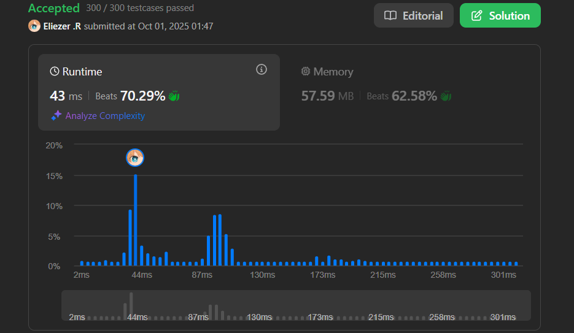

# 2221. Find Triangular Sum of an Array

Se te da un array de enteros **indexado en 0** llamado `nums`, donde `nums[i]` es un dígito entre `0` y `9` (inclusive).

La **suma triangular** de `nums` es el valor del único elemento presente en `nums` después de que el siguiente proceso termina:

1. Sea `nums` compuesto de `n` elementos. Si `n == 1`, **terminar** el proceso. De lo contrario, **crear** un nuevo array indexado en 0 llamado `newNums` de longitud `n - 1`.
2. Para cada índice `i`, donde `0 <= i < n - 1`, **asigna** el valor de `newNums[i]` como `(nums[i] + nums[i+1]) % 10`.
3. **Reemplaza** el array `nums` con `newNums`.
4. **Repetir** el proceso completo desde el paso 1.

Retorna la suma triangular de `nums`.

**Dificultad:** Medium

---

## 📋 Ejemplos

**Ejemplo 1:**

- Entrada: `nums = [1,2,3,4,5]`
- Salida: `8`
- Explicación:
```
[1,2,3,4,5]
[3,5,7,9]
[8,2,6]
[0,8]
[8]
```

**Ejemplo 2:**

- Entrada: `nums = [5]`
- Salida: `5`
- Explicación: Como solo hay un elemento, es la suma triangular.

---

## 💭 Enfoque y Estrategia

- **Objetivo**: Reducir el array iterativamente hasta obtener un solo elemento.
- **Proceso**: En cada iteración, crear un nuevo array sumando pares adyacentes módulo 10.
- **Técnica**: Modificación in-place del array para ahorrar espacio.
- **Optimización**: Usar `pop()` para reducir longitud en lugar de crear nuevos arrays.

La estrategia simula el proceso triangular modificando el array original en cada iteración, reduciendo su tamaño hasta que solo queda un elemento.

---

## 🔧 Implementación

```js
const triangularSum = function(nums) {
    // Mientras haya más de un elemento
    while (nums.length > 1) {
        // Calcular nuevos valores sumando pares adyacentes
        for (let i = 0; i < nums.length - 1; i++) {
            nums[i] = (nums[i] + nums[i + 1]) % 10
        }
        // Eliminar el último elemento (ya procesado)
        nums.pop()  
    }
    
    return nums[0]
}

console.log(triangularSum([1,2,3,4,5])) // 8

/**
 * Ejemplo paso a paso con nums = [1,2,3,4,5]:
 * 
 * Iteración 1: nums.length = 5
 * i=0: nums[0] = (1+2)%10 = 3
 * i=1: nums[1] = (2+3)%10 = 5
 * i=2: nums[2] = (3+4)%10 = 7
 * i=3: nums[3] = (4+5)%10 = 9
 * nums.pop() → nums = [3,5,7,9]
 * 
 * Iteración 2: nums.length = 4
 * i=0: nums[0] = (3+5)%10 = 8
 * i=1: nums[1] = (5+7)%10 = 2
 * i=2: nums[2] = (7+9)%10 = 6
 * nums.pop() → nums = [8,2,6]
 * 
 * Iteración 3: nums.length = 3
 * i=0: nums[0] = (8+2)%10 = 0
 * i=1: nums[1] = (2+6)%10 = 8
 * nums.pop() → nums = [0,8]
 * 
 * Iteración 4: nums.length = 2
 * i=0: nums[0] = (0+8)%10 = 8
 * nums.pop() → nums = [8]
 * 
 * nums.length = 1, terminar
 * Resultado: 8
 */
```

---

## 📊 Análisis de Rendimiento

- **Complejidad temporal**: O(n²), donde n es la longitud inicial del array.
  - Primera iteración: n-1 operaciones
  - Segunda iteración: n-2 operaciones
  - Total: (n-1) + (n-2) + ... + 1 = n(n-1)/2 = O(n²)
- **Complejidad espacial**: O(1), modificación in-place del array de entrada.


*Aunque el tiempo es O(n²), el espacio es óptimo al no crear arrays auxiliares.*

---

## 🎯 Visualización del Proceso Triangular

```
Entrada: [1,2,3,4,5]

Nivel 0:  1   2   3   4   5      (5 elementos)
           ╲ ╱ ╲ ╱ ╲ ╱ ╲ ╱
Nivel 1:    3   5   7   9        (4 elementos)
             ╲ ╱ ╲ ╱ ╲ ╱
Nivel 2:      8   2   6          (3 elementos)
               ╲ ╱ ╲ ╱
Nivel 3:        0   8            (2 elementos)
                 ╲ ╱
Nivel 4:          8              (1 elemento)

Cada nivel tiene un elemento menos que el anterior.
Total de niveles: n - 1
```

---

## 🔄 Enfoques Alternativos

**Enfoque con array nuevo (más memoria):**
```js
const triangularSumNewArray = function(nums) {
    while (nums.length > 1) {
        const newNums = []
        for (let i = 0; i < nums.length - 1; i++) {
            newNums.push((nums[i] + nums[i + 1]) % 10)
        }
        nums = newNums
    }
    return nums[0]
}
// O(n²) tiempo, O(n) espacio
```

**Enfoque recursivo:**
```js
const triangularSumRecursive = function(nums) {
    if (nums.length === 1) return nums[0]
    
    const newNums = []
    for (let i = 0; i < nums.length - 1; i++) {
        newNums.push((nums[i] + nums[i + 1]) % 10)
    }
    
    return triangularSumRecursive(newNums)
}
// O(n²) tiempo, O(n²) espacio (stack + arrays)
```

---

## 🎯 Aprendizajes Clave

- **In-place modification**: Optimizar espacio modificando el array original.
- **Pop efficiency**: `pop()` es O(1) en JavaScript para eliminar el último elemento.
- **Módulo 10**: Mantener dígitos entre 0-9 para evitar overflow.
- **Iterative reduction**: Reducir el problema paso a paso hasta el caso base.
- **Triangle pattern**: Estructura similar al triángulo de Pascal pero con sumas.

---

## 🔍 Casos Edge

- **Array de un elemento**: `[5]` → `5` (caso base inmediato)
- **Array de dos elementos**: `[1,2]` → `(1+2)%10 = 3`
- **Sumas que exceden 10**: `[9,9]` → `(9+9)%10 = 8`
- **Array con ceros**: `[0,0,0]` → `0`
- **Array largo**: La complejidad O(n²) sigue siendo manejable

---

## 🧮 Ejemplo con Módulo

```
nums = [9,8,7,6,5]

Nivel 0: [9,8,7,6,5]
         (9+8)%10=7, (8+7)%10=5, (7+6)%10=3, (6+5)%10=1

Nivel 1: [7,5,3,1]
         (7+5)%10=2, (5+3)%10=8, (3+1)%10=4

Nivel 2: [2,8,4]
         (2+8)%10=0, (8+4)%10=2

Nivel 3: [0,2]
         (0+2)%10=2

Nivel 4: [2]

Resultado: 2
```

---

## 🚀 Relación con el Triángulo de Pascal

Este problema es similar al **Triángulo de Pascal**, pero con diferencias:

| Aspecto | Triángulo de Pascal | Este Problema |
|---------|---------------------|---------------|
| Operación | Suma directa | Suma módulo 10 |
| Bordes | Siempre 1 | Dependen del input |
| Objetivo | Generar filas | Reducir a un valor |
| Valores | Crecen exponencialmente | Se mantienen 0-9 |

---

## 🏷️ Tags

`Array` `Math` `Simulation` `Medium`

---

**Tiempo invertido**: 40 minutos  
**Intentos**: 4  
**Dificultad percibida**: Medium