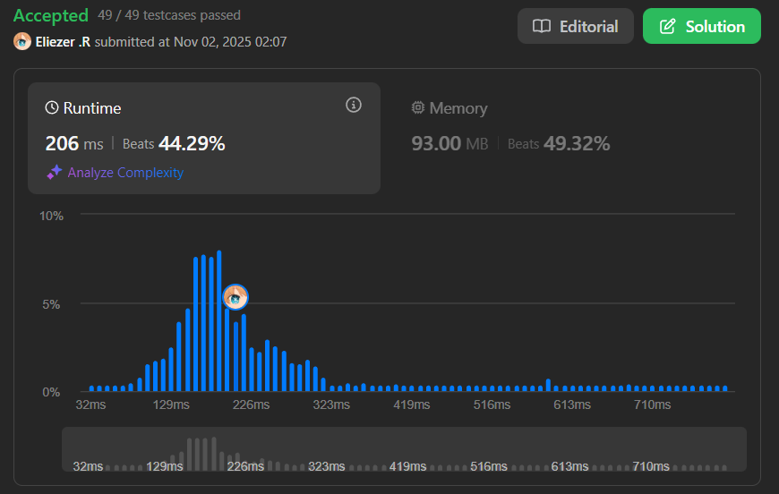

# 2257. Count Unguarded Cells in the Grid

## 🧠 Descripción

Se te da dos enteros `m` y `n` que representan una cuadrícula de `m x n` con índice 0. También se te dan dos arrays 2D `guards` y `walls` donde:
- `guards[i] = [rowi, coli]` representa la posición del guardia i-ésimo.
- `walls[j] = [rowj, colj]` representa la posición del muro j-ésimo.

Un guardia puede ver cada celda en las 4 direcciones cardinales (norte, este, sur, oeste) a menos que esté obstruido por un muro o otro guardia.

Retorna el **número de celdas desprotegidas** en la cuadrícula.

**Dificultad:** Medium

---

## 📋 Ejemplos

### Ejemplo 1:

* **Entrada**: `m = 4, n = 6, guards = [[0,0],[1,1],[2,3]], walls = [[0,1],[2,2],[1,4]]`
* **Salida**: `7`

### Ejemplo 2:

* **Entrada**: `m = 3, n = 3, guards = [[1,1]], walls = [[0,1],[1,0],[2,1],[1,2]]`
* **Salida**: `4`

---

## 💭 Estrategia y Enfoque

La estrategia es simular la visión de cada guardia en las 4 direcciones, marcando las celdas que pueden ver.

### 🔢 Código de celdas:
- `0`: Celda vacía (desprotegida)
- `1`: Guardia
- `2`: Muro
- `3`: Celda protegida (vista por un guardia)

### 🧩 Pasos del Algoritmo:

1. Crear cuadrícula inicializada en 0.
2. Marcar posiciones de guardias (1) y muros (2).
3. Para cada guardia, proyectar su visión en las 4 direcciones.
4. Detener la proyección al encontrar muro u otro guardia.
5. Contar celdas que quedaron en 0.

---

## 💻 Implementación en JavaScript

```js
var countUnguarded = function (m, n, guards, walls) {
    // Paso 1: Crear cuadrícula m x n inicializada en 0
    // Array.from crea un array de m filas
    // Cada fila es un Array(n).fill(0) con n columnas en 0
    let grid = Array.from({ length: m }, () => Array(n).fill(0));

    // Paso 2a: Marcar posiciones de guardias con 1
    // Destructuramos [r, c] de cada guardia
    for (const [r, c] of guards) grid[r][c] = 1;
    
    // Paso 2b: Marcar posiciones de muros con 2
    for (const [r, c] of walls) grid[r][c] = 2;

    // Definir las 4 direcciones cardinales:
    // [-1, 0]: arriba (norte) - decrementar fila
    // [1, 0]: abajo (sur) - incrementar fila
    // [0, -1]: izquierda (oeste) - decrementar columna
    // [0, 1]: derecha (este) - incrementar columna
    const directions = [
        [-1, 0],  // Norte (↑)
        [1, 0],   // Sur (↓)
        [0, -1],  // Oeste (←)
        [0, 1]    // Este (→)
    ];

    // Paso 3: Para cada guardia, proyectar su visión
    for (const [r, c] of guards) {
        // Probar cada una de las 4 direcciones
        for (const [dr, dc] of directions) {
            // Empezar desde la posición adyacente al guardia
            // dr es el delta de fila, dc es el delta de columna
            let row = r + dr;
            let col = c + dc;

            // Continuar en esta dirección mientras:
            // 1. Estemos dentro de los límites de la cuadrícula
            // 2. No hayamos encontrado obstáculos
            while (row >= 0 && row < m && col >= 0 && col < n) {
                // Si encontramos un guardia (1) o un muro (2), detener
                // Los guardias y muros bloquean la visión
                if (grid[row][col] === 1 || grid[row][col] === 2) break;

                // Si la celda está vacía (0), marcarla como protegida (3)
                // Si ya es 3, no importa, la dejamos en 3
                if (grid[row][col] === 0) grid[row][col] = 3;

                // Avanzar un paso más en la misma dirección
                row += dr;
                col += dc;
            }
        }
    }

    // Paso 4: Contar celdas desprotegidas (valor 0)
    let unguarded = 0;
    
    // Recorrer toda la cuadrícula
    for (let i = 0; i < m; i++) {
        for (let j = 0; j < n; j++) {
            // Si la celda tiene valor 0, está desprotegida
            if (grid[i][j] === 0) unguarded++;
        }
    }

    return unguarded;
};

console.log(countUnguarded(4, 6, [[0,0],[1,1],[2,3]], [[0,1],[2,2],[1,4]])) // 7
```

### 📝 Ejemplo visual con `m=4, n=4, guards=[[1,1]], walls=[[0,2]]`:

```
Estado inicial (0 = vacío):
0 0 0 0
0 0 0 0
0 0 0 0
0 0 0 0

Después de marcar guardias (1) y muros (2):
0 0 2 0
0 1 0 0
0 0 0 0
0 0 0 0

Proyectar visión del guardia en [1,1]:

Dirección Norte (↑):
0 0 2 0
0 G 0 0  ← Guardia mira hacia arriba
3 0 0 0  ← Marca [0,1] como protegida, luego para (límite)

Dirección Sur (↓):
0 0 2 0
0 G 0 0  ← Guardia mira hacia abajo
0 3 0 0  ← Marca [2,1]
0 3 0 0  ← Marca [3,1]

Dirección Oeste (←):
0 0 2 0
3 G 0 0  ← Marca [1,0]
0 0 0 0
0 0 0 0

Dirección Este (→):
0 0 2 0
0 G 3 3  ← Marca [1,2] y [1,3]
0 0 0 0
0 0 0 0

Grid final:
0 3 2 0
3 1 3 3
0 3 0 0
0 3 0 0

Celdas con valor 0 (desprotegidas): 8
```

---

## 📊 Análisis de Rendimiento

* **Complejidad temporal**: O(m × n × g), donde g es el número de guardias.
  - Cada guardia puede ver hasta O(m + n) celdas
  - En el peor caso: O(g × (m + n))
* **Complejidad espacial**: O(m × n), para la cuadrícula.



---

## 🎯 Aprendizajes Clave

* **Grid simulation**: Representar estados con números.
* **Direction vectors**: Usar arrays para movimientos cardinales.
* **Ray casting**: Proyectar visión hasta encontrar obstáculo.
* **Early termination**: break cuando encontramos bloqueo.
* **State encoding**: 0=vacío, 1=guardia, 2=muro, 3=protegido.

---

## 💡 Optimización alternativa

Para grids muy grandes, podríamos optimizar marcando rangos completos en lugar de celda por celda, pero la solución actual es clara y suficientemente eficiente.

---

## 🏷️ Etiquetas

`Array` `Matrix` `Simulation` `Medium`