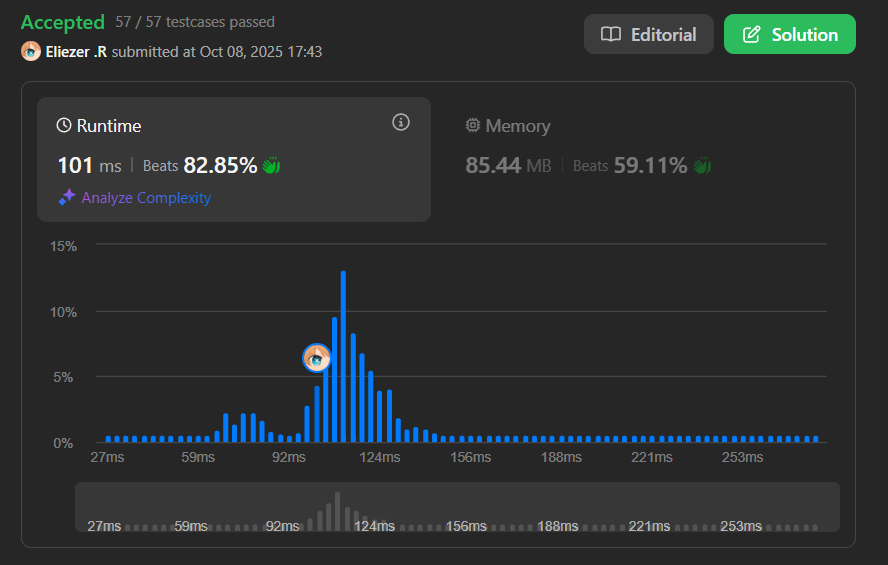

# 2300. Successful Pairs of Spells and Potions

Se te dan dos arrays de enteros positivos `spells` y `potions`, de longitud `n` y `m` respectivamente, donde `spells[i]` representa la fuerza del `i`-ésimo hechizo y `potions[j]` representa la fuerza de la `j`-ésima poción.

También se te da un entero `success`. Un par de hechizo y poción se considera **exitoso** si el **producto** de sus fuerzas es **al menos** `success`.

Retorna un array de enteros `pairs` de longitud `n` donde `pairs[i]` es el **número de pociones** que formarán un par exitoso con el `i`-ésimo hechizo.

**Dificultad:** Medium

---

## 📋 Ejemplos

**Ejemplo 1:**

- Entrada: `spells = [5,1,3], potions = [1,2,3,4,5], success = 7`
- Salida: `[4,0,3]`
- Explicación:
  - Hechizo 0 (fuerza 5): 5×2=10, 5×3=15, 5×4=20, 5×5=25 ≥ 7 → 4 parejas
  - Hechizo 1 (fuerza 1): ningún producto ≥ 7 → 0 parejas
  - Hechizo 2 (fuerza 3): 3×3=9, 3×4=12, 3×5=15 ≥ 7 → 3 parejas

**Ejemplo 2:**

- Entrada: `spells = [3,1,2], potions = [8,5,8], success = 16`
- Salida: `[2,0,2]`

---

## 💭 Enfoque y Estrategia

- **Objetivo**: Para cada hechizo, contar cuántas pociones forman un par exitoso.
- **Insight clave**: Ordenar pociones + búsqueda binaria para encontrar el umbral.
- **Fórmula**: Para que `spell[i] × potion[j] ≥ success`, necesitamos `potion[j] ≥ success / spell[i]`.
- **Optimización**: Binary search encuentra la primera poción válida en O(log m).

La estrategia ordena las pociones una vez, luego para cada hechizo usa búsqueda binaria para encontrar cuántas pociones superan el umbral necesario.

---

## 🔧 Implementación

```js
const successfulPairs = function (spells, potions, success) {
    potions.sort((a, b) => a - b)  // Ordenar pociones una vez
    const subArr = []
    
    // Para cada hechizo, encontrar cuántas pociones son válidas
    for (let i = 0; i < spells.length; i++) {
        const divi = success / spells[i]  // Umbral mínimo de poción necesaria
        const idx = binarySearch(divi)    // Encontrar primera poción válida
        
        subArr.push(potions.length - idx)  // Contar pociones desde idx hasta el final
    }

    // Búsqueda binaria: encuentra la primera poción >= num
    function binarySearch(num) {
        let left = 0
        let right = potions.length - 1

        while (left <= right) {
            const mid = Math.floor((left + right) / 2)
            if (potions[mid] >= num) {
                right = mid - 1  // Buscar a la izquierda para encontrar la primera
            }
            else {
                left = mid + 1   // Buscar a la derecha
            }
        }
        return left  // left es el índice de la primera poción válida
    }

    return subArr
}

console.log(successfulPairs([5,1,3], [1,2,3,4,5], 7)) // [4,0,3]

/**
 * Ejemplo paso a paso con spells = [5,1,3], potions = [1,2,3,4,5], success = 7:
 * 
 * Paso 1: Ordenar pociones
 * potions = [1,2,3,4,5] (ya estaba ordenado)
 * 
 * Paso 2: Procesar cada hechizo
 * 
 * Hechizo i=0 (spell=5):
 *   divi = 7/5 = 1.4
 *   binarySearch(1.4):
 *     left=0, right=4
 *     mid=2: potions[2]=3 >= 1.4 → right=1
 *     mid=0: potions[0]=1 >= 1.4? No → left=1
 *     mid=1: potions[1]=2 >= 1.4 → right=0
 *     left=1, right=0 → termina, return 1
 *   
 *   Count: 5 - 1 = 4 pociones [2,3,4,5]
 *   subArr = [4]
 * 
 * Hechizo i=1 (spell=1):
 *   divi = 7/1 = 7
 *   binarySearch(7):
 *     ... ninguna poción >= 7
 *     return 5
 *   
 *   Count: 5 - 5 = 0 pociones
 *   subArr = [4, 0]
 * 
 * Hechizo i=2 (spell=3):
 *   divi = 7/3 = 2.333...
 *   binarySearch(2.333):
 *     ... encuentra índice 2
 *     return 2
 *   
 *   Count: 5 - 2 = 3 pociones [3,4,5]
 *   subArr = [4, 0, 3]
 * 
 * Resultado: [4, 0, 3]
 */
```

---

## 📊 Análisis de Rendimiento

- **Complejidad temporal**: O(m log m + n log m), donde n = spells.length y m = potions.length.
  - Ordenar pociones: O(m log m)
  - Por cada hechizo, binary search: O(log m)
  - Total para n hechizos: O(n log m)
- **Complejidad espacial**: O(log m) para el sorting (o O(1) si no contamos el sort), O(n) para el resultado.
  
*Solución óptima usando binary search para evitar comparaciones O(n×m).*

---

## 🎯 Intuición de la Búsqueda Binaria

**¿Por qué funciona?**

Después de ordenar, las pociones forman un array donde:
```
[poción1, poción2, poción3, ..., pociónM]
  ↓        ↓        ↓              ↓
[muy débil, débil, fuerte, muy fuerte]
```

Para un hechizo dado, buscamos el **primer** punto donde `poción × hechizo ≥ success`:
```
[1, 2, 3, 4, 5]  spell=5, success=7, umbral=1.4
 X  ✓  ✓  ✓  ✓   (2 es la primera válida)
    ↑
    idx=1, count = 5-1 = 4
```

---

## 🔍 Visualización del Proceso

```
spells = [5, 1, 3]
potions = [1, 2, 3, 4, 5]
success = 7

Para spell=5:
  Necesitamos potion × 5 ≥ 7
  → potion ≥ 1.4
  
  Pociones ordenadas: [1, 2, 3, 4, 5]
  Binary search encuentra: índice 1 (valor 2)
  Count: [2, 3, 4, 5] = 4 pociones ✓

Para spell=1:
  Necesitamos potion × 1 ≥ 7
  → potion ≥ 7
  
  Ninguna poción ≥ 7
  Count: 0 pociones ✓

Para spell=3:
  Necesitamos potion × 3 ≥ 7
  → potion ≥ 2.33...
  
  Binary search encuentra: índice 2 (valor 3)
  Count: [3, 4, 5] = 3 pociones ✓
```

---

## 🔄 Enfoque Alternativo (Fuerza Bruta)

```js
// Menos eficiente - O(n × m)
const successfulPairsBruteForce = function(spells, potions, success) {
    const result = []
    
    for (let i = 0; i < spells.length; i++) {
        let count = 0
        for (let j = 0; j < potions.length; j++) {
            if (spells[i] * potions[j] >= success) {
                count++
            }
        }
        result.push(count)
    }
    
    return result
}

// O(n×m) vs O(m log m + n log m) con binary search
```

---

## 🎯 Aprendizajes Clave

- **Sort + Binary Search**: Patrón común para optimizar búsquedas repetidas.
- **Umbral calculado**: Transformar `a × b ≥ c` en `b ≥ c / a` simplifica la búsqueda.
- **Counting trick**: En array ordenado, contar desde índice hasta el final da el total.
- **Reutilización de sort**: Ordenar una vez, buscar múltiples veces.
- **División con decimales**: La búsqueda binaria maneja correctamente valores flotantes.

---

## 🔍 Casos Edge

- **Todos los pares exitosos**: Cuando el success es muy bajo
- **Ningún par exitoso**: Cuando el success es extremadamente alto
- **Un solo hechizo/poción**: Arrays de tamaño 1
- **Números grandes**: El producto puede ser muy grande, usar precaución con overflow

---

## 🧮 Detalles de la Búsqueda Binaria

**¿Por qué `return left`?**

```js
Al final del while loop:
- left apunta al primer elemento >= target
- right apunta al último elemento < target

Ejemplos:
potions = [1, 2, 3, 4, 5], buscando 2.5

Iteraciones:
  left=0, right=4, mid=2: potions[2]=3 >= 2.5 → right=1
  left=0, right=1, mid=0: potions[0]=1 >= 2.5? No → left=1
  left=1, right=1, mid=1: potions[1]=2 >= 2.5? No → left=2
  left=2, right=1 → termina

left=2 apunta a potions[2]=3, la primera >= 2.5 ✓
```


---

## 🧠 Comparación con Problemas Similares

| Problema | Técnica | Complejidad |
|----------|---------|-------------|
| **2300. Successful Pairs** | Sort + Binary Search | O(m log m + n log m) |
| **611. Valid Triangle Number** | Sort + Two Pointers | O(n² + n log n) |
| **167. Two Sum II** | Two Pointers | O(n) |
| **1. Two Sum** | Hash Map | O(n) |

**Patrón común**: Ordenar para habilitar búsqueda eficiente.

---

## 🏷️ Tags

`Array` `Two Pointers` `Binary Search` `Sorting` `Medium`

---

**Tiempo invertido**: 38 minutos  
**Intentos**: 3  
**Dificultad percibida**: Medium