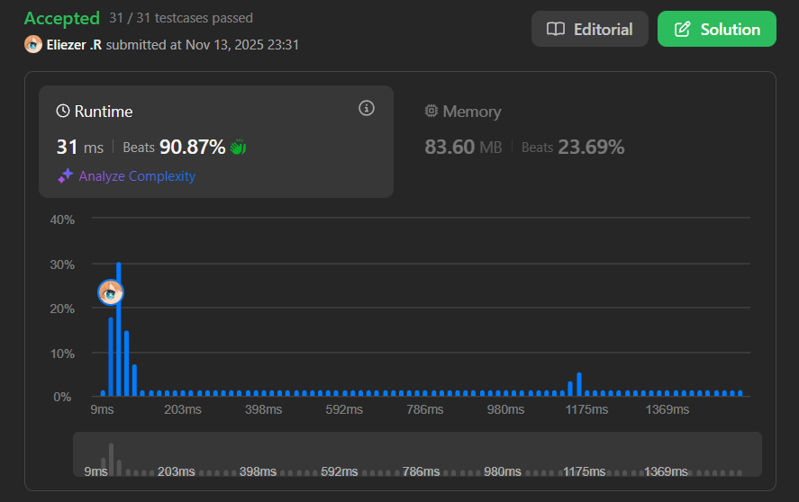

# 2536. Increment Submatrices by One

Se te da un entero positivo **n**, indicando que inicialmente tenemos una matriz entera de **n × n** indexada desde 0 llamada `mat` llena de ceros.

También se te da un arreglo 2D de enteros **query**. Para cada `query[i] = [row1ᵢ, col1ᵢ, row2ᵢ, col2ᵢ]`, debes realizar la siguiente operación:

- Sumar **1** a cada elemento en la submatriz con la esquina superior izquierda `(row1ᵢ, col1ᵢ)` y la esquina inferior derecha `(row2ᵢ, col2ᵢ)`.
- Es decir, sumar 1 a `mat[x][y]` para todo `row1ᵢ ≤ x ≤ row2ᵢ` y `col1ᵢ ≤ y ≤ col2ᵢ`.

Retorna la matriz `mat` después de realizar todas las consultas.

**Dificultad:** Medium

---

## 📋 Ejemplos

**Ejemplo 1:**

- Entrada: `n = 3, queries = [[1,1,2,2],[0,0,1,1]]`
- Salida: `[[1,1,0],[1,2,1],[0,1,1]]`
- Explicación: 
  - En la primera consulta, sumamos 1 a cada elemento en la submatriz con esquina superior izquierda `(1, 1)` y esquina inferior derecha `(2, 2)`.
  - En la segunda consulta, sumamos 1 a cada elemento en la submatriz con esquina superior izquierda `(0, 0)` y esquina inferior derecha `(1, 1)`.

**Ejemplo 2:**

- Entrada: `n = 2, queries = [[0,0,1,1]]`
- Salida: `[[1,1],[1,1]]`
- Explicación: En la primera consulta sumamos 1 a cada elemento de la matriz.

---

## 💭 Enfoque y Estrategia

- **Objetivo**: Actualizar eficientemente múltiples rangos en una matriz 2D.
- **Insight clave**: Usar un **arreglo de diferencias 2D** para marcar los límites de cada actualización en O(1) por consulta.
- **Técnica**: Diferencias 2D + suma de prefijos 2D para reconstruir la matriz final.
- **Retos**: Manejar correctamente los índices de límite y evitar desbordamientos.

Si aplicáramos cada consulta directamente (incrementando cada celda en el rango), tendríamos una complejidad de O(n² × q). Con el arreglo de diferencias, reducimos esto a O(n² + q).

---

## 🔧 Implementación

```javascript
var rangeAddQueries = function(n, queries) {
    // Crear matriz de diferencias (n+1) × (n+1) para evitar chequeos de límites
    const diff = Array.from({length: n+1}, () => Array(n+1).fill(0));

    // Paso 1: Aplicar todas las consultas a la matriz de diferencias
    for (let i = 0; i < queries.length; i++) {
        const [row1, col1, row2, col2] = queries[i];

        // Técnica de diferencias 2D:
        // Marcar el inicio del rango (esquina superior izquierda)
        diff[row1][col1] += 1;
        
        // Marcar el final del rango en columnas (justo después del borde derecho)
        diff[row1][col2 + 1] -= 1;
        
        // Marcar el final del rango en filas (justo después del borde inferior)
        diff[row2 + 1][col1] -= 1;
        
        // Compensar la doble resta (esquina inferior derecha + 1)
        diff[row2 + 1][col2 + 1] += 1;
    }

    // Paso 2: Aplicar suma de prefijos horizontal (por filas)
    for (let r = 0; r < n; r++) {
        for (let c = 1; c < n; c++) {
            diff[r][c] += diff[r][c - 1];
        }
    }

    // Paso 3: Aplicar suma de prefijos vertical (por columnas)
    for (let r = 1; r < n; r++) {
        for (let c = 0; c < n; c++) {
            diff[r][c] += diff[r - 1][c];
        }
    }

    // Paso 4: Extraer solo la submatriz n × n (descartar la fila/columna extra)
    const res = Array.from({length: n}, (_, i) => diff[i].slice(0, n));

    return res;
};

console.log(rangeAddQueries(3, [[1,1,2,2],[0,0,1,1]]));
// [[1,1,0],[1,2,1],[0,1,1]]

/**
 * Ejemplo paso a paso con n = 3, queries = [[1,1,2,2],[0,0,1,1]]:
 * 
 * PASO 1: Aplicar consultas a matriz de diferencias
 * 
 * Matriz inicial diff (4×4, todo en 0):
 * [[0, 0, 0, 0],
 *  [0, 0, 0, 0],
 *  [0, 0, 0, 0],
 *  [0, 0, 0, 0]]
 * 
 * Query 1: [1,1,2,2]
 *   diff[1][1] += 1  → diff[1][1] = 1
 *   diff[1][3] -= 1  → diff[1][3] = -1
 *   diff[3][1] -= 1  → diff[3][1] = -1
 *   diff[3][3] += 1  → diff[3][3] = 1
 * 
 * Matriz diff después de Query 1:
 * [[0,  0,  0,  0],
 *  [0,  1,  0, -1],
 *  [0,  0,  0,  0],
 *  [0, -1,  0,  1]]
 * 
 * Query 2: [0,0,1,1]
 *   diff[0][0] += 1  → diff[0][0] = 1
 *   diff[0][2] -= 1  → diff[0][2] = -1
 *   diff[2][0] -= 1  → diff[2][0] = -1
 *   diff[2][2] += 1  → diff[2][2] = 1
 * 
 * Matriz diff después de Query 2:
 * [[ 1,  0, -1,  0],
 *  [ 0,  1,  0, -1],
 *  [-1,  0,  1,  0],
 *  [ 0, -1,  0,  1]]
 * 
 * PASO 2: Suma de prefijos horizontal (por filas)
 * 
 * Para cada fila, acumular valores de izquierda a derecha:
 * 
 * Fila 0: [1, 1, 0, 0]    (1, 1+0=1, 1-1=0, 0+0=0)
 * Fila 1: [0, 1, 1, 0]    (0, 0+1=1, 1+0=1, 1-1=0)
 * Fila 2: [-1, -1, 0, 0]  (-1, -1+0=-1, -1+1=0, 0+0=0)
 * 
 * Matriz después del paso 2:
 * [[ 1,  1,  0,  0],
 *  [ 0,  1,  1,  0],
 *  [-1, -1,  0,  0],
 *  [ 0, -1, -1,  0]]
 * 
 * PASO 3: Suma de prefijos vertical (por columnas)
 * 
 * Para cada columna, acumular valores de arriba a abajo:
 * 
 * Col 0: [1, 1, 0, 0]     (1, 1+0=1, 1-1=0, 0+0=0)
 * Col 1: [1, 2, 1, 0]     (1, 1+1=2, 2-1=1, 1-1=0)
 * Col 2: [0, 1, 1, 0]     (0, 0+1=1, 1+0=1, 1-1=0)
 * Col 3: [0, 0, 0, 0]     (todo se mantiene en 0)
 * 
 * Matriz final:
 * [[1, 1, 0, 0],
 *  [1, 2, 1, 0],
 *  [0, 1, 1, 0],
 *  [0, 0, 0, 0]]
 * 
 * PASO 4: Extraer submatriz 3×3
 * Resultado: [[1, 1, 0],
 *             [1, 2, 1],
 *             [0, 1, 1]]
 */
```

---

## 📊 Análisis de Rendimiento

- **Complejidad temporal**: O(n² + q), donde q es el número de consultas.
  - O(q) para procesar todas las consultas
  - O(n²) para las dos pasadas de suma de prefijos
- **Complejidad espacial**: O(n²) para la matriz de diferencias.


*Comparado con O(n² × q) de la solución naive, esta es mucho más eficiente.*

---

## 🔧 Detalles Técnicos Importantes

**¿Qué es un Arreglo de Diferencias 2D?**

En 1D, un arreglo de diferencias nos permite marcar rangos en O(1):
```javascript
// Para incrementar rango [L, R]:
diff[L] += 1;
diff[R + 1] -= 1;
// Luego aplicar suma de prefijos para obtener valores reales
```

En 2D, extendemos esta idea usando **cuatro esquinas**:

```javascript
// Para incrementar rectángulo [(r1,c1), (r2,c2)]:
diff[r1][c1] += 1;        // Esquina superior izquierda: INICIO
diff[r1][c2 + 1] -= 1;    // Borde derecho: TERMINA en columnas
diff[r2 + 1][c1] -= 1;    // Borde inferior: TERMINA en filas  
diff[r2 + 1][c2 + 1] += 1; // Esquina: COMPENSAR doble resta
```

**Visualización de la técnica:**

```
Matriz original:        Matriz de diferencias:
[0, 0, 0, 0]           [ 1,  0,  0, -1]
[0, 1, 1, 0]    -->    [ 0,  0,  0,  0]
[0, 1, 1, 0]           [ 0,  0,  0,  0]
[0, 0, 0, 0]           [-1,  0,  0,  1]

Después de suma de prefijos → obtener matriz original
```

**¿Por qué necesitamos (n+1) × (n+1)?**

Para evitar chequeos de límites cuando `col2 + 1 = n` o `row2 + 1 = n`. La fila y columna extra actúan como "buffer de límite".

---

## 🎯 Aprendizajes Clave

- **Arreglo de diferencias 2D**: Técnica poderosa para actualizaciones de rango eficientes.
- **Suma de prefijos 2D**: Aplicar primero horizontal, luego vertical.
- **Optimización de espacio-tiempo**: Sacrificar O(n²) espacio extra por ganar eficiencia temporal.
- **Manejo de límites**: Usar dimensiones (n+1) × (n+1) simplifica el código.
- **Principio de inclusión-exclusión**: Las cuatro esquinas se ajustan correctamente.

---

## 🔍 Casos Edge

- **Una sola celda**: `n = 1, queries = [[0,0,0,0]]` → `[[1]]`
- **Matriz completa**: `n = 2, queries = [[0,0,1,1]]` → `[[1,1],[1,1]]`
- **Sin consultas**: `n = 3, queries = []` → matriz de ceros
- **Consultas superpuestas**: Las regiones que se superponen acumulan valores
- **Consultas disjuntas**: Cada región mantiene su propio valor
- **Máximo n**: `n = 1000` con múltiples consultas → sigue siendo eficiente

---

## 🧮 Ejemplos Adicionales

```javascript
// Consulta simple
n = 2, queries = [[0,0,0,0]]
→ [[1,0],[0,0]]

// Múltiples consultas superpuestas
n = 2, queries = [[0,0,1,1], [0,0,1,1]]
→ [[2,2],[2,2]]

// Patrón en forma de cruz
n = 3, queries = [[1,0,1,2], [0,1,2,1]]
→ [[0,1,0],
   [1,2,1],
   [0,1,0]]
```

---

## 🚀 Comparación: Solución Naive vs Optimizada

**Solución Naive (TLE para casos grandes):**

```javascript
var rangeAddQueriesNaive = function(n, queries) {
    const mat = Array.from({length: n}, () => Array(n).fill(0));
    
    // Para cada consulta, iterar sobre todo el rectángulo
    for (let [r1, c1, r2, c2] of queries) {
        for (let r = r1; r <= r2; r++) {
            for (let c = c1; c <= c2; c++) {
                mat[r][c] += 1;
            }
        }
    }
    
    return mat;
};
```

**Complejidad**: O(n² × q × k), donde k es el tamaño promedio de cada consulta.

**Solución Optimizada (usando diferencias 2D):**
- Complejidad: O(n² + q) ✓

Para `n = 1000` y `q = 10000`:
- Naive: ~10^10 operaciones (TLE)
- Optimizada: ~1.01×10^6 operaciones ✓

---

## 🔬 Variante: Suma de Prefijos en Una Pasada

Alternativamente, puedes combinar ambas sumas de prefijos:

```javascript
// Combinar suma de prefijos horizontal y vertical
for (let r = 0; r < n; r++) {
    for (let c = 0; c < n; c++) {
        if (r > 0) diff[r][c] += diff[r-1][c];
        if (c > 0) diff[r][c] += diff[r][c-1];
        if (r > 0 && c > 0) diff[r][c] -= diff[r-1][c-1];
    }
}
```

Esta es la fórmula clásica de suma de prefijos 2D, pero las dos pasadas separadas son más fáciles de entender.

---

## 🏷️ Tags

`Array` `Matrix` `Prefix Sum` `Difference Array` `Medium`

---