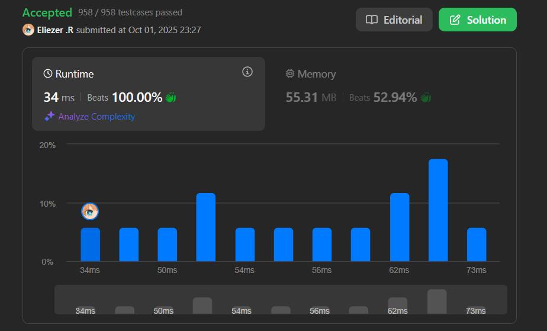

# 3100. Water Bottles II

Se te dan dos enteros `numBottles` y `numExchange`.

`numBottles` representa el número de botellas de agua llenas que inicialmente tienes. En una operación, puedes realizar uno de los siguientes:

- Beber cualquier número de botellas de agua llenas convirtiéndolas en botellas vacías.
- Intercambiar `numExchange` botellas de agua vacías por una botella de agua llena. Luego, **incrementar** `numExchange` en uno.

**Nota importante:** No puedes intercambiar múltiples lotes de botellas vacías por el mismo valor de `numExchange`. Por ejemplo, si `numBottles == 3` y `numExchange == 1`, no puedes intercambiar 3 botellas vacías por 3 botellas llenas.

Retorna el **número máximo** de botellas de agua que puedes beber.

**Dificultad:** Medium

---

## 📋 Ejemplos

**Ejemplo 1:**

- Entrada: `numBottles = 13, numExchange = 6`
- Salida: `15`
- Explicación:
  - Bebes las 13 botellas → 13 vacías
  - Intercambias 6 vacías por 1 llena (quedan 7 vacías, numExchange=7)
  - Bebes 1 botella → 8 vacías
  - Intercambias 7 vacías por 1 llena (queda 1 vacía, numExchange=8)
  - Bebes 1 botella → 2 vacías
  - No puedes intercambiar más (2 < 8)
  - Total: 13 + 1 + 1 = 15

**Ejemplo 2:**

- Entrada: `numBottles = 10, numExchange = 3`
- Salida: `13`

---

## 💭 Enfoque y Estrategia

- **Objetivo**: Maximizar el número total de botellas bebidas considerando intercambios dinámicos.
- **Diferencia clave con Water Bottles I**: El costo de intercambio **aumenta** después de cada intercambio.
- **Técnica**: Simulación iterativa rastreando vacías y el costo creciente.
- **Optimización**: Usar una variable que acumule directamente las botellas bebidas.

La estrategia simula el proceso de intercambio donde cada vez que intercambiamos botellas, el costo aumenta, haciendo que los intercambios subsecuentes sean más difíciles.

---

## 🔧 Implementación

```js
const maxBottlesDrunk = function (numBottles, numExchange) {
    let emptyBottles = numBottles   // Botellas vacías disponibles
    let fullBottles = numBottles    // Total de botellas bebidas (acumulador)

    // Mientras podamos hacer un intercambio
    while (emptyBottles >= numExchange) {
        emptyBottles -= numExchange - 1  // Costo neto del intercambio
        numExchange++                    // Incrementar costo para próximo intercambio
        fullBottles++                    // Contar la nueva botella bebida
    }

    return fullBottles
}

console.log(maxBottlesDrunk(13, 6)) // 15

/**
 * Ejemplo paso a paso con numBottles = 13, numExchange = 6:
 * 
 * Estado inicial:
 * emptyBottles = 13 (bebimos las 13 iniciales)
 * fullBottles = 13 (total bebido hasta ahora)
 * numExchange = 6 (costo actual)
 * 
 * Iteración 1:
 * 13 >= 6? Sí, podemos intercambiar
 * emptyBottles = 13 - (6-1) = 13 - 5 = 8
 *   (usamos 6, obtenemos 1 llena que se vuelve vacía = neto -5)
 * numExchange = 6 + 1 = 7
 * fullBottles = 13 + 1 = 14
 * 
 * Iteración 2:
 * 8 >= 7? Sí, podemos intercambiar
 * emptyBottles = 8 - (7-1) = 8 - 6 = 2
 * numExchange = 7 + 1 = 8
 * fullBottles = 14 + 1 = 15
 * 
 * Iteración 3:
 * 2 >= 8? No, terminar
 * 
 * Resultado: 15
 */
```

---

## 📊 Análisis de Rendimiento

- **Complejidad temporal**: O(√n), donde n es el número inicial de botellas.
  - El costo de intercambio crece linealmente: 6, 7, 8, 9, ...
  - Número de intercambios es aproximadamente O(√n)
- **Complejidad espacial**: O(1), solo variables auxiliares.


*Más eficiente que parece: aunque simula, el crecimiento del costo limita las iteraciones.*

---

## 🔧 Lógica del "Costo Neto"

**¿Por qué `emptyBottles -= numExchange - 1`?**

```
Tenemos: emptyBottles botellas vacías
Acción: Intercambiar numExchange vacías por 1 llena

Proceso detallado:
1. Usamos numExchange botellas vacías
2. Recibimos 1 botella llena  
3. Bebemos esa botella → 1 botella vacía nueva

Cambio neto en vacías:
  - Perdemos: numExchange
  + Ganamos: 1 (de beber la nueva)
  = Neto: -numExchange + 1 = -(numExchange - 1)

Por eso: emptyBottles -= (numExchange - 1)
```

---

## 🎯 Comparación con Water Bottles I

| Aspecto | Water Bottles I | Water Bottles II |
|---------|-----------------|------------------|
| Costo de intercambio | **Fijo** | **Creciente** |
| Fórmula directa | Existe O(1) | No existe |
| Complejidad | O(1) con fórmula | O(√n) simulación |
| Dificultad | Easy | Medium |
| Estrategia óptima | Matemática | Simulación |

**Water Bottles I:**
```js
// Costo fijo: siempre 3 por 1
13 vacías → 4 intercambios (3,3,3,3 = 12 vacías usadas)
```

**Water Bottles II:**
```js
// Costo creciente: 6, luego 7, luego 8...
13 vacías → solo 2 intercambios (6 + 7 = 13 vacías usadas)
```

---

## 🔄 Enfoque Alternativo (Más Explícito)

```js
const maxBottlesDrunkExplicit = function (numBottles, numExchange) {
    let drunk = numBottles          // Total bebido
    let empty = numBottles          // Vacías actuales
    let costNext = numExchange      // Costo del próximo intercambio

    while (empty >= costNext) {
        // Hacer intercambio
        empty -= costNext    // Gastar vacías
        costNext++          // Incrementar costo para siguiente
        
        // Recibir y beber nueva botella
        drunk++
        empty++             // Nueva vacía
    }

    return drunk
}

// Equivalente pero más verbose
```

---

## 🎯 Aprendizajes Clave

- **Simulación necesaria**: No hay fórmula directa debido al costo variable.
- **Costo neto optimizado**: `emptyBottles -= (numExchange - 1)` combina dos operaciones.
- **Crecimiento del costo**: Cada intercambio hace el siguiente más difícil.
- **Variables acumuladoras**: `fullBottles` mantiene el total global.
- **Condición de parada**: Cuando vacías < costo actual.

---

## 🔍 Casos Edge

- **No alcanza para ningún intercambio**: `numBottles = 5, numExchange = 10` → `5`
- **Un solo intercambio**: `numBottles = 6, numExchange = 6` → `7`
- **Muchos intercambios inicialmente**: Con numExchange bajo al inicio
- **Progresión aritmética**: El costo forma la serie 6, 7, 8, 9, ...

---

## 🧮 Trazado Completo

```
numBottles = 10, numExchange = 3

Inicial: drunk=10, empty=10, cost=3

Round 1: 10 >= 3 ✓
  empty = 10 - 2 = 8
  cost = 4
  drunk = 11

Round 2: 8 >= 4 ✓
  empty = 8 - 3 = 5
  cost = 5
  drunk = 12

Round 3: 5 >= 5 ✓
  empty = 5 - 4 = 1
  cost = 6
  drunk = 13

Round 4: 1 >= 6? No

Resultado: 13
```

---

## 🚀 Análisis de Complejidad Detallado

**¿Por qué O(√n)?**

```
Sea k = número de intercambios
Suma total gastada: numExchange + (numExchange+1) + ... + (numExchange+k-1)

Esto es una serie aritmética:
Suma ≈ k * numExchange + k(k-1)/2 ≤ numBottles

Para k grande: k²/2 ≈ numBottles
Por tanto: k ≈ √(2 * numBottles) = O(√n)
```

---

## 🏷️ Tags

`Math` `Simulation` `Medium`

---

**Tiempo invertido**: 5 minutos  
**Intentos**: 1  
**Dificultad percibida**: Easy