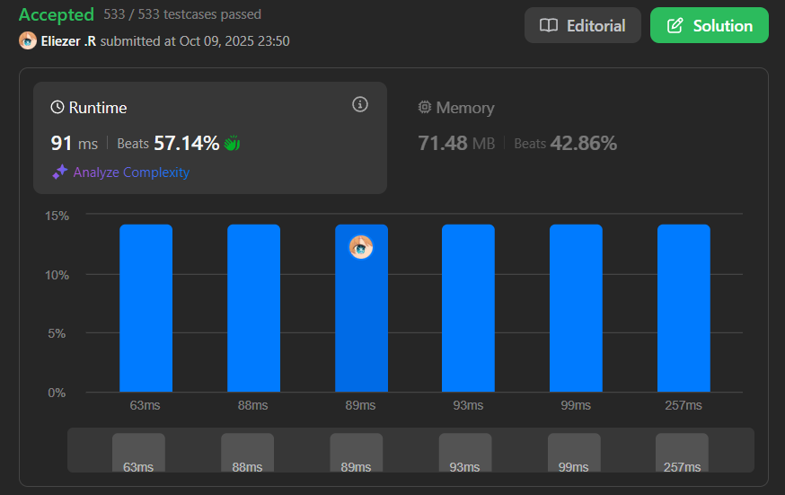

# 3147. Taking Maximum Energy From the Mystic Dungeon

En una mazmorra mística, `n` magos están de pie en una línea. Cada mago tiene un atributo que te da energía. Algunos magos pueden darte energía negativa, lo que significa quitarte energía.

Has sido maldecido de tal manera que después de absorber energía del mago `i`, serás transportado instantáneamente al mago `(i + k)`. Este proceso se repetirá hasta que llegues a un mago donde `(i + k)` no existe.

En otras palabras, elegirás un punto de inicio y luego te teletransportarás con saltos de `k` hasta que llegues al final del array.

Retorna la **máxima** cantidad de energía que puedes obtener.

**Dificultad:** Medium

---

## 📋 Ejemplos

**Ejemplo 1:**

- Entrada: `energy = [5,-2,-3,1], k = 2`
- Salida: `3`
- Explicación: Podemos obtener un máximo de 3 unidades de energía comenzando desde el mago 1 con energía -2: -2 → índice 3 con 1 = -2 + 1 = -1. O comenzar desde el mago 2: -3 → fin = -3. O comenzar desde el mago 3: 1 → fin = 1. Pero también: índice 0 → 2: 5 + (-3) = 2. La mejor opción es comenzar en índice 3: 1 = 1 o índice 1: -2 + 1 = -1. Espera, revisemos...

**Ejemplo 2:**

- Entrada: `energy = [4,-1,5], k = 2`
- Salida: `5`
- Explicación: Comenzar desde el índice 2: 5 (no hay siguiente salto).

---

## 💭 Enfoque y Estrategia

- **Objetivo**: Encontrar el camino con suma máxima saltando de `i` a `i+k` repetidamente.
- **Insight clave**: Usar programación dinámica desde el final hacia el inicio.
- **Técnica**: DP bottom-up donde `dp[i]` = máxima energía comenzando desde posición `i`.
- **Optimización**: Calcular desde atrás permite usar valores ya calculados para `i+k`.

La estrategia construye el array dp desde el final, donde cada posición almacena la máxima energía posible si comenzamos desde ahí.

---

## 🔧 Implementación

```js
const maximumEnergy = function (energy, k) {
    const n = energy.length
    const dp = new Array(n).fill(0)

    // Construir dp desde el final hacia el inicio
    for (let i = n - 1; i >= 0; i--) {
        const next = i + k
        if (next < n) {
            // Si hay un siguiente salto, sumar su valor óptimo
            dp[i] = energy[i] + dp[next]
        } else {
            // Si es el último salto, solo tomar la energía actual
            dp[i] = energy[i]
        }
    }

    // Retornar el máximo de todos los posibles puntos de inicio
    return Math.max(...dp)
}

console.log(maximumEnergy([5,-2,-3,1], 2)) // 3

/**
 * Ejemplo paso a paso con energy = [5,-2,-3,1], k = 2:
 * 
 * Índices: [0, 1, 2, 3]
 * energy:  [5,-2,-3, 1]
 * 
 * i=3: next=5 (fuera de bounds)
 *      dp[3] = 1
 *      dp = [0, 0, 0, 1]
 * 
 * i=2: next=4 (fuera de bounds)
 *      dp[2] = -3
 *      dp = [0, 0, -3, 1]
 * 
 * i=1: next=3 (dentro)
 *      dp[1] = -2 + dp[3] = -2 + 1 = -1
 *      dp = [0, -1, -3, 1]
 * 
 * i=0: next=2 (dentro)
 *      dp[0] = 5 + dp[2] = 5 + (-3) = 2
 *      dp = [2, -1, -3, 1]
 * 
 * Math.max(2, -1, -3, 1) = 2
 * 
 * Caminos posibles:
 * - Empezar en 0: 5 → -3 = 2
 * - Empezar en 1: -2 → 1 = -1
 * - Empezar en 2: -3 = -3
 * - Empezar en 3: 1 = 1
 * 
 * Máximo: 2
 */
```

---

## 📊 Análisis de Rendimiento

- **Complejidad temporal**: O(n), donde n es la longitud del array energy.
- **Complejidad espacial**: O(n), para el array dp.
 
*Solución óptima usando programación dinámica con una sola pasada.*

---

## 🎯 Visualización del DP

```
energy = [5, -2, -3, 1], k = 2

Construcción del DP (de derecha a izquierda):

Paso 1: i=3
  Camino desde 3: [1] → suma = 1
  dp[3] = 1

Paso 2: i=2  
  Camino desde 2: [-3] → suma = -3
  dp[2] = -3

Paso 3: i=1
  Camino desde 1: [-2] → [1] → suma = -1
  dp[1] = -2 + dp[3] = -1

Paso 4: i=0
  Camino desde 0: [5] → [-3] → suma = 2
  dp[0] = 5 + dp[2] = 2

Resultado: max(2, -1, -3, 1) = 2
```

---

## 🔄 Enfoque Alternativo (Simulación Directa)

```js
// Menos eficiente - O(n * n/k)
const maximumEnergySimulation = function(energy, k) {
    let maxEnergy = -Infinity
    
    // Probar cada posible punto de inicio
    for (let start = 0; start < energy.length; start++) {
        let sum = 0
        let pos = start
        
        // Saltar de k en k desde este inicio
        while (pos < energy.length) {
            sum += energy[pos]
            pos += k
        }
        
        maxEnergy = Math.max(maxEnergy, sum)
    }
    
    return maxEnergy
}
```

---

## 🎯 Aprendizajes Clave

- **DP bottom-up**: Construir desde el final permite reutilizar subproblemas ya resueltos.
- **Recurrencia simple**: `dp[i] = energy[i] + dp[i+k]` captura la estructura del problema.
- **Optimización con memoización**: Evitar recalcular caminos desde la misma posición.
- **Math.max con spread**: Forma concisa de encontrar el máximo en un array.
- **Casos base**: Cuando `i+k >= n`, el valor es simplemente `energy[i]`.

---

## 🔍 Casos Edge

- **k = 1**: Subarrays contiguos con máxima suma (similar a Kadane's algorithm)
- **k >= n**: Cada posición es independiente, retornar `Math.max(...energy)`
- **Todos negativos**: Retornar el menos negativo
- **Un solo elemento**: Retornar ese elemento

---

## 🧮 Trazado Completo

```
energy = [1, -1, -2, 4, -3, 2], k = 2

DP construction (i = n-1 to 0):

i=5: dp[5] = 2 (no hay i+2)
i=4: dp[4] = -3 (no hay i+2)
i=3: dp[3] = 4 + dp[5] = 4 + 2 = 6
i=2: dp[2] = -2 + dp[4] = -2 + (-3) = -5
i=1: dp[1] = -1 + dp[3] = -1 + 6 = 5
i=0: dp[0] = 1 + dp[2] = 1 + (-5) = -4

dp = [-4, 5, -5, 6, -3, 2]

Caminos:
- Desde 0: 1 → -2 → -3 = -4
- Desde 1: -1 → 4 → 2 = 5
- Desde 2: -2 → -3 = -5
- Desde 3: 4 → 2 = 6 ← MÁXIMO
- Desde 4: -3 = -3
- Desde 5: 2 = 2

Resultado: 6
```

---

## 🚀 Optimización Adicional

**Espacio O(1) si solo necesitamos el máximo:**
```js
// Si solo queremos el resultado final
const maximumEnergyOptimized = function(energy, k) {
    const n = energy.length
    let maxEnergy = -Infinity
    
    // Solo necesitamos rastrear últimos k valores
    const last = new Array(k).fill(0)
    
    for (let i = n - 1; i >= 0; i--) {
        const idx = i % k
        last[idx] = energy[i] + (i + k < n ? last[idx] : 0)
        maxEnergy = Math.max(maxEnergy, last[idx])
    }
    
    return maxEnergy
}
// O(n) tiempo, O(k) espacio
```

---

## 🏷️ Tags

`Array` `Dynamic Programming` `Medium`

---

**Tiempo invertido**: 40 minutos  
**Intentos**: 4  
**Dificultad percibida**: Medium