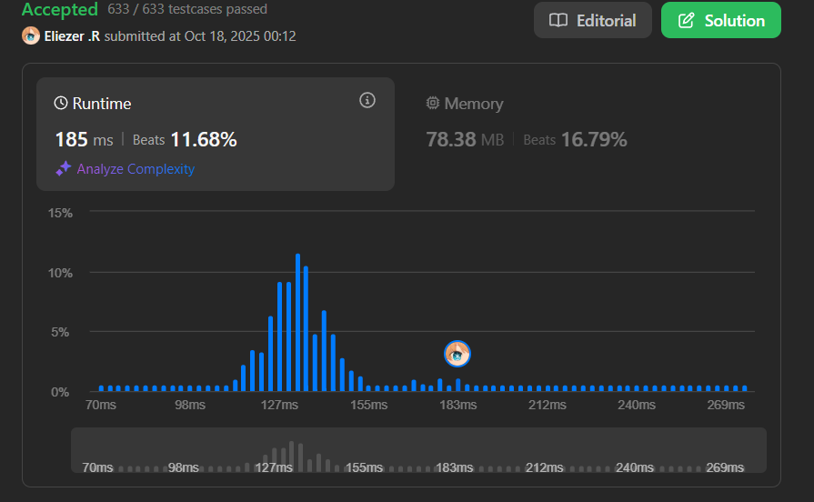

# 3186. Maximum Total Damage With Spell Casting

Un mago tiene varios hechizos. Se te da un array `power`, donde cada elemento representa el daño de un hechizo. Múltiples hechizos pueden tener el mismo valor de daño.

Es un hecho conocido que si un mago decide lanzar un hechizo con poder `power[i]`, no puede lanzar ningún hechizo con poder `power[i] - 2`, `power[i] - 1`, `power[i] + 1`, o `power[i] + 2`.

Cada hechizo puede ser lanzado **solo una vez**. Retorna el **daño total máximo** que el mago puede lanzar.

**Dificultad:** Medium

---

## 📋 Ejemplos

**Ejemplo 1:**

- Entrada: `power = [1,1,3,4]`
- Salida: `6`
- Explicación:
  - Total damage = 3 + 3 = 6
  - Podemos usar dos hechizos con poder 3 (ya que hay frecuencia)
  - No podemos usar poder 4 porque 4 - 1 = 3

**Ejemplo 2:**

- Entrada: `power = [7,1,6,6]`
- Salida: `13`
- Explicación:
  - Total damage = 7 + 6 = 13
  - Lanzamos un hechizo con poder 7 y uno con poder 6

---

## 💭 Enfoque y Estrategia

- **Problema base**: Similar a "House Robber" pero con restricción de diferencia ≤ 2.
- **Observación clave**: Si usamos un poder X, no podemos usar X-2, X-1, X+1, X+2.
- **Frecuencias**: Múltiples hechizos del mismo poder pueden usarse juntos.
- **Programación Dinámica**: `dp[i]` = máximo daño usando los primeros i poderes únicos.
- **Transición**: Tomar o no tomar el poder actual, considerando restricciones.

---

## 🔧 Implementación

```js
var maximumTotalDamage = function (power) {
    // Paso 1: Contar frecuencias de cada poder
    const freq = new Map()
    for (const p of power) {
        freq.set(p, (freq.get(p) || 0) + 1)
    }

    // Paso 2: Obtener valores únicos ordenados
    const values = Array.from(freq.keys()).sort((a, b) => a - b)
    const n = values.length

    // Casos base
    if (n === 0) return 0
    if (n === 1) return values[0] * freq.get(values[0])

    // Paso 3: Programación dinámica
    const dp = new Array(n)
    dp[0] = values[0] * freq.get(values[0])

    for (let i = 1; i < n; i++) {
        const val = values[i]
        const damage = val * freq.get(val)

        // Opción 1: No tomar el poder actual
        let notTake = dp[i - 1]

        // Opción 2: Tomar el poder actual
        let take = damage

        // Encontrar el último índice válido (diferencia >= 3)
        let j = i - 1
        while (j >= 0 && val - values[j] < 3) {
            j--
        }

        // Si hay un índice válido previo, sumar su daño
        if (j >= 0) {
            take += dp[j]
        }

        dp[i] = Math.max(notTake, take)
    }

    return dp[n - 1]
}

console.log(maximumTotalDamage([1,1,3,4])) // 6
console.log(maximumTotalDamage([7,1,6,6])) // 13

/**
 * Ejemplo paso a paso con power = [1,1,3,4]:
 * 
 * Frecuencias: {1: 2, 3: 1, 4: 1}
 * Values ordenados: [1, 3, 4]
 * 
 * dp[0] = 1 × 2 = 2
 *   (usar ambos hechizos de poder 1)
 * 
 * dp[1] (val=3):
 *   damage = 3 × 1 = 3
 *   notTake = dp[0] = 2
 *   
 *   Buscar j donde 3 - values[j] >= 3:
 *   j=0: 3 - 1 = 2 < 3 → j = -1
 *   
 *   take = 3 + 0 = 3
 *   dp[1] = max(2, 3) = 3
 * 
 * dp[2] (val=4):
 *   damage = 4 × 1 = 4
 *   notTake = dp[1] = 3
 *   
 *   Buscar j donde 4 - values[j] >= 3:
 *   j=1: 4 - 3 = 1 < 3 → continuar
 *   j=0: 4 - 1 = 3 >= 3 ✓ → j = 0
 *   
 *   take = 4 + dp[0] = 4 + 2 = 6
 *   dp[2] = max(3, 6) = 6
 * 
 * Resultado: 6
 * Hechizos usados: poder 3 (una vez) + poder 3 (otra vez) = 6
 * O podría ser: poder 4 (4) + poder 1 (dos veces, 2) = 6
 */
```

---

## 📊 Análisis de Rendimiento

- **Complejidad temporal**: O(n² log n) en el peor caso, donde n es el número de valores únicos.
  - Ordenar: O(n log n)
  - DP con búsqueda lineal hacia atrás: O(n²) en peor caso
  - Puede optimizarse a O(n log n) con búsqueda binaria
- **Complejidad espacial**: O(n), para el Map de frecuencias y el array dp.
 
---

## 🎯 Visualización del DP

```
power = [1,1,3,4]
Valores únicos: [1, 3, 4]

       1   3   4
dp: [ 2 | 3 | 6 ]
      ↑   ↑   ↑
      2×1 max 4+2
          (2,3)

Decisiones:
- Índice 0: tomar 1 (2 veces) = 2
- Índice 1: tomar 3 (no compatible con 1) = 3
- Índice 2: tomar 4 + daño de índice 0 = 6
```

---

## 🔄 Optimización con Búsqueda Binaria

```js
var maximumTotalDamageOptimized = function(power) {
    const freq = new Map()
    for (const p of power) {
        freq.set(p, (freq.get(p) || 0) + 1)
    }

    const values = Array.from(freq.keys()).sort((a, b) => a - b)
    const n = values.length

    if (n === 0) return 0
    if (n === 1) return values[0] * freq.get(values[0])

    const dp = new Array(n)
    dp[0] = values[0] * freq.get(values[0])

    for (let i = 1; i < n; i++) {
        const val = values[i]
        const damage = val * freq.get(val)
        let notTake = dp[i - 1]
        let take = damage

        // Búsqueda binaria para encontrar el último índice válido
        let left = 0, right = i - 1, j = -1
        while (left <= right) {
            const mid = Math.floor((left + right) / 2)
            if (val - values[mid] >= 3) {
                j = mid
                left = mid + 1
            } else {
                right = mid - 1
            }
        }

        if (j >= 0) {
            take += dp[j]
        }

        dp[i] = Math.max(notTake, take)
    }

    return dp[n - 1]
}
// O(n log n) tiempo
```

---

## 🔍 Casos Edge

- **Todos el mismo poder**: `[5,5,5,5]` → Usar todos = 20
- **Poderes consecutivos**: `[1,2,3,4,5]` → Elegir alternados óptimamente
- **Un solo hechizo**: `[10]` → 10
- **Gap grande**: `[1,10,20]` → Tomar todos = 31

---

## 🎯 Aprendizajes Clave

- **House Robber variant**: Extensión del problema clásico con restricción de rango.
- **Frequency mapping**: Agrupar valores idénticos antes de DP.
- **DP transition**: Considerar compatibilidad al hacer transiciones.
- **Binary search optimization**: Mejorar búsqueda lineal a logarítmica.
- **Greedy doesn't work**: No siempre es óptimo tomar el mayor valor.

---

## 🏷️ Tags

`Array` `Dynamic Programming` `Hash Table` `Sorting` `Binary Search` `Medium`

---

**Tiempo invertido**: 40 minutos  
**Intentos**: 4  
**Dificultad percibida**: Medium
