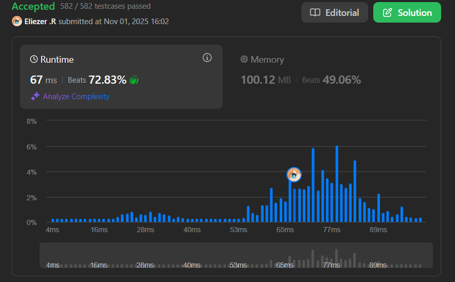

# 3217. Delete Nodes From Linked List Present in Array

## 🧠 Descripción

Se te da un array de enteros `nums` y la cabeza de una lista enlazada `head`. Tu tarea es eliminar todos los nodos de la lista enlazada cuyos valores existan en `nums`.

Retorna la cabeza de la lista enlazada modificada.

**Dificultad:** Medium

---

## 📋 Ejemplos

### Ejemplo 1:

* **Entrada**: `nums = [1,2,3], head = [1,2,3,4,5]`
* **Salida**: `[4,5]`
* **Explicación**: Se eliminan los nodos con valores 1, 2 y 3.

### Ejemplo 2:

* **Entrada**: `nums = [1], head = [1,2,1,2,1,2]`
* **Salida**: `[2,2,2]`
* **Explicación**: Se eliminan todos los nodos con valor 1.

### Ejemplo 3:

* **Entrada**: `nums = [5], head = [1,2,3,4]`
* **Salida**: `[1,2,3,4]`
* **Explicación**: No hay nodos con valor 5, la lista permanece igual.

---

## 💭 Estrategia y Enfoque

La estrategia usa el patrón **dummy node** (nodo ficticio) que es una técnica común en problemas de listas enlazadas para manejar casos donde la cabeza puede ser eliminada.

### 🧩 Pasos del Algoritmo:

1. **Convertir array a Set**: Para búsquedas O(1).
2. **Crear dummy node**: Apunta a la cabeza original.
3. **Iterar con puntero**: Verificar el siguiente nodo (no el actual).
4. **Eliminar si coincide**: Saltar el nodo ajustando punteros.
5. **Retornar dummy.next**: La nueva cabeza.

---

## 💻 Implementación en JavaScript

```js
var modifiedList = function (nums, head) {
    // Paso 1: Convertir el array a Set para búsquedas O(1)
    // Set nos permite verificar si un valor existe en tiempo constante
    const toRemove = new Set(nums);

    // Paso 2: Crear un nodo dummy (ficticio)
    // El dummy node simplifica el manejo de casos edge como eliminar la cabeza
    // new ListNode(0, head) crea un nodo con valor 0 que apunta a head
    const dummy = new ListNode(0, head);
    
    // curr empieza en el dummy, no en head
    // Esto nos permite verificar curr.next y eliminarlo si es necesario
    let curr = dummy;

    // Paso 3: Iterar mientras haya un siguiente nodo
    while (curr.next !== null) {
        // Verificar si el SIGUIENTE nodo debe ser eliminado
        // Verificamos curr.next, no curr, porque necesitamos mantener
        // una referencia al nodo anterior para poder eliminar
        if (toRemove.has(curr.next.val)) {
            // ELIMINAR: Saltar el siguiente nodo
            // curr.next = curr.next.next hace que curr apunte al nodo
            // después del que queremos eliminar, efectivamente eliminándolo
            curr.next = curr.next.next;
        } else {
            // NO ELIMINAR: Avanzar al siguiente nodo
            // Solo avanzamos si NO eliminamos el nodo
            curr = curr.next;
        }
    }

    // Paso 4: Retornar dummy.next (la nueva cabeza)
    // dummy.next es la nueva cabeza de la lista
    // (podría ser diferente de head si la cabeza original fue eliminada)
    return dummy.next;
};

// Ejemplo de uso:
// head: 1 -> 2 -> 3 -> 4 -> 5
// nums: [1, 2, 3]
// Resultado: 4 -> 5
```

### 📝 Ejemplo paso a paso con `nums = [1,2,3], head = 1->2->3->4->5`:

```
Lista inicial:
dummy -> 1 -> 2 -> 3 -> 4 -> 5 -> null
curr

toRemove = Set{1, 2, 3}

Iteración 1:
- curr = dummy (valor 0)
- curr.next = nodo con valor 1
- toRemove.has(1)? Sí ✓
- Acción: curr.next = curr.next.next
- Resultado: dummy -> 2 -> 3 -> 4 -> 5 -> null
            curr

Iteración 2:
- curr = dummy (valor 0)
- curr.next = nodo con valor 2
- toRemove.has(2)? Sí ✓
- Acción: curr.next = curr.next.next
- Resultado: dummy -> 3 -> 4 -> 5 -> null
            curr

Iteración 3:
- curr = dummy (valor 0)
- curr.next = nodo con valor 3
- toRemove.has(3)? Sí ✓
- Acción: curr.next = curr.next.next
- Resultado: dummy -> 4 -> 5 -> null
            curr

Iteración 4:
- curr = dummy (valor 0)
- curr.next = nodo con valor 4
- toRemove.has(4)? No ✗
- Acción: curr = curr.next
- Resultado: dummy -> 4 -> 5 -> null
                    curr

Iteración 5:
- curr = nodo con valor 4
- curr.next = nodo con valor 5
- toRemove.has(5)? No ✗
- Acción: curr = curr.next
- Resultado: dummy -> 4 -> 5 -> null
                         curr

Iteración 6:
- curr = nodo con valor 5
- curr.next = null
- Termina el while

Retornar: dummy.next → nodo con valor 4
Lista final: 4 -> 5 -> null
```

---

## 📊 Análisis de Rendimiento

* **Complejidad temporal**: O(n + m), donde n es la longitud de la lista y m es la longitud del array nums.
  - Crear Set: O(m)
  - Recorrer lista: O(n)
* **Complejidad espacial**: O(m), para el Set.


---

## 🎯 Aprendizajes Clave

* **Dummy node pattern**: Simplifica eliminación en listas enlazadas.
* **Set for lookups**: O(1) vs O(m) con array.
* **Pointer manipulation**: Ajustar punteros para eliminar nodos.
* **Check next, not current**: Necesitamos referencia al nodo anterior.
* **Conditional advancement**: Solo avanzar si no eliminamos.

---

## 💡 ¿Por qué usar dummy node?

**Sin dummy node** (más complicado):
```js
// Necesitamos casos especiales para la cabeza
if (head && toRemove.has(head.val)) {
    head = head.next // Caso especial
}
let curr = head
while (curr && curr.next) {
    // ... código de eliminación
}
return head
```

**Con dummy node** (más limpio):
```js
const dummy = new ListNode(0, head)
let curr = dummy
// Un solo loop, sin casos especiales
return dummy.next
```

---

## 🏷️ Etiquetas

`Linked List` `Hash Table` `Medium`