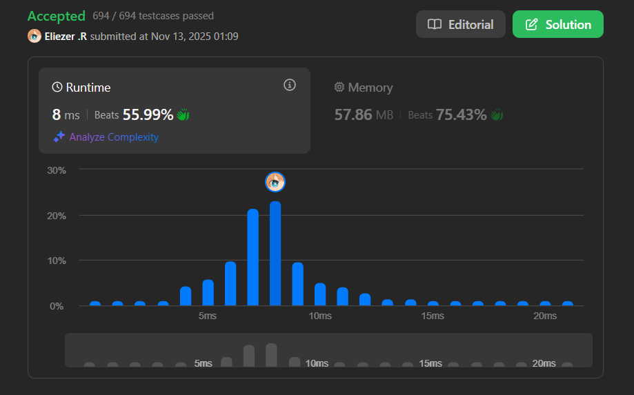

# 3228. Maximum Number of Operations to Move Ones to the End

Dada una cadena binaria **s**, puedes realizar la siguiente operación cualquier número de veces:

- Elige cualquier índice **i** donde `i + 1 < s.length` tal que `s[i] == '1'` y `s[i + 1] == '0'`.
- Mueve el carácter `s[i]` hacia la derecha hasta que llegue al final de la cadena o encuentre otro `'1'`.

Por ejemplo, para `s = "010010"`, si elegimos `i = 1`, la cadena resultante será `s = "000110"`.

Retorna el **número máximo de operaciones** que puedes realizar.

**Dificultad:** Medium

---

## 📋 Ejemplos

**Ejemplo 1:**

- Entrada: `s = "1001101"`
- Salida: `4`
- Explicación: 
  - Elegimos índice `i = 0`. La cadena resultante es `s = "0011101"`.
  - Elegimos índice `i = 4`. La cadena resultante es `s = "0011011"`.
  - Elegimos índice `i = 3`. La cadena resultante es `s = "0010111"`.
  - Elegimos índice `i = 2`. La cadena resultante es `s = "0001111"`.

**Ejemplo 2:**

- Entrada: `s = "00111"`
- Salida: `0`
- Explicación: No hay operaciones posibles ya que no existen pares `"10"`.

---

## 💭 Enfoque y Estrategia

- **Objetivo**: Contar cuántas veces cada `'1'` necesita "saltar" sobre grupos de ceros.
- **Insight clave**: Cada vez que encontramos un grupo de ceros después de `'1's`, todas las `'1's` vistas hasta ahora necesitan moverse.
- **Técnica**: Recorrido lineal contando `'1's` acumuladas y sumando al resultado cuando encontramos el final de un grupo de `'1's`.
- **Retos**: Detectar correctamente cuándo termina un grupo de `'1's` y evitar contar operaciones innecesarias.

La estrategia es simple pero elegante: cada vez que un `'1'` encuentra un `'0'`, eventualmente tendrá que moverse. Si hay varios `'1's` antes de un grupo de `'0's`, cada uno necesitará moverse, acumulando operaciones.

---

## 🔧 Implementación

```javascript
var maxOperations = function(s) {
    let ones = 0, res = 0;
    
    for (let i = 0; i < s.length; i++) {
        if (s[i] === '1') {
            // Contar el número de '1's que hemos visto
            ones++;
        } else if (i > 0 && s[i - 1] === '1') {
            // Encontramos un '0' justo después de un '1'
            // Esto significa que terminó un grupo de '1's
            // Todas las '1's vistas necesitan moverse sobre este grupo de '0's
            res += ones;
        }
    }
    
    return res;
};

console.log(maxOperations("1001101")); // 4

/**
 * Ejemplo paso a paso con s = "1001101":
 * 
 * Iteración por cada carácter:
 * 
 * i=0, s[0]='1': ones=1, res=0
 * 
 * i=1, s[1]='0': i>0 && s[0]='1' ✓
 *   → res += ones → res = 0 + 1 = 1
 *   (El primer '1' necesita moverse sobre este '0')
 * 
 * i=2, s[2]='0': i>0 pero s[1]='0' ✗
 *   → No hacemos nada (ya contamos este grupo de '0's)
 * 
 * i=3, s[3]='1': ones=2, res=1
 * 
 * i=4, s[4]='1': ones=3, res=1
 * 
 * i=5, s[5]='0': i>0 && s[4]='1' ✓
 *   → res += ones → res = 1 + 3 = 4
 *   (Los tres '1's acumulados necesitan moverse sobre este '0')
 * 
 * i=6, s[6]='1': ones=4, res=4
 * 
 * Resultado: 4
 * 
 * Explicación de la lógica:
 * - El primer '1' (posición 0) necesita moverse una vez
 * - Los tres '1's siguientes (posiciones 3,4,6) cada uno necesita
 *   moverse sobre el '0' de la posición 5
 * - Total: 1 + 3 = 4 operaciones
 */
```

---

## 📊 Análisis de Rendimiento

- **Complejidad temporal**: O(n), un solo recorrido de la cadena.
- **Complejidad espacial**: O(1), solo usamos dos variables auxiliares.


*Esta solución es óptima ya que necesitamos examinar cada carácter al menos una vez.*

---

## 🔧 Detalles Técnicos Importantes

**¿Por qué funciona esta lógica?**

Cuando movemos un `'1'` hacia la derecha, tiene que saltar sobre todos los `'0's` hasta llegar al final o encontrar otro `'1'`. La clave es que:

1. **Cada `'1'` contribuye al contador acumulado**: `ones++`
2. **Cuando encontramos el inicio de un grupo de `'0's`** (detectado con `s[i] === '0' && s[i-1] === '1'`), todas las `'1's` acumuladas necesitarán moverse sobre este grupo.
3. **No importa cuántos `'0's` consecutivos haya**: solo contamos una vez cuando detectamos el inicio del grupo.

**Condición crucial:**
```javascript
else if (i > 0 && s[i - 1] === '1')
```
Esta condición asegura que:
- `i > 0`: No estamos en el primer carácter
- `s[i - 1] === '1'`: El carácter anterior era un `'1'`, indicando el **final de un grupo de `'1's`**

---

## 🎯 Aprendizajes Clave

- **Pensamiento greedy**: No necesitamos simular las operaciones, solo contarlas.
- **Detección de patrones**: Identificar cuándo termina un grupo de `'1's` es la clave.
- **Optimización**: O(n) tiempo con O(1) espacio es óptimo para este problema.
- **Acumulación inteligente**: Mantener un contador de `'1's` nos permite calcular operaciones en tiempo constante.

---

## 🔍 Casos Edge

- **Sin `'1's`**: `"0000"` → `0`
- **Sin `'0's`**: `"1111"` → `0`
- **Un solo carácter**: `"1"` → `0`, `"0"` → `0`
- **Alternados**: `"1010"` → `2` (cada `'1'` necesita moverse una vez)
- **Termina en `'0'`**: `"110"` → `2` (ambos `'1's` se mueven)
- **Termina en `'1'`**: `"101"` → `1` (solo el primer `'1'` se mueve)
- **Grupos múltiples**: `"11001100"` → `6`

---

## 🧮 Ejemplos Adicionales

```javascript
"10"     → 1  (un '1' se mueve sobre un '0')
"101"    → 1  (primer '1' se mueve, segundo ya está al final)
"1100"   → 4  (dos '1's × dos '0's... no! → 2, cada '1' salta 2 '0's)
"110011" → 4  (dos '1's iniciales saltan, dos finales ya están juntos)
```

**Corrección para "1100":**
- i=0: ones=1
- i=1: ones=2
- i=2: s[1]='1', entonces res += 2 → res=2
- i=3: s[2]='0', no se suma
- Resultado: 2 ✓

---

## 🚀 Variante Alternativa

Una forma alternativa de pensar el problema:

```javascript
var maxOperationsAlt = function(s) {
    let ones = 0, res = 0;
    
    for (let i = 0; i < s.length; i++) {
        if (s[i] === '1') {
            ones++;
        } else {
            // Encontramos un '0', pero solo sumamos si hay '1's antes
            // y si no estamos en medio de un grupo de '0's
            if (ones > 0 && (i === s.length - 1 || s[i + 1] === '1')) {
                res += ones;
            }
        }
    }
    
    return res;
};
```

Esta versión mira hacia adelante en lugar de mirar hacia atrás, pero la complejidad es la misma.

---

## 🏷️ Tags

`String` `Greedy` `Counting` `Medium`

---