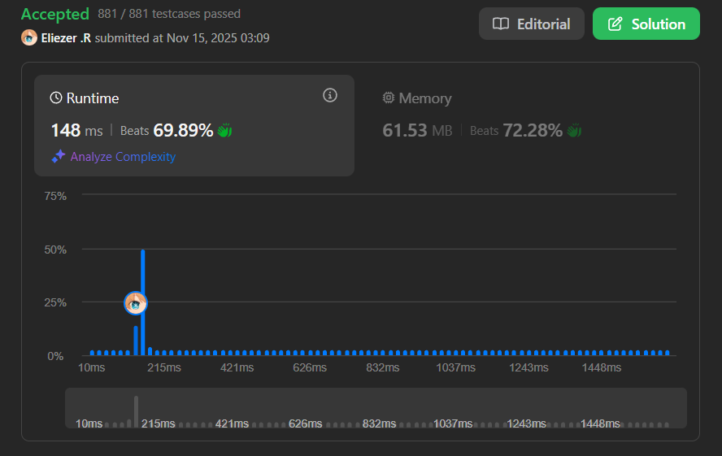

# 3234. Count the Number of Substrings With Dominant Ones

Se te da una cadena binaria **s**.

Retorna el número de subcadenas con **ones dominantes**.

Una cadena tiene **ones dominantes** si el número de `'1's` en la cadena es **mayor o igual al cuadrado** del número de `'0's` en la cadena.

Es decir: `cnt1 >= cnt0²`

**Dificultad:** Medium

---

## 📋 Ejemplos

**Ejemplo 1:**

- Entrada: `s = "00011"`
- Salida: `5`
- Explicación: Las subcadenas con ones dominantes son:
  - `"1"` (índice 3): 0 ceros, 1 uno → 1 >= 0² ✓
  - `"1"` (índice 4): 0 ceros, 1 uno → 1 >= 0² ✓
  - `"01"` (índices 2-3): 1 cero, 1 uno → 1 >= 1² ✓
  - `"11"` (índices 3-4): 0 ceros, 2 unos → 2 >= 0² ✓
  - `"011"` (índices 2-4): 1 cero, 2 unos → 2 >= 1² ✓

**Ejemplo 2:**

- Entrada: `s = "101101"`
- Salida: `16`
- Explicación: Hay 21 subcadenas totales. 5 tienen ones NO dominantes, por lo tanto 16 tienen ones dominantes.

---

## 💭 Enfoque y Estrategia

- **Objetivo**: Contar eficientemente subcadenas donde `cnt1 >= cnt0²`.
- **Insight clave**: Para una cadena de longitud n, el número máximo de ceros es limitado por `cnt0² <= n`, lo que significa `cnt0 <= √n`. Esto nos permite iterar sobre todos los posibles conteos de ceros.
- **Técnica**: Pre-procesamiento con arreglo de "posiciones previas de ceros" + iteración inteligente saltando entre ceros.
- **Retos**: Evitar contar la misma subcadena múltiples veces y manejar eficientemente los rangos válidos.

La clave está en que el número de ceros en cualquier subcadena válida está limitado a O(√n), lo que hace viable iterar sobre grupos de ceros y calcular cuántos unos necesitamos.

---

## 🔧 Implementación

```javascript
var numberOfSubstrings = function (s) {
    const n = s.length;
    
    // pre[i] guarda el índice del '0' más reciente antes de la posición i
    // o el índice del inicio del grupo actual de '1's
    const pre = new Array(n + 1);
    pre[0] = -1;
    
    for (let i = 0; i < n; i++) {
        if (i === 0 || (i > 0 && s[i - 1] === "0")) {
            // Si estamos al inicio o el carácter anterior era '0',
            // marcamos esta posición como el inicio de un nuevo segmento
            pre[i + 1] = i;
        } else {
            // Si el anterior era '1', heredamos el inicio del segmento
            pre[i + 1] = pre[i];
        }
    }
     
    let res = 0;
    
    // Iterar sobre cada posición como posible final de subcadena
    for (let i = 1; i <= n; i++) {
        let cnt0 = s[i - 1] === "0" ? 1 : 0; // Contador de ceros
        let j = i; // Índice para moverse hacia la izquierda
       
        // Saltar entre grupos de '0's hacia la izquierda
        // Solo continuar mientras cnt0² no exceda n (optimización)
        while (j > 0 && cnt0 * cnt0 <= n) {
            // Calcular cuántos '1's hay en el rango [pre[j], i)
            const cnt1 = i - pre[j] - cnt0;
         
            // Verificar si esta configuración satisface la condición
            if (cnt0 * cnt0 <= cnt1) {
                // Calcular cuántas subcadenas válidas terminan en i
                // con exactamente cnt0 ceros
                res += Math.min(j - pre[j], cnt1 - cnt0 * cnt0 + 1);
            }
            
            // Saltar al siguiente grupo de '0's hacia la izquierda
            j = pre[j];
            cnt0++;
        }
    }
    
    return res;
};

console.log(numberOfSubstrings("00011")); // 5

/**
 * Ejemplo paso a paso con s = "00011":
 * Índices:  0 1 2 3 4
 * Cadena:  "0 0 0 1 1"
 * 
 * PASO 1: Construir arreglo pre[]
 * 
 * pre[0] = -1 (inicialización)
 * 
 * i=0, s[0]='0':
 *   i === 0 ✓ → pre[1] = 0
 * 
 * i=1, s[1]='0':
 *   s[0]='0' ✓ → pre[2] = 1
 * 
 * i=2, s[2]='0':
 *   s[1]='0' ✓ → pre[3] = 2
 * 
 * i=3, s[3]='1':
 *   s[2]='0' ✓ → pre[4] = 3
 * 
 * i=4, s[4]='1':
 *   s[3]='1' → pre[5] = pre[4] = 3
 * 
 * Resultado: pre = [-1, 0, 1, 2, 3, 3]
 * 
 * PASO 2: Contar subcadenas válidas
 * 
 * i=1, s[0]='0': cnt0=1, j=1
 *   cnt0²=1 <= 5 ✓
 *   cnt1 = 1 - pre[1] - 1 = 1 - 0 - 1 = 0
 *   cnt0²=1 > cnt1=0 ✗ → no válido
 *   j = pre[1] = 0, cnt0=2
 *   cnt0²=4 <= 5 ✓
 *   j=0, salir del while
 * 
 * i=2, s[1]='0': cnt0=1, j=2
 *   cnt1 = 2 - pre[2] - 1 = 2 - 1 - 1 = 0
 *   cnt0²=1 > cnt1=0 ✗
 *   j = pre[2] = 1, cnt0=2
 *   (similar, no válido)
 * 
 * i=3, s[2]='0': cnt0=1, j=3
 *   cnt1 = 3 - pre[3] - 1 = 3 - 2 - 1 = 0
 *   No válido
 * 
 * i=4, s[3]='1': cnt0=0, j=4
 *   cnt0²=0 <= 5 ✓
 *   cnt1 = 4 - pre[4] - 0 = 4 - 3 - 0 = 1
 *   cnt0²=0 <= cnt1=1 ✓
 *   res += min(4 - 3, 1 - 0 + 1) = min(1, 2) = 1
 *   → Subcadena "1" (índice 3)
 *   j = pre[4] = 3, cnt0=1
 *   cnt1 = 4 - pre[3] - 1 = 4 - 2 - 1 = 1
 *   cnt0²=1 <= cnt1=1 ✓
 *   res += min(3 - 2, 1 - 1 + 1) = min(1, 1) = 1
 *   → Subcadena "01" (índices 2-3)
 *   j = pre[3] = 2, cnt0=2
 *   cnt1 = 4 - pre[2] - 2 = 4 - 1 - 2 = 1
 *   cnt0²=4 > cnt1=1 ✗
 * 
 * i=5, s[4]='1': cnt0=0, j=5
 *   cnt1 = 5 - pre[5] - 0 = 5 - 3 - 0 = 2
 *   cnt0²=0 <= cnt1=2 ✓
 *   res += min(5 - 3, 2 - 0 + 1) = min(2, 3) = 2
 *   → Subcadenas "1" (índice 4) y "11" (índices 3-4)
 *   j = pre[5] = 3, cnt0=1
 *   cnt1 = 5 - pre[3] - 1 = 5 - 2 - 1 = 2
 *   cnt0²=1 <= cnt1=2 ✓
 *   res += min(3 - 2, 2 - 1 + 1) = min(1, 2) = 1
 *   → Subcadena "011" (índices 2-4)
 * 
 * Resultado final: res = 1 + 1 + 2 + 1 = 5 ✓
 */
```

---

## 📊 Análisis de Rendimiento

- **Complejidad temporal**: O(n√n), donde n es la longitud de la cadena.
  - El bucle externo itera n veces
  - El bucle interno itera a lo sumo √n veces (limitado por `cnt0² <= n`)
- **Complejidad espacial**: O(n) para el arreglo `pre`.


*Esta solución es eficiente gracias a la observación de que cnt0 está limitado a √n.*

---

## 🔧 Detalles Técnicos Importantes

**Arreglo de Pre-procesamiento `pre[]`:**

El arreglo `pre[i]` guarda la posición del último `'0'` encontrado antes de la posición `i`, o el inicio del segmento actual de `'1's`.

```javascript
// Ejemplo con s = "11001"
// pre = [-1, 0, 0, 2, 3, 3]
//         ^   ^  ^  ^  ^  ^
//        init |  |  |  |  └─ s[4]='1' → hereda de pre[4]=3
//             |  |  |  └──── s[3]='0' → nuevo inicio en 3
//             |  |  └─────── s[2]='0' → nuevo inicio en 2
//             |  └────────── s[1]='1' → hereda de pre[1]=0
//             └───────────── s[0]='1' → nuevo inicio en 0
```

**¿Por qué `cnt0² <= n` es la condición de parada?**

Si tenemos más de √n ceros, entonces necesitaríamos más de n unos para satisfacer `cnt1 >= cnt0²`, lo cual es imposible en una cadena de longitud n.

**Cálculo de subcadenas válidas:**

```javascript
res += Math.min(j - pre[j], cnt1 - cnt0 * cnt0 + 1);
```

Este cálculo cuenta:
- `j - pre[j]`: Cuántas posiciones podemos mover el inicio hacia la izquierda
- `cnt1 - cnt0² + 1`: Cuántos unos "extras" tenemos más allá del mínimo requerido

Tomamos el mínimo porque estamos limitados por ambos factores.

---

## 🎯 Aprendizajes Clave

- **Límite matemático**: Usar `cnt0² <= n` para limitar el espacio de búsqueda a O(√n).
- **Pre-procesamiento inteligente**: El arreglo `pre[]` permite saltar eficientemente entre grupos de ceros.
- **Conteo sin enumeración**: Calcular directamente cuántas subcadenas válidas existen sin enumerarlas todas.
- **Optimización de bucles anidados**: Aunque hay dos bucles, la complejidad es O(n√n) en lugar de O(n²).

---

## 🔍 Casos Edge

- **Solo ceros**: `"0000"` → `0` (ninguna subcadena válida)
- **Solo unos**: `"1111"` → `10` (todas las subcadenas: 4+3+2+1)
- **Un carácter**: `"1"` → `1`, `"0"` → `0`
- **Un cero al final**: `"1110"` → `6` (subcadenas de unos: 3+2+1)
- **Alternados**: `"1010"` → `2` (solo los unos individuales)
- **Muchos ceros**: `"000000001"` → `1` (solo el último `'1'`)

---

## 🧮 Ejemplos Adicionales

```javascript
"1"      → 1   (cnt1=1, cnt0=0: 1 >= 0²)
"11"     → 3   ("1", "1", "11")
"101"    → 2   (solo los dos "1")
"0011"   → 3   ("1", "1", "11")
"10101"  → 3   (tres "1" individuales)
```

---

## 🚀 Comparación con Enfoque Naive

**Solución Naive (O(n³)):**

```javascript
var numberOfSubstringsNaive = function(s) {
    let res = 0;
    const n = s.length;
    
    // Enumerar todas las subcadenas
    for (let i = 0; i < n; i++) {
        for (let j = i; j < n; j++) {
            let cnt0 = 0, cnt1 = 0;
            
            // Contar 0s y 1s en la subcadena s[i..j]
            for (let k = i; k <= j; k++) {
                if (s[k] === '0') cnt0++;
                else cnt1++;
            }
            
            // Verificar condición
            if (cnt1 >= cnt0 * cnt0) res++;
        }
    }
    
    return res;
};
```

**Complejidad**: O(n³) vs O(n√n) ✓

Para `n = 40000`:
- Naive: ~64×10¹² operaciones (TLE)
- Optimizada: ~8×10⁶ operaciones ✓

---

## 🔬 Visualización del Algoritmo

Para `s = "00011"`:

```
Posiciones:    0   1   2   3   4
Cadena:       [0] [0] [0] [1] [1]
pre:          -1   0   1   2   3   3

Iteración i=4 (terminando en '1' índice 3):
- cnt0=0, j=4
- cnt1 = 4 - 3 - 0 = 1
- Subcadenas: [3:3] = "1" ✓

Iteración i=5 (terminando en '1' índice 4):
- cnt0=0, j=5
- cnt1 = 5 - 3 - 0 = 2
- Subcadenas: [4:4] = "1", [3:4] = "11" ✓
- Luego cnt0=1, j=3
- cnt1 = 5 - 2 - 1 = 2
- Subcadenas: [2:4] = "011" ✓
```

---

## 🏷️ Tags

`String` `Math` `Prefix Sum` `Counting` `Medium`

---