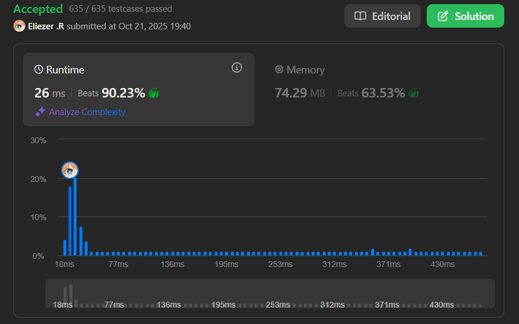

# 3346. Maximum Frequency of an Element After Performing Operations I

Se te da un array de enteros `nums` y dos enteros `k` y `numOperations`.

Debes realizar una operación `numOperations` veces en `nums`, donde en cada operación:
- Seleccionas un índice `i` que no fue seleccionado en ninguna operación anterior.
- Sumas un entero en el rango `[-k, k]` a `nums[i]`.

Retorna la **frecuencia máxima** posible de cualquier elemento en `nums` después de realizar las operaciones.

**Dificultad:** Medium

---

## 📋 Ejemplos

**Ejemplo 1:**

- Entrada: `nums = [1,4,5], k = 1, numOperations = 2`
- Salida: `2`
- Explicación:
```
Podemos lograr una frecuencia máxima de dos:
- Sumar 0 a nums[1], nums se convierte en [1, 4, 5]
- Sumar -1 a nums[2], nums se convierte en [1, 4, 4]
```

**Ejemplo 2:**

- Entrada: `nums = [5,11,20,20], k = 5, numOperations = 1`
- Salida: `2`
- Explicación:
```
Podemos lograr una frecuencia máxima de dos:
- Sumar 0 a nums[1]
```

---

## 💭 Enfoque y Estrategia

- **Diferencia con versión II**: Esta es la versión Medium del problema (versión I es más simple).
- **Enfoque con Prefix Sum**: Usar un array de diferencias para marcar rangos alcanzables.
- **Concepto**: Para cada valor `x` en nums, cualquier número en `[x-k, x+k]` puede alcanzarlo.
- **Técnica**: Usar difference array para contar cuántos elementos pueden transformarse a cada valor.

---

## 🔧 Implementación

```js
const maxFrequency = (nums, k, numOps) => {
    const maxVal = Math.max(...nums) + k + 2
    const count = new Array(maxVal).fill(0)

    // Llenar array de conteo con prefix sum
    for (const v of nums)
        count[v]++

    for (let i = 1; i < maxVal; i++)
        count[i] += count[i - 1]

    let res = 0
    
    // Para cada posible valor objetivo
    for (let i = 0; i < maxVal; i++) {
        const left = Math.max(0, i - k)
        const right = Math.min(maxVal - 1, i + k)
        
        // Total de elementos que pueden alcanzar i
        const total = count[right] - (left ? count[left - 1] : 0)
        
        // Elementos que ya son i
        const freq = count[i] - (i ? count[i - 1] : 0)
        
        // Máximo: ya existentes + convertibles (hasta numOps)
        res = Math.max(res, freq + Math.min(numOps, total - freq))
    }

    return res
}

console.log(maxFrequency([1,4,5], 1, 2)) // 2
console.log(maxFrequency([5,11,20,20], 5, 1)) // 2

/**
 * Ejemplo paso a paso con nums = [1,4,5], k = 1, numOps = 2:
 * 
 * maxVal = 5 + 1 + 2 = 8
 * count inicial: [0, 1, 0, 0, 1, 1, 0, 0]
 *                 0  1  2  3  4  5  6  7
 * 
 * Después de prefix sum:
 * count: [0, 1, 1, 1, 2, 3, 3, 3]
 *         0  1  2  3  4  5  6  7
 * 
 * Para i = 1:
 *   Rango: [0, 2]
 *   total = count[2] - count[-1] = 1 - 0 = 1
 *   freq = count[1] - count[0] = 1 - 0 = 1
 *   res = max(0, 1 + min(2, 1-1)) = 1
 * 
 * Para i = 4:
 *   Rango: [3, 5]
 *   total = count[5] - count[2] = 3 - 1 = 2
 *   freq = count[4] - count[3] = 2 - 1 = 1
 *   res = max(1, 1 + min(2, 2-1)) = max(1, 2) = 2 ✓
 * 
 * Para i = 5:
 *   Rango: [4, 6]
 *   total = count[6] - count[3] = 3 - 1 = 2
 *   freq = count[5] - count[4] = 3 - 2 = 1
 *   res = max(2, 1 + min(2, 2-1)) = 2
 * 
 * Resultado: 2
 */
```

---

## 📊 Análisis de Rendimiento

- **Complejidad temporal**: O(n + maxVal), donde n es la longitud de nums y maxVal es el valor máximo posible.
  - Construcción de prefix sum: O(n + maxVal)
  - Iteración sobre todos los valores: O(maxVal)
- **Complejidad espacial**: O(maxVal), para el array de conteo.


---

## 🎯 Visualización del Proceso

```
nums = [1,4,5], k = 1

Array de frecuencias original:
índice:  0  1  2  3  4  5  6  7
count:   0  1  0  0  1  1  0  0
         ↓
Después de prefix sum:
count:   0  1  1  1  2  3  3  3

Para valor objetivo i = 4:
Rango alcanzable: [3, 5]

  Elementos en rango:
  count[5] - count[2] = 3 - 1 = 2
  
  Ya tenemos freq(4) = 1
  Podemos convertir: 2 - 1 = 1
  Total: 1 + min(2, 1) = 2
```

---

## 🔄 Diferencia entre Versión I y II

| Aspecto | Versión I (Medium) | Versión II (Hard) |
|---------|-------------------|-------------------|
| Enfoque principal | Prefix sum | Binary search + Sliding window |
| Mejor para | Valores pequeños | Valores grandes/dispersos |
| Complejidad | O(n + maxVal) | O(n log n) |
| Espacio | O(maxVal) | O(n) |

---

## 🔍 Casos Edge

- **k = 0**: Solo contar frecuencia máxima existente
- **numOperations ≥ n**: Podemos convertir todo el array a un mismo valor
- **Valores negativos**: El código maneja valores desde 0, ajustar si hay negativos
- **Array vacío**: Retornar 0

---

## 🎯 Aprendizajes Clave

- **Prefix sum technique**: Calcular sumas de rangos en O(1).
- **Difference array**: Útil para marcar rangos de manera eficiente.
- **Range counting**: Contar elementos en un rango usando prefix sum.
- **Trade-offs**: Prefix sum vs binary search según el tamaño de valores.

---

## 🧮 Detalles del Prefix Sum

El prefix sum nos permite calcular:
```
Suma en rango [L, R] = prefixSum[R] - prefixSum[L-1]

Para nuestro caso:
Elementos en rango [i-k, i+k] = count[i+k] - count[i-k-1]
```

---

## 💡 Intuición del Algoritmo

1. **Crear histogram**: Contar frecuencia de cada valor
2. **Prefix sum**: Convertir a suma acumulativa
3. **Para cada valor posible**:
   - Calcular cuántos elementos están en su rango alcanzable
   - Restar los que ya son ese valor
   - Sumar hasta numOperations conversiones
4. **Tomar el máximo**

---

## 🏷️ Tags

`Array` `Prefix Sum` `Hash Table` `Medium`

---

**Complejidad Final:**
- ⏱️ Tiempo: O(n + maxVal)
- 💾 Espacio: O(maxVal)