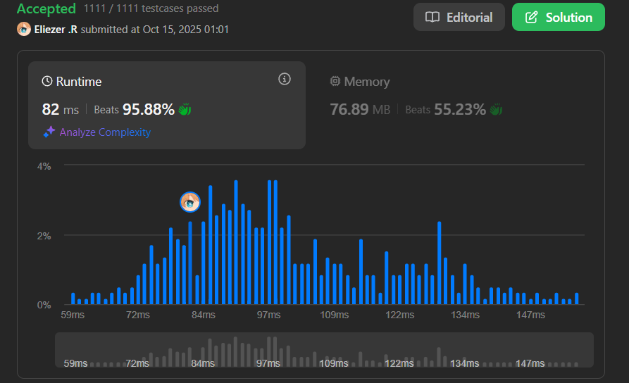

# 3350. Adjacent Increasing Subarrays Detection II

Dado un array de enteros `nums`, encuentra la **longitud máxima** `k` tal que existan **dos subarrays adyacentes** de longitud `k` que sean **estrictamente crecientes**.

Dos subarrays son adyacentes si el segundo comienza justo donde termina el primero.

---

## 📋 Ejemplos

**Ejemplo 1:**

- Entrada: `nums = [2,5,7,8,9,2,3,4,3,1]`
- Salida: `3`
- Explicación: Los subarrays `[2,5,7]` y `[7,8,9]` son ambos crecientes de longitud 3 y adyacentes.

**Ejemplo 2:**

- Entrada: `nums = [1,2,3,4,4,4,4,5,6,7]`
- Salida: `2`
- Explicación: Los subarrays `[1,2]` y `[2,3]` son crecientes de longitud 2 y adyacentes.

---

## 💭 Enfoque y Estrategia

- **Objetivo**: Encontrar la máxima longitud `k` para dos subarrays adyacentes crecientes.
- **Observación**: Mantener el conteo de elementos crecientes consecutivos.
- **Salida**: Un entero representando la longitud máxima.

Hay dos formas de tener subarrays adyacentes:
1. **Separados**: Uno del grupo anterior, uno del actual → `min(precnt, cnt)`
2. **Divididos**: Partir el grupo actual en dos → `cnt / 2`

---

## 🔧 Implementación

```js
const maxIncreasingSubarrays = function(nums) {
    const n = nums.length
    let cnt = 1      // Contador del subarray creciente actual
    let precnt = 0   // Contador del subarray creciente previo
    let ans = 0      // Respuesta máxima

    for (let i = 1; i < n; ++i) {
        if (nums[i] > nums[i - 1]) {
            // Continuar el subarray creciente
            ++cnt
        } else {
            // Termina el subarray, guardar longitud y reiniciar
            precnt = cnt
            cnt = 1
        }
        
        // Caso 1: Dos subarrays separados (anterior y actual)
        ans = Math.max(ans, Math.min(precnt, cnt))
        
        // Caso 2: Dividir el actual en dos partes iguales
        ans = Math.max(ans, Math.floor(cnt / 2))
    }
    
    return ans
}

console.log(maxIncreasingSubarrays([2,5,7,8,9,2,3,4,3,1]))  // 3

/**
 * Ejemplo paso a paso con nums = [2,5,7,8,9,2,3,4,3,1]:
 * 
 * Inicio: cnt=1, precnt=0, ans=0
 * 
 * i=1 (5>2): cnt=2
 *   ans = max(0, min(0,2)) = 0
 *   ans = max(0, floor(2/2)) = 1
 * 
 * i=2 (7>5): cnt=3
 *   ans = max(1, min(0,3)) = 1
 *   ans = max(1, floor(3/2)) = 1
 * 
 * i=3 (8>7): cnt=4
 *   ans = max(1, min(0,4)) = 1
 *   ans = max(1, floor(4/2)) = 2
 * 
 * i=4 (9>8): cnt=5
 *   ans = max(2, min(0,5)) = 2
 *   ans = max(2, floor(5/2)) = 2
 * 
 * i=5 (2<9): precnt=5, cnt=1
 *   ans = max(2, min(5,1)) = 2
 *   ans = max(2, floor(1/2)) = 2
 * 
 * i=6 (3>2): cnt=2
 *   ans = max(2, min(5,2)) = 2
 *   ans = max(2, floor(2/2)) = 2
 * 
 * i=7 (4>3): cnt=3
 *   ans = max(2, min(5,3)) = 3  ← ¡Aquí encontramos k=3!
 *   ans = max(3, floor(3/2)) = 3
 * 
 * i=8 (3<4): precnt=3, cnt=1
 *   ans = max(3, min(3,1)) = 3
 *   ans = max(3, floor(1/2)) = 3
 * 
 * i=9 (1<3): precnt=1, cnt=1
 *   ans = max(3, min(1,1)) = 3
 *   ans = max(3, floor(1/2)) = 3
 * 
 * Resultado: 3
 * Subarrays: [2,5,7] (longitud 3) y [7,8,9] (longitud 3)
 */
```

---

## 📊 Análisis de Rendimiento

- **Complejidad temporal**: O(n), una sola pasada por el array.
- **Complejidad espacial**: O(1), solo variables auxiliares.


---

## 🎯 Aprendizajes Clave

- Mantener dos contadores (actual y previo) permite detectar patrones
- Hay dos escenarios: subarrays separados o dividir uno en dos
- `Math.min(precnt, cnt)` maneja el caso de grupos separados
- `Math.floor(cnt / 2)` maneja dividir el grupo actual
- El patrón de "conteo de elementos consecutivos" es muy útil

---

## 🏷️ Tags

`Array` `Two Pointers` `Sliding Window` `Medium`

---

**Tiempo invertido**: 50 minutos  
**Intentos**: 4  
**Dificultad percibida**: Media

