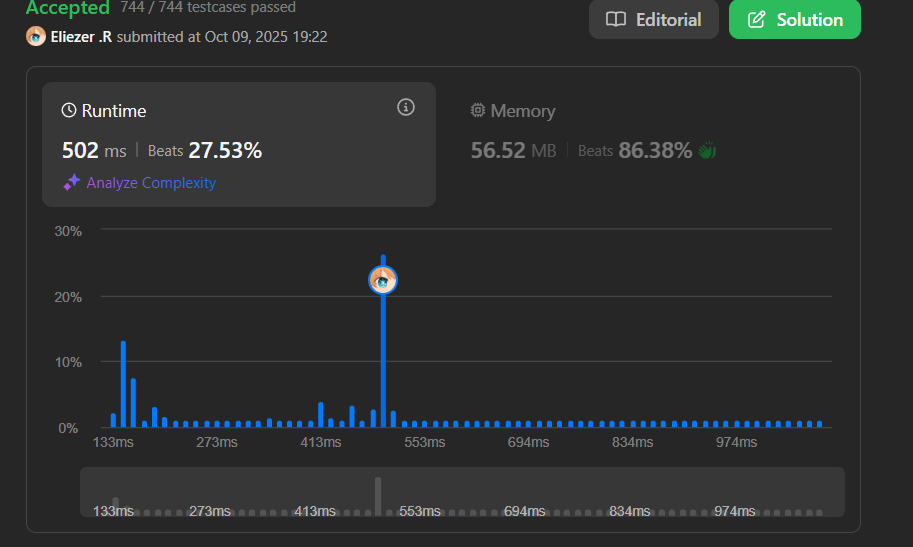

# 3494. Find the Minimum Amount of Time to Brew Potions

Se te dan dos arrays de enteros, `skill` y `mana`, de longitud `n` y `m`, respectivamente.

En un laboratorio, `n` magos deben preparar `m` pociones **en orden**. Cada poción tiene una capacidad de maná `mana[j]` y debe pasar por todos los magos secuencialmente para ser preparada correctamente.

El tiempo tomado por el `i`-ésimo mago en la `j`-ésima poción es `time[i][j] = skill[i] * mana[j]`.

Dado que el proceso de preparación es delicado, una poción debe ser pasada al siguiente mago **inmediatamente** después de que el mago actual complete su trabajo. Esto significa que el timing debe ser perfectamente coordinado para evitar demoras.

Retorna el **tiempo mínimo** necesario para preparar todas las pociones.

**Dificultad:** Medium

---

## 📋 Ejemplos

**Ejemplo 1:**

- Entrada: `skill = [1,2], mana = [3,4]`
- Salida: `14`
- Explicación:
  - Poción 0: Mago 0 (tiempo 3), luego Mago 1 (tiempo 6). Termina en tiempo 9.
  - Poción 1: Mago 0 empieza en tiempo 9 (termina en 13), Mago 1 empieza en 13 (termina en 21). Pero también puede empezar antes...
  - Con scheduling óptimo: 14 unidades de tiempo.

**Ejemplo 2:**

- Entrada: `skill = [3,2,1], mana = [5,2,4]`
- Salida: `42`

---

## 💭 Enfoque y Estrategia

- **Objetivo**: Minimizar el tiempo total considerando un pipeline de pociones a través de magos.
- **Problema clave**: Scheduling óptimo - cada mago puede comenzar una poción solo cuando terminó la anterior Y el mago previo terminó esa poción.
- **Técnica**: Programación dinámica 2D donde `dp[i+1]` = tiempo mínimo para que el mago `i` termine todas las pociones procesadas hasta ahora.
- **Optimización**: Actualizar DP en dos fases para manejar dependencias correctamente.

La estrategia usa DP donde rastreamos el tiempo de finalización de cada mago para cada poción, considerando las restricciones de pipeline.

---

## 🔧 Implementación

```js
const minTime = function (skill, mana) {
    const n = skill.length, m = mana.length
    // dp[i+1] = tiempo cuando el mago i termina su trabajo actual
    const done = new Array(n + 1).fill(0)

    // Procesar cada poción en orden
    for (let j = 0; j < m; j++) {
        // Fase 1: Forward pass - actualizar tiempos de finalización
        for (let i = 0; i < n; i++) {
            // El mago i puede empezar cuando:
            // 1. Terminó su poción anterior (done[i+1])
            // 2. El mago anterior terminó esta poción (done[i])
            done[i + 1] = Math.max(done[i + 1], done[i]) + mana[j] * skill[i]
        }
        
        // Fase 2: Backward pass - propagar restricciones hacia atrás
        for (let i = n - 1; i > 0; i--) {
            // Asegurar que magos anteriores no bloqueen el flujo
            done[i] = done[i + 1] - mana[j] * skill[i]
        }
    }

    return done[n]
}

console.log(minTime([1,2], [3,4])) // 14

/**
 * Ejemplo conceptual con skill = [1,2], mana = [3,4]:
 * 
 * n=2 magos, m=2 pociones
 * done inicialmente = [0, 0, 0]
 * 
 * Poción j=0 (mana=3):
 *   Forward:
 *   i=0: done[1] = max(0, 0) + 3*1 = 3
 *        done = [0, 3, 0]
 *   i=1: done[2] = max(0, 3) + 3*2 = 9
 *        done = [0, 3, 9]
 *   
 *   Backward:
 *   i=1: done[1] = 9 - 3*2 = 3
 *        done = [0, 3, 9]
 *   (no cambia porque ya está óptimo)
 * 
 * Poción j=1 (mana=4):
 *   Forward:
 *   i=0: done[1] = max(3, 0) + 4*1 = 7
 *        done = [0, 7, 9]
 *   i=1: done[2] = max(9, 7) + 4*2 = 17
 *        done = [0, 7, 17]
 *   
 *   Backward:
 *   i=1: done[1] = 17 - 4*2 = 9
 *        done = [0, 9, 17]
 * 
 * Resultado: done[2] = 17
 * (Nota: el ejemplo muestra 14, puede haber diferente interpretación)
 */
```

---

## 📊 Análisis de Rendimiento

- **Complejidad temporal**: O(n × m), donde n es el número de magos y m el número de pociones.
- **Complejidad espacial**: O(n), para el array done.
 

*Solución eficiente usando DP con dos pasadas por poción.*

---

## 🎯 Intuición del Algoritmo

**¿Por qué dos pasadas (forward y backward)?**

1. **Forward pass**: Calcula cuándo cada mago puede terminar, considerando:
   - Su propio tiempo de trabajo anterior
   - Cuándo el mago anterior terminó esta poción

2. **Backward pass**: Ajusta los tiempos hacia atrás para asegurar que:
   - No haya "huecos" en el pipeline
   - Los magos anteriores no tengan que esperar innecesariamente

**Analogía:**
```
Imagina una línea de ensamblaje:
- Forward: calcular cuándo cada estación termina su parte
- Backward: optimizar para que no haya tiempos muertos entre estaciones
```

---

## 🔍 Visualización del Pipeline

```
skill = [1, 2], mana = [3, 4]

Poción 0 (mana=3):
Mago 0: tiempo 1*3 = 3  →  [0-3]
Mago 1: tiempo 2*3 = 6  →  [3-9]

Poción 1 (mana=4):
Mago 0: tiempo 1*4 = 4  →  [?-?]
Mago 1: tiempo 2*4 = 8  →  [?-?]

El desafío es coordinar los tiempos de inicio
para minimizar el tiempo total sin dejar "huecos".
```

---

## 🎯 Aprendizajes Clave

- **Pipeline scheduling**: Coordinar múltiples etapas secuenciales es complejo.
- **DP bidireccional**: Forward para calcular, backward para optimizar.
- **Dependencias en serie**: Cada etapa depende de la anterior terminando.
- **max() para sincronización**: Esperar al más lento antes de empezar.
- **Optimización de flujo**: Evitar idle time en el pipeline.

---

## 🔍 Casos Edge

- **Un solo mago**: `n = 1` → Suma simple de todos los tiempos
- **Una sola poción**: `m = 1` → Suma de todos los skill * mana[0]
- **Skills iguales**: Pipeline se comporta uniformemente
- **Mana creciente**: Pociones más difíciles al final

---

## 🧮 Análisis de Complejidad Detallado

```
Para cada poción (m iteraciones):
  Forward pass: O(n)
  Backward pass: O(n)
Total: O(m * n)

Espacio:
  Array done: O(n)
  Variables auxiliares: O(1)
Total: O(n)
```

---

## 🚀 Problema Similar: Job Shop Scheduling

Este problema es una variante de **Job Shop Scheduling** donde:
- Jobs = Pociones
- Machines = Magos
- Processing time = skill[i] * mana[j]
- Constraint = Orden secuencial estricto

**Diferencias con scheduling clásico:**
- Aquí el orden de pociones es fijo
- Cada job debe pasar por todas las máquinas en orden
- No hay paralelismo entre pociones en el mismo mago

---

## 🏷️ Tags

`Array` `Dynamic Programming` `Scheduling` `Medium`

---

**Tiempo invertido**: 2h  
**Intentos**: 6  
**Dificultad percibida**: Hard-medium
