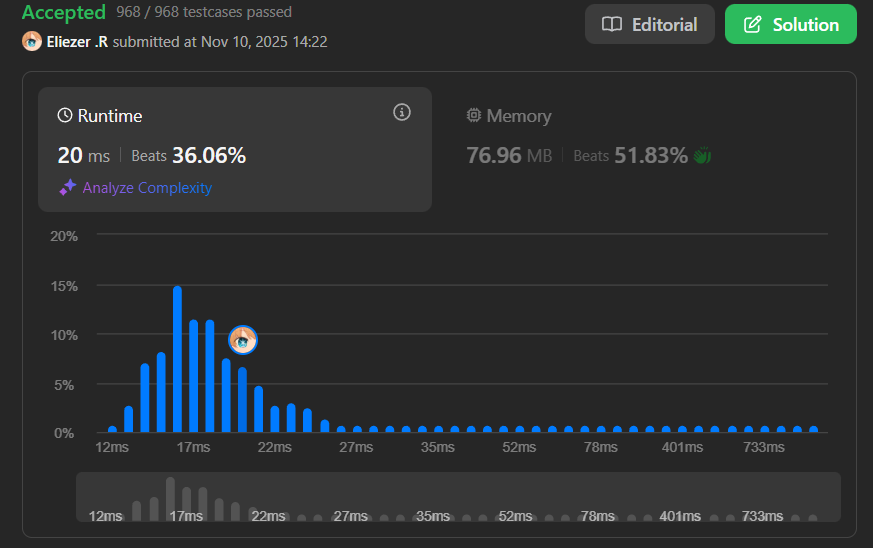

# 3542. Minimum Operations to Convert All Elements to Zero

## 🧠 Descripción

Se te da un array `nums` de tamaño `n`, que consiste de enteros no negativos. Tu tarea es aplicar algunas (posiblemente cero) operaciones en el array para que todos los elementos se conviertan en 0.

En una operación, puedes seleccionar un subarray `[i, j]` (donde `0 <= i <= j < n`) y establecer todas las ocurrencias del **entero no negativo mínimo** en ese subarray a 0.

Retorna el **número mínimo de operaciones** requeridas para hacer que todos los elementos en el array sean 0.

**Dificultad:** Medium

---

## 📋 Ejemplos

### Ejemplo 1:

* **Entrada**: `nums = [0,2]`
* **Salida**: `1`
* **Explicación**: Seleccionar subarray `[1,1]` (que es `[2]`), el mínimo es 2. Establecer todas las ocurrencias de 2 a 0 resulta en `[0,0]`.

### Ejemplo 2:

* **Entrada**: `nums = [3,1,2,1]`
* **Salida**: `3`
* **Explicación**:
```
1. Seleccionar [1,3] = [1,2,1], mínimo = 1 → [3,0,2,0]
2. Seleccionar [2,2] = [2], mínimo = 2 → [3,0,0,0]
3. Seleccionar [0,0] = [3], mínimo = 3 → [0,0,0,0]
Total: 3 operaciones
```

### Ejemplo 3:

* **Entrada**: `nums = [1,2,1,2,1,2]`
* **Salida**: `4`

---

## 💭 Estrategia y Enfoque

Este problema requiere una estrategia **greedy con stack monotónico**:

### 🧩 Observación clave:

Cuando procesamos el array de izquierda a derecha:
- Si un elemento es **menor o igual** que el anterior, forma parte del mismo "grupo" y no necesita operación adicional.
- Si un elemento es **mayor** que el anterior, inicia un nuevo "nivel" que requiere una operación adicional.

### 🎨 Intuición visual:

Imagina el array como una serie de "capas" o "niveles":
```
nums = [3,1,2,1]

Visualización por capas:
□ □ □ □   Nivel 3: necesita 1 operación
□   □     Nivel 2: necesita 1 operación  
  □   □   Nivel 1: necesita 1 operación

Total: 3 operaciones
```

### 🎯 Algoritmo con Stack:

1. Usar un stack para rastrear valores "activos".
2. Para cada elemento:
   - Si es 0, ignorarlo (skip).
   - Si es menor que el top del stack, hacer pop hasta encontrar uno menor o igual.
   - Si es mayor que el top del stack (o stack vacío), push y contar operación.

---

## 💻 Implementación en JavaScript

```js
var minOperations = function (nums) {
    // subArr actúa como un stack monotónico creciente
    const subArr = [];
    
    // res cuenta el número de operaciones necesarias
    let res = 0;
    
    // Iterar por cada número en el array
    for (const n of nums) {
        // Mientras el stack no esté vacío Y el top sea mayor que n
        // Necesitamos hacer pop porque n es menor (bajamos de nivel)
        while (subArr.length && subArr.at(-1) > n)
            subArr.pop();
        
        // Si n es 0, no necesitamos hacer nada
        // Los ceros no requieren operaciones
        if (n === 0)
            continue;
        
        // Si el stack está vacío O el top es menor que n
        // Esto significa que estamos subiendo a un nuevo nivel
        if (!subArr.length || subArr.at(-1) < n) {
            // Incrementar operaciones (nuevo nivel)
            res++;
            // Agregar n al stack
            subArr.push(n);
        }
        // Si subArr.at(-1) === n, no hacemos nada
        // Estamos en el mismo nivel
    }
    
    return res;
};

console.log(minOperations([0,2]))           // 1
console.log(minOperations([3,1,2,1]))       // 3
console.log(minOperations([1,2,1,2,1,2]))   // 4
```

### 📝 Ejemplo paso a paso con `nums = [3,1,2,1]`:

```
Inicio: subArr = [], res = 0

Procesar n = 3:
  - subArr está vacío
  - n ≠ 0
  - Stack vacío → nuevo nivel
  - res = 1
  - subArr.push(3) → subArr = [3]

Procesar n = 1:
  - subArr.at(-1) = 3 > 1 → pop hasta que sea ≤ 1
  - subArr.pop() → subArr = []
  - n ≠ 0
  - Stack vacío → nuevo nivel
  - res = 2
  - subArr.push(1) → subArr = [1]

Procesar n = 2:
  - subArr.at(-1) = 1 < 2 (no hacer pop)
  - n ≠ 0
  - subArr.at(-1) < n → nuevo nivel
  - res = 3
  - subArr.push(2) → subArr = [1, 2]

Procesar n = 1:
  - subArr.at(-1) = 2 > 1 → pop hasta que sea ≤ 1
  - subArr.pop() → subArr = [1]
  - n ≠ 0
  - subArr.at(-1) === n (ambos son 1)
  - No hacer nada (mismo nivel)

Resultado: res = 3
```

### 📝 Ejemplo con `nums = [1,2,1,2,1,2]`:

```
n=1: Stack vacío → res=1, stack=[1]
n=2: 1 < 2 → res=2, stack=[1,2]
n=1: 2 > 1 → pop(2), stack=[1], mismo nivel
n=2: 1 < 2 → res=3, stack=[1,2]
n=1: 2 > 1 → pop(2), stack=[1], mismo nivel
n=2: 1 < 2 → res=4, stack=[1,2]

Resultado: 4 operaciones
```

---

## 📊 Análisis de Rendimiento

* **Complejidad temporal**: O(n), cada elemento entra y sale del stack máximo una vez.
* **Complejidad espacial**: O(n), para el stack en el peor caso.



---

## 🎯 Aprendizajes Clave

* **Monotonic stack**: Stack que mantiene orden creciente o decreciente.
* **Greedy approach**: Procesar de izquierda a derecha y tomar decisiones locales.
* **Level counting**: Contar "niveles" o "capas" en lugar de simular operaciones.
* **Skip zeros**: Los ceros no afectan el conteo.
* **Pop strategy**: Hacer pop cuando bajamos de nivel.

---

## 💡 Intuición del Algoritmo

**¿Por qué funciona?**

Piensa en el array como una serie de montañas y valles:
- Cuando "subimos" (número mayor que el anterior) → nueva operación
- Cuando "bajamos" (número menor) → no necesitamos operación extra
- Cuando nos "mantenemos" (número igual) → mismo nivel, no operación

El stack rastrea los "niveles activos" que aún no hemos procesado completamente.

---

## 🔄 Enfoque Alternativo (Divide and Conquer)

```js
// Enfoque recursivo con divide and conquer
var minOperationsRecursive = function(nums) {
    if (nums.length === 0 || nums.every(n => n === 0)) return 0;
    if (nums.length === 1 && nums[0] !== 0) return 1;
    
    const minVal = Math.min(...nums.filter(n => n > 0));
    
    // Dividir por el valor mínimo
    const groups = [];
    let current = [];
    
    for (const n of nums) {
        if (n === minVal || n === 0) {
            if (current.length > 0) {
                groups.push(current);
                current = [];
            }
        } else {
            current.push(n - minVal);
        }
    }
    if (current.length > 0) groups.push(current);
    
    return 1 + groups.reduce((sum, g) => sum + minOperationsRecursive(g), 0);
};
// Más intuitivo pero potencialmente más lento
```

---

## 🏷️ Etiquetas

`Array` `Stack` `Greedy` `Monotonic Stack` `Medium`