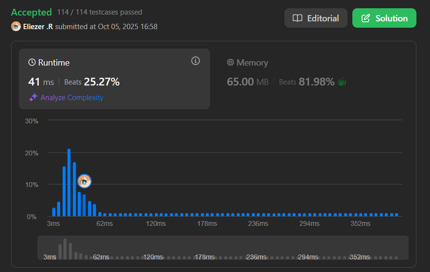

# 417. Pacific Atlantic Water Flow

## 🧠 Descripción

Hay una isla `m x n` que está bordeada tanto por el **Océano Pacífico** como por el **Océano Atlántico**. El Pacífico toca el borde izquierdo y superior de la isla, y el Atlántico toca el borde derecho e inferior.

La isla está dividida en una cuadrícula de cuadrados. Se te da una matriz de enteros `m x n` llamada `heights` donde `heights[i][j]` representa la **altura sobre el nivel del mar** de la celda en la coordenada `(i, j)`.

La lluvia de la isla es abundante, por lo que el agua puede fluir a celdas adyacentes directamente (arriba, abajo, izquierda, derecha) si la altura de la celda adyacente es **menor o igual** que la altura de la celda actual.

El agua puede fluir desde cualquier celda adyacente al océano Pacífico y Atlántico.

Retorna una **lista de coordenadas** de cuadrícula donde el agua puede fluir a **ambos** océanos (Pacífico **y** Atlántico).

---

## 📋 Ejemplos

### Ejemplo 1:

* **Entrada**: `heights = [[1,2,2,3,5],[3,2,3,4,4],[2,4,5,3,1],[6,7,1,4,5],[5,1,1,2,4]]`
* **Salida**: `[[0,4],[1,3],[1,4],[2,2],[3,0],[3,1],[4,0]]`

### Ejemplo 2:

* **Entrada**: `heights = [[1]]`
* **Salida**: `[[0,0]]`
* **Explicación**: El agua puede fluir del único punto a ambos océanos.

---

## 💭 Estrategia y Enfoque

La clave de este problema es **invertir el flujo**:

### 🧩 Idea contra-intuitiva pero brillante:

En lugar de preguntarnos "¿desde dónde puede el agua llegar a ambos océanos?", preguntamos:
**"¿Desde qué océano puede el agua subir hasta qué celdas?"**

### 🌊 Pasos del Algoritmo:

1. **DFS desde el Pacífico**: Comenzar DFS desde todas las celdas del borde superior e izquierdo.
2. **DFS desde el Atlántico**: Comenzar DFS desde todas las celdas del borde inferior y derecho.
3. **El agua puede "subir"**: En el DFS, avanzamos a celdas con altura **mayor o igual** (invertido).
4. **Intersección**: Las celdas que pueden ser alcanzadas desde **ambos** océanos son la respuesta.

---

## 💻 Implementación en JavaScript

```js
var pacificAtlantic = function(heights) {
    // Validar entrada vacía
    if (!heights || heights.length === 0) return [];
    
    const filas = heights.length;
    const columnas = heights[0].length;
    
    // Sets para rastrear qué celdas pueden alcanzar cada océano
    const pacifico = new Set();
    const atlantico = new Set();
    
    // Función DFS que marca las celdas alcanzables desde un océano
    // @param fila: fila actual
    // @param col: columna actual
    // @param visitados: Set de celdas ya visitadas para este océano
    // @param alturaAnterior: altura de la celda desde donde venimos
    function dfs(fila, col, visitados, alturaAnterior) {
        // Validar límites de la matriz
        if (fila < 0 || fila >= filas || col < 0 || col >= columnas) {
            return;
        }
        
        // Crear clave única para esta celda
        const clave = `${fila},${col}`;
        
        // Si ya visitamos esta celda para este océano, no continuar
        if (visitados.has(clave)) {
            return;
        }
        
        const alturaActual = heights[fila][col];
        
        // CLAVE: El agua solo puede "subir" o mantenerse igual
        // Si la altura actual es menor, el agua no puede llegar aquí desde el océano
        if (alturaActual < alturaAnterior) {
            return;
        }
        
        // Marcar esta celda como alcanzable desde este océano
        visitados.add(clave);
        
        // Explorar las 4 direcciones (abajo, arriba, derecha, izquierda)
        dfs(fila + 1, col, visitados, alturaActual); // Abajo
        dfs(fila - 1, col, visitados, alturaActual); // Arriba
        dfs(fila, col + 1, visitados, alturaActual); // Derecha
        dfs(fila, col - 1, visitados, alturaActual); // Izquierda
    }
    
    // DFS desde el PACÍFICO (borde superior e izquierdo)
    
    // Recorrer fila superior (todas las columnas)
    for (let col = 0; col < columnas; col++) {
        dfs(0, col, pacifico, heights[0][col]);
    }
    
    // Recorrer columna izquierda (todas las filas)
    for (let fila = 0; fila < filas; fila++) {
        dfs(fila, 0, pacifico, heights[fila][0]);
    }
    
    // DFS desde el ATLÁNTICO (borde inferior y derecho)
    
    // Recorrer fila inferior (todas las columnas)
    for (let col = 0; col < columnas; col++) {
        dfs(filas - 1, col, atlantico, heights[filas - 1][col]);
    }
    
    // Recorrer columna derecha (todas las filas)
    for (let fila = 0; fila < filas; fila++) {
        dfs(fila, columnas - 1, atlantico, heights[fila][columnas - 1]);
    }
    
    // Encontrar la intersección: celdas alcanzables desde AMBOS océanos
    const resultado = [];
    
    // Recorrer toda la matriz
    for (let fila = 0; fila < filas; fila++) {
        for (let col = 0; col < columnas; col++) {
            const clave = `${fila},${col}`;
            
            // Si esta celda puede ser alcanzada desde ambos océanos
            if (pacifico.has(clave) && atlantico.has(clave)) {
                resultado.push([fila, col]);
            }
        }
    }
    
    return resultado;
};

console.log(pacificAtlantic([[1,2,2,3,5],[3,2,3,4,4],[2,4,5,3,1],[6,7,1,4,5],[5,1,1,2,4]]))
// [[0,4],[1,3],[1,4],[2,2],[3,0],[3,1],[4,0]]
```

### 📝 Ejemplo visual con grid pequeño:

```
heights = [[3,3,3],
           [3,1,3],
           [0,2,4]]

Pacífico (↓ y →):
  P  P  P
  P  1  3
  0  2  4

Atlántico (↑ y ←):
  3  3  A
  3  1  A
  A  A  A

DFS desde Pacífico:
- Empezar desde fila 0: (0,0), (0,1), (0,2)
- Empezar desde col 0: (1,0), (2,0)
- Desde (0,0) altura=3: puede ir a (0,1)=3, (1,0)=3
- Desde (0,2) altura=3: puede ir a (1,2)=3
- Desde (1,2) altura=3: puede ir a (2,2)=4
- ...
- Pacifico = {(0,0), (0,1), (0,2), (1,0), (1,2), (2,2)}

DFS desde Atlántico:
- Empezar desde fila 2: (2,0), (2,1), (2,2)
- Empezar desde col 2: (0,2), (1,2)
- Desde (2,2) altura=4: puede ir a (1,2)=3 ✗ (3 < 4)
- Desde (1,2) altura=3: puede ir a (0,2)=3, (1,1)=1 ✗
- ...
- Atlantico = {(0,2), (1,2), (2,0), (2,1), (2,2)}

Intersección:
- Pacifico ∩ Atlantico = {(0,2), (1,2), (2,2)}
```

---

## 📊 Análisis de Rendimiento

* **Complejidad temporal**: O(m × n), donde m y n son las dimensiones de la matriz.
  - Cada celda es visitada como máximo 2 veces (una por cada océano)
* **Complejidad espacial**: O(m × n), para los Sets y la recursión.


---

## 🎯 Aprendizajes Clave

* **Inversión de problema**: En lugar de fluir hacia abajo, "subir" desde los océanos.
* **DFS desde bordes**: Comenzar desde los límites en lugar del centro.
* **Set intersection**: Usar Sets para encontrar celdas comunes eficientemente.
* **Condición invertida**: `alturaActual >= alturaAnterior` en lugar de `<=`.
* **Two-pass algorithm**: Resolver para cada océano por separado, luego combinar.

---

## 🔍 Casos Edge

* **Matriz 1x1**: `[[1]]` → `[[0,0]]` (único punto toca ambos océanos)
* **Toda la matriz plana**: Todas las celdas pueden alcanzar ambos océanos
* **Montaña en el centro**: Solo los bordes y picos pueden alcanzar ambos
* **Valle en el centro**: El valle no puede alcanzar ningún océano

---

## 🏷️ Etiquetas

`Array` `DFS` `BFS` `Matrix` `Medium`