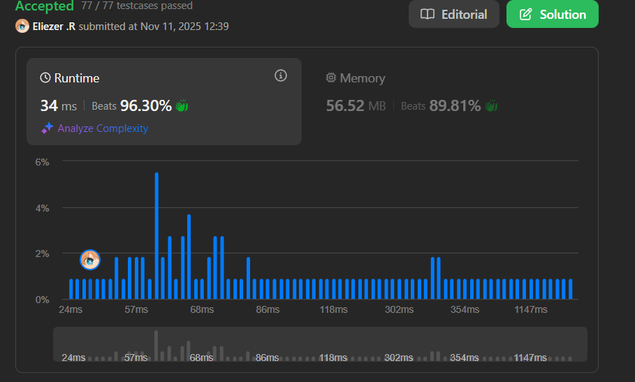

# 474. Ones and Zeroes

## 🧠 Descripción

Se te da un array de **strings binarios** `strs` y dos enteros `m` y `n`.

Retorna el **tamaño del subset más grande** de `strs` tal que haya **como máximo** `m` ceros (`'0'`) y `n` unos (`'1'`) en el subset.

Un set `x` es un subset de un set `y` si todos los elementos de `x` también son elementos de `y`.

**Dificultad:** Medium

---

## 📋 Ejemplos

### Ejemplo 1:

* **Entrada**: `strs = ["10","0001","111001","1","0"], m = 5, n = 3`
* **Salida**: `4`
* **Explicación**: 
  - El subset más grande con como máximo 5 ceros y 3 unos es `{"10", "0001", "1", "0"}`.
  - Total: 5 ceros y 3 unos.

### Ejemplo 2:

* **Entrada**: `strs = ["10","0","1"], m = 1, n = 1`
* **Salida**: `2`
* **Explicación**: El subset más grande es `{"0", "1"}`.

---

## 💭 Estrategia y Enfoque

Este es un problema clásico de **0/1 Knapsack en 2D**:

### 🎒 Analogía del Knapsack:

- **Items**: Los strings
- **Peso en dimensión 1**: Número de ceros
- **Peso en dimensión 2**: Número de unos
- **Capacidad 1**: `m` (máximo de ceros)
- **Capacidad 2**: `n` (máximo de unos)
- **Valor**: Cada string vale 1 (queremos maximizar la cantidad)

### 🔑 Idea clave:

`dp[i][j]` = máximo número de strings que podemos tomar con como máximo `i` ceros y `j` unos.

### 🎯 Transición DP:

Para cada string con `zeros` ceros y `ones` unos:
```
dp[i][j] = max(dp[i][j], dp[i-zeros][j-ones] + 1)
```

---

## 💻 Implementación en JavaScript

```js
var findMaxForm = function(S, M, N) {
    // Crear tabla DP 2D de tamaño (M+1) x (N+1)
    // dp[i][j] = máximo número de strings con ≤ i ceros y ≤ j unos
    // Usamos Uint8Array para optimizar memoria (solo necesitamos valores pequeños)
    let dp = Array.from({length:M+1},() => new Uint8Array(N+1))
    
    // Iterar por cada string en el array
    for (let i = 0; i < S.length; i++) {
        let str = S[i], zeros = 0, ones = 0
        
        // Contar cuántos '0' y '1' tiene este string
        for (let j = 0; j < str.length; j++)
            str.charAt(j) === "0" ? zeros++ : ones++
        
        // Actualizar la tabla DP en orden REVERSO
        // IMPORTANTE: Iterar de M hacia zeros (no de zeros hacia M)
        // Esto evita usar el mismo string múltiples veces
        for (let j = M; j >= zeros; j--)
            for (let k = N; k >= ones; k--)
                // Decidir: ¿tomamos este string o no?
                // No tomar: dp[j][k] (valor actual)
                // Tomar: dp[j-zeros][k-ones] + 1
                //   (el mejor resultado con menos zeros/ones + 1)
                dp[j][k] = Math.max(dp[j][k], dp[j-zeros][k-ones] + 1)
    }
    
    // La respuesta está en dp[M][N]: máximo con M ceros y N unos
    return dp[M][N]
};

console.log(findMaxForm(["10","0001","111001","1","0"], 5, 3))  // 4
console.log(findMaxForm(["10","0","1"], 1, 1))  // 2
```

### 📝 Ejemplo paso a paso con `strs = ["10","0","1"], m = 2, n = 2`:

```
Inicialización: dp = tabla 3x3 llena de ceros
  [0][0] [1][2]
[0] 0    0   0
[1] 0    0   0
[2] 0    0   0

Procesar string "10" (zeros=1, ones=1):
  Iterar j desde 2 hasta 1, k desde 2 hasta 1:
  
  j=2, k=2: dp[2][2] = max(0, dp[2-1][2-1] + 1) = max(0, 0+1) = 1
  j=2, k=1: dp[2][1] = max(0, dp[2-1][1-1] + 1) = max(0, 0+1) = 1
  j=1, k=2: dp[1][2] = max(0, dp[1-1][2-1] + 1) = max(0, 0+1) = 1
  j=1, k=1: dp[1][1] = max(0, dp[1-1][1-1] + 1) = max(0, 0+1) = 1
  
  Tabla después de "10":
    [0][1][2]
  [0] 0  0  0
  [1] 0  1  1
  [2] 0  1  1

Procesar string "0" (zeros=1, ones=0):
  j=2, k=0: dp[2][0] = max(0, dp[2-1][0-0] + 1) = max(0, 0+1) = 1
  j=1, k=0: dp[1][0] = max(0, dp[1-1][0-0] + 1) = max(0, 0+1) = 1
  
  j=2, k=2: dp[2][2] = max(1, dp[2-1][2-0] + 1) = max(1, dp[1][2]+1) = max(1, 1+1) = 2
  j=2, k=1: dp[2][1] = max(1, dp[2-1][1-0] + 1) = max(1, dp[1][1]+1) = max(1, 1+1) = 2
  
  Tabla después de "0":
    [0][1][2]
  [0] 0  0  0
  [1] 1  1  1
  [2] 1  2  2

Procesar string "1" (zeros=0, ones=1):
  j=2, k=2: dp[2][2] = max(2, dp[2-0][2-1] + 1) = max(2, dp[2][1]+1) = max(2, 2+1) = 3
                                                                              ✗ Pero solo hay 3 strings!
  
  ...continuar proceso...

Resultado: dp[2][2] = 2 (tomamos "0" y "1")
```

---

## 📊 Análisis de Rendimiento

* **Complejidad temporal**: O(S × M × N), donde S es el número de strings.
  - Por cada string: O(M × N) para actualizar la tabla
* **Complejidad espacial**: O(M × N), para la tabla DP.



---

## 🎯 Aprendizajes Clave

* **2D Knapsack**: Extensión del knapsack clásico con dos dimensiones de capacidad.
* **Reverse iteration**: Crucial para evitar usar el mismo item múltiples veces.
* **Space optimization**: Uint8Array ahorra memoria vs Array normal.
* **DP table semantics**: dp[i][j] representa el máximo alcanzable, no solo un flag.

---

## 💡 ¿Por qué iterar en reverso?

**Si iteramos hacia adelante:**
```js
for (let j = zeros; j <= M; j++)
    for (let k = ones; k <= N; k++)
        dp[j][k] = max(dp[j][k], dp[j-zeros][k-ones] + 1)
```
Problema: Podríamos usar `dp[j-zeros][k-ones]` que **ya fue actualizado en esta iteración**, lo que permitiría usar el mismo string múltiples veces.

**Iterando en reverso:**
```js
for (let j = M; j >= zeros; j--)
    for (let k = N; k >= ones; k--)
```
Garantizamos que `dp[j-zeros][k-ones]` viene de la iteración **anterior** (sin este string).

---

## 🏷️ Etiquetas

`Array` `String` `Dynamic Programming` `Medium`