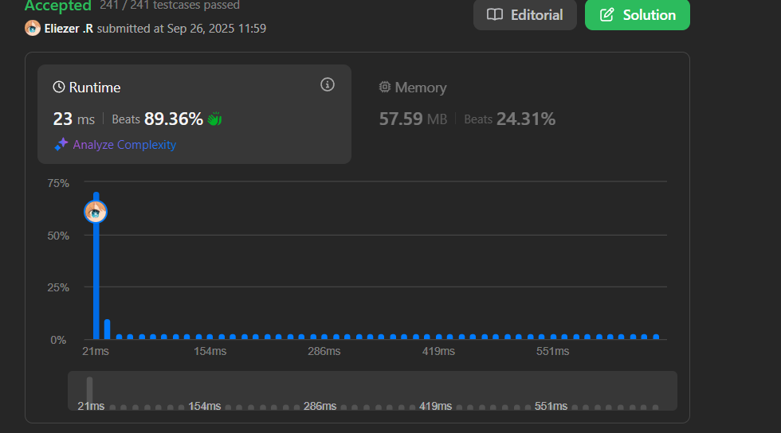

# 611. Valid Triangle Number

Dado un array de enteros `nums`, retorna el **número de triplas** elegidas del array que pueden formar triángulos si las tomamos como longitudes de los lados de un triángulo.

**Dificultad:** Medium

---

## 📋 Ejemplos

**Ejemplo 1:**

- Entrada: `nums = [2,2,3,4]`
- Salida: `3`
- Explicación: Las combinaciones válidas son:
  - `2,3,4` (usando el primer 2)
  - `2,3,4` (usando el segundo 2)  
  - `2,2,3`

**Ejemplo 2:**

- Entrada: `nums = [4,2,3,4]`
- Salida: `4`

---

## 💭 Enfoque y Estrategia

- **Objetivo**: Contar triplas que satisfacen la desigualdad triangular: `a + b > c` para todos los lados.
- **Insight clave**: Si ordenamos el array, solo necesitamos verificar `nums[i] + nums[j] > nums[k]` donde `k` es el lado más largo.
- **Técnica**: Ordenar + Two Pointers para cada lado más largo fijo.
- **Optimización**: Evitar verificar las 3 condiciones de desigualdad triangular.

La estrategia aprovecha que en un array ordenado, si `a + b > c` y `a ≤ a'`, entonces `a' + b > c` también es verdadero.

---

## 🔧 Implementación

```js
const triangleNumber = function (nums) {
    nums.sort((a, b) => a - b)  // Ordenar array ascendentemente
    let count = 0               // Contador de triángulos válidos

    // Iterar desde el final (lado más largo) hacia el inicio
    for (let i = nums.length - 1; i >= 2; i--) {
        let first = nums[i]   // Lado más largo fijo
        let point1 = i - 1    // Puntero derecho (lado mediano)
        let point2 = 0        // Puntero izquierdo (lado más corto)

        // Two pointers para encontrar pares válidos
        while (point2 < point1) {
            // Si la suma de los dos lados menores > lado mayor
            if ((nums[point1] + nums[point2]) > first) {
                // Todos los elementos entre point2 y point1 forman triángulos válidos
                count += (point1 - point2)
                point1--  // Mover puntero derecho hacia la izquierda
            } else {
                // La suma es muy pequeña, incrementar lado menor
                point2++
            }
        }
    }
    
    return count
}

console.log(triangleNumber([2,2,3,4])) // 3

/**
 * Ejemplo paso a paso con nums = [2,2,3,4]:
 * 
 * Después de ordenar: [2,2,3,4]
 * 
 * i=3 (first=4, lado más largo):
 * point1=2, point2=0 → nums[2]+nums[0] = 3+2 = 5 > 4 ✓
 * count += (2-0) = 2 → count = 2
 * (Triángulos: [2,3,4] con índices (0,2,3) y (1,2,3))
 * point1=1
 * 
 * point1=1, point2=0 → nums[1]+nums[0] = 2+2 = 4 > 4? No
 * point2=1
 * 
 * point2=1, point1=1 → point2 < point1? No, salir del while
 * 
 * i=2 (first=3, lado más largo):
 * point1=1, point2=0 → nums[1]+nums[0] = 2+2 = 4 > 3 ✓
 * count += (1-0) = 1 → count = 3
 * (Triángulo: [2,2,3])
 * point1=0
 * 
 * point2=0, point1=0 → point2 < point1? No, salir del while
 * 
 * i=1: i >= 2? No, terminar
 * 
 * Resultado: count = 3
 */
```

---

## 📊 Análisis de Rendimiento

- **Complejidad temporal**: O(n²), donde n es la longitud del array (O(n log n) para sorting + O(n²) para two pointers).
- **Complejidad espacial**: O(1), solo variables auxiliares (el sorting es in-place).


*Mucho más eficiente que el enfoque de fuerza bruta O(n³).*

---

## 🔧 Teoría: Desigualdad Triangular

**Condición para triángulo válido:**
Para que tres lados `a`, `b`, `c` formen un triángulo:
- `a + b > c`
- `a + c > b`
- `b + c > a`

**Optimización con array ordenado:**
Si `a ≤ b ≤ c`, solo necesitamos verificar `a + b > c`
- ¿Por qué? Las otras dos condiciones siempre se cumplen:
  - `a + c > b` ✓ (porque `c ≥ b`)
  - `b + c > a` ✓ (porque `b ≥ a` y `c > 0`)

---

## 🎯 Visualización del Algoritmo

```
Array: [2,2,3,4] (ya ordenado)
Índices: 0 1 2 3

i=3 (first=4):
  point2=0, point1=2: nums[0]+nums[2]=2+3=5 > 4 ✓
  count += (2-0)=2 → Triángulos: (0,2,3), (1,2,3)
  
  point2=0, point1=1: nums[0]+nums[1]=2+2=4 > 4? No
  point2=1, point1=1: point2 >= point1, salir

i=2 (first=3):
  point2=0, point1=1: nums[0]+nums[1]=2+2=4 > 3 ✓  
  count += (1-0)=1 → Triángulo: (0,1,2)
  
Total: 3 triángulos válidos
```

---

## 🎯 Aprendizajes Clave

- **Two pointers optimization**: Reducir O(n³) a O(n²) aprovechando el orden.
- **Desigualdad triangular**: Solo verificar una condición cuando el array está ordenado.
- **Counting trick**: Cuando `a + b > c`, todos los elementos entre los punteros son válidos.
- **Iteración reversa**: Fijar el lado más largo facilita la lógica de two pointers.
- **Sorting como preprocessing**: A menudo vale la pena el costo O(n log n) inicial.

---

## 🔄 Enfoque Alternativo (Fuerza Bruta)

```js
const triangleNumberBruteForce = function(nums) {
    let count = 0
    
    // Verificar todas las combinaciones de 3 elementos
    for (let i = 0; i < nums.length - 2; i++) {
        for (let j = i + 1; j < nums.length - 1; j++) {
            for (let k = j + 1; k < nums.length; k++) {
                const [a, b, c] = [nums[i], nums[j], nums[k]]
                
                // Verificar las 3 condiciones de desigualdad triangular
                if (a + b > c && a + c > b && b + c > a) {
                    count++
                }
            }
        }
    }
    
    return count
}
// O(n³) - menos eficiente
```

---

## 🔍 Casos Edge

- **Array con menos de 3 elementos**: `[1,2]` → `0`
- **Ningún triángulo válido**: `[1,2,5]` → `0` (1+2 ≤ 5)
- **Todos los triángulos válidos**: `[3,4,5,6]` → Múltiples combinaciones
- **Elementos duplicados**: `[2,2,2,2]` → Múltiples triángulos iguales pero válidos

---

## 🧮 Verificación Manual

```
Array: [4,2,3,4] → Ordenado: [2,3,4,4]

Triángulos válidos:
1. (2,3,4): 2+3=5 > 4 ✓
2. (2,4,4): 2+4=6 > 4 ✓  
3. (3,4,4): 3+4=7 > 4 ✓
4. (2,3,4): 2+3=5 > 4 ✓ (segundo 4)

Total: 4 triángulos
```

---

## 🏷️ Tags

`Array` `Two Pointers` `Binary Search` `Greedy` `Sorting` `Medium`

---

**Tiempo invertido**: 2H  
**Intentos**: 3  
**Dificultad percibida**: Medium