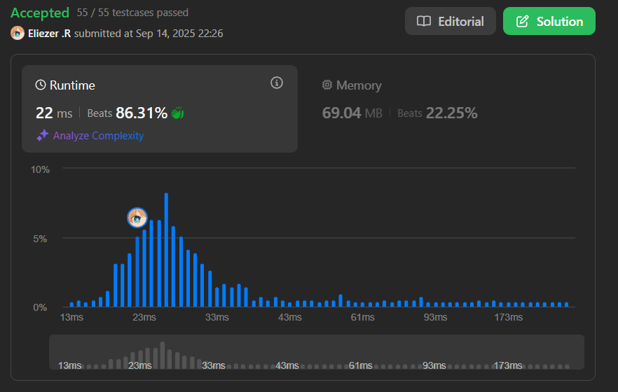

# 966. Vowel Spellchecker

Dado un `wordlist`, queremos implementar un corrector ortográfico que convierta una palabra de consulta en una palabra correcta.

Para una palabra `query` dada, el corrector ortográfico maneja dos categorías de errores ortográficos:

- **Capitalización**: Si la query coincide con una palabra en wordlist (**case-insensitive**), entonces la palabra query se devuelve con el mismo case que en wordlist.
- **Errores de vocales**: Si después de reemplazar las vocales (`'a', 'e', 'i', 'o', 'u'`) de la query con cualquier vocal individualmente, coincide con una palabra en wordlist (**case-insensitive**), entonces se devuelve la palabra con el mismo case que la coincidencia en wordlist.

**Dificultad:** Medium

---

## 🎯 Reglas de Precedencia

1. **Coincidencia exacta** (case-sensitive): Devolver la misma palabra.
2. **Coincidencia de capitalización**: Devolver la primera coincidencia en wordlist.
3. **Coincidencia de vocales**: Devolver la primera coincidencia en wordlist.
4. **Sin coincidencia**: Devolver string vacío.

---

## 📋 Ejemplos

**Ejemplo 1:**

- Entrada: `wordlist = ["KiTe","kite","hare","Hare"], queries = ["kite","Kite","KiTe","Hare","HARE","Hear","hear","keti","keet","keto"]`
- Salida: `["kite","KiTe","KiTe","Hare","hare","","","KiTe","","KiTe"]`

**Ejemplo 2:**

- Entrada: `wordlist = ["yellow"], queries = ["YellOw"]`
- Salida: `["yellow"]`

---

## 💭 Enfoque y Estrategia

- **Objetivo**: Implementar un corrector con 3 niveles de tolerancia a errores.
- **Estructuras clave**: 
  - Set para coincidencias exactas (O(1) lookup)
  - Map para coincidencias case-insensitive (primera aparición)
  - Map para coincidencias vowel-insensitive (primera aparición)
- **Técnica**: Preprocessing del wordlist + pattern matching con máscaras de vocales.

La estrategia consiste en preprocesar el wordlist creando 3 estructuras de datos diferentes para cada tipo de búsqueda, luego procesar cada query siguiendo el orden de precedencia establecido.

---

## 🔧 Implementación

```js
const spellchecker = function (wordlist, queries) {
    const result = []
    const exactWords = new Set(wordlist)        // Para coincidencias exactas
    const caseInsensitive = new Map()           // Para coincidencias de case
    const vowelInsensitive = new Map()          // Para coincidencias de vocales

    // Función para enmascarar vocales con '*'
    const maskVowels = (word) => {
        return word.toLowerCase().replace(/[aeiou]/g, '*')
    }

    // Preprocessing: construir las estructuras de datos
    for (let word of wordlist) {
        const lower = word.toLowerCase()
        const masked = maskVowels(lower)

        // Solo guardar la PRIMERA aparición (orden de precedencia)
        if (!caseInsensitive.has(lower)) {
            caseInsensitive.set(lower, word)
        }
        if (!vowelInsensitive.has(masked)) {
            vowelInsensitive.set(masked, word)
        }
    }

    // Procesamiento de queries siguiendo orden de precedencia
    for (let query of queries) {
        if (exactWords.has(query)) {
            // Nivel 1: Coincidencia exacta (case-sensitive)
            result.push(query)
        } else {
            const lower = query.toLowerCase()
            const masked = maskVowels(lower)

            if (caseInsensitive.has(lower)) {
                // Nivel 2: Coincidencia case-insensitive
                result.push(caseInsensitive.get(lower))
            } else if (vowelInsensitive.has(masked)) {
                // Nivel 3: Coincidencia vowel-insensitive
                result.push(vowelInsensitive.get(masked))
            } else {
                // Nivel 4: Sin coincidencia
                result.push('')
            }
        }
    }
    
    return result
}

console.log(spellchecker(["KiTe","kite"], ["kite","Kite"])) // ["kite","KiTe"]

/**
 * Ejemplo paso a paso con wordlist = ["KiTe","kite"], query = "kite":
 * 
 * 1. Preprocessing:
 *    exactWords = Set{"KiTe", "kite"}
 *    caseInsensitive = {"kite" → "KiTe"}  // Primera aparición
 *    vowelInsensitive = {"k*t*" → "KiTe"} // Primera aparición
 * 
 * 2. Query "kite":
 *    - exactWords.has("kite") = true → result.push("kite")
 * 
 * 3. Query "Kite":
 *    - exactWords.has("Kite") = false
 *    - caseInsensitive.has("kite") = true → result.push("KiTe")
 * 
 * Resultado: ["kite", "KiTe"]
 */
```

---

## 📊 Análisis de Rendimiento

- **Complejidad temporal**: O(W×L + Q×L), donde W es el tamaño de wordlist, Q el de queries, y L la longitud promedio de palabras.
- **Complejidad espacial**: O(W×L), para almacenar las estructuras de datos del preprocessing.


*El preprocessing O(W×L) permite consultas eficientes O(L) por query.*

---

## 🔍 Detalles de Implementación

**Función maskVowels:**
```js
const maskVowels = (word) => {
    return word.toLowerCase().replace(/[aeiou]/g, '*')
}
// Ejemplos:
// "hello" → "h*ll*"
// "WORLD" → "w*rld"  
// "aeiou" → "*****"
```

**Orden de precedencia en preprocessing:**
- Solo se guarda la **primera aparición** en cada Map
- Esto asegura que se respete el orden del wordlist original

---

## 🎯 Aprendizajes Clave

- **Preprocessing inteligente**: Construir estructuras optimizadas para consultas rápidas.
- **Orden de precedencia**: Usar if-else en el orden correcto para respetar prioridades.
- **Pattern matching**: Enmascarar caracteres similares para comparaciones flexibles.
- **Primera aparición**: Usar `!map.has(key)` para guardar solo el primer match.
- **Múltiples estructuras**: Combinar Set y Map según las necesidades de cada nivel.

---

## 🔄 Casos Edge

- Query exacta: `wordlist=["Test"], query="Test"` → `"Test"`
- Solo case difference: `wordlist=["Test"], query="test"` → `"Test"`
- Solo vowel difference: `wordlist=["Test"], query="Tist"` → `"Test"`
- Sin match: `wordlist=["Test"], query="Best"` → `""`
- Múltiples matches: Se retorna el primero en wordlist

---

## 🚀 Optimizaciones Posibles

- Usar `Set(['a','e','i','o','u'])` en lugar de regex para mejor performance
- Pre-calcular todas las transformaciones si el wordlist es muy grande
- Usar Trie para búsquedas más eficientes en casos específicos

---

## 🏷️ Tags

`Array` `Hash Table` `String` `Medium`

---

**Tiempo invertido**: 1:30 h  
**Intentos**: 15  
**Dificultad percibida**: Medium